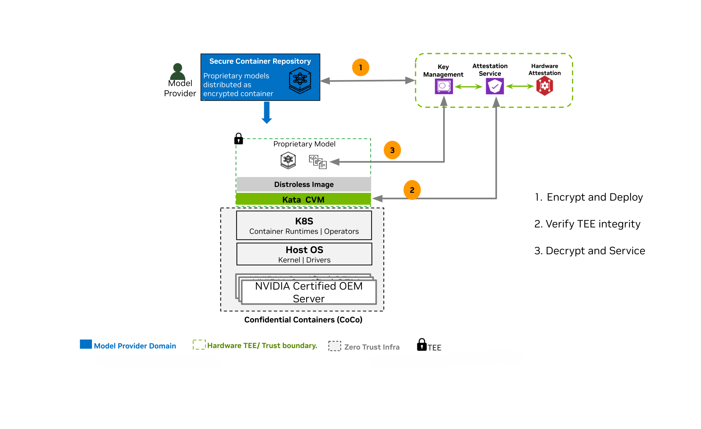
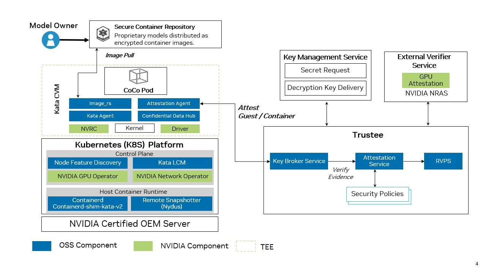

.. license-header
  SPDX-FileCopyrightText: Copyright (c) 2026 NVIDIA CORPORATION & AFFILIATES. All rights reserved.
  SPDX-License-Identifier: Apache-2.0

  Licensed under the Apache License, Version 2.0 (the "License");
  you may not use this file except in compliance with the License.
  You may obtain a copy of the License at

  http://www.apache.org/licenses/LICENSE-2.0

  Unless required by applicable law or agreed to in writing, software
  distributed under the License is distributed on an "AS IS" BASIS,
  WITHOUT WARRANTIES OR CONDITIONS OF ANY KIND, either express or implied.
  See the License for the specific language governing permissions and
  limitations under the License.

.. headings # #, * *, =, -, ^, "

*****************************************************
NVIDIA Confidential Containers Reference Architecture
*****************************************************

NVIDIA GPUs with Confidential Computing support provide the hardware foundation for running GPU workloads inside a hardware-enforced Trusted Execution Environment (TEE).
The NVIDIA Confidential Containers Reference Architecture provides a validated deployment model for cluster administrators interested in leveraging NVIDIA GPU Confidential Computing capabilities on Kubernetes platforms.

This documentation describes the architecture overview and the key software components, including the NVIDIA GPU Operator and Kata Containers, used to deploy and manage confidential workloads.
This architecture builds on principles of Confidential Computing and `Confidential Containers <https://confidentialcontainers.org/docs/architecture/design-overview/>`__, the cloud-native approach to Confidential Computing.
It is recommended to be familiar with the basic concepts of Confidential Containers, including attestation, before reading this documentation.
Refer to the `Confidential Containers <https://confidentialcontainers.org/docs/>`__ documentation for more information.

.. _confidential-containers-overview:

Background
==========

NVIDIA GPUs power the training and deployment of Frontier Models—world-class Large Language Models (LLMs) that define the state of the art in AI reasoning and capability.

As organizations adopt these models in regulated industries such as financial services, healthcare, and the public sector, protecting model intellectual property and sensitive user data becomes essential. Additionally, the model deployment landscape is evolving to include public clouds, enterprise on-premises, and edge. A zero-trust posture on cloud-native platforms such as Kubernetes is essential to secure assets (model IP and enterprise private data) from untrusted infrastructure with privileged user access.

Confidential Computing (CC) addresses this gap by using hardware-based Trusted Execution Environments (TEEs), such as AMD SEV-SNP and Intel TDX, with NVIDIA Confidential Computing capabilities to provide isolation, memory encryption, and integrity verification during processing. In addition to isolation, CC provides Remote Attestation, which allows workload owners to cryptographically verify the state of a TEE before providing secrets or sensitive data.

`Confidential Containers <https://github.com/confidential-containers>`__ (CoCo) is the cloud-native approach of CC on Kubernetes.
The Confidential Containers project leverages Kata Containers to provide the sandboxing capabilities. `Kata Containers <https://katacontainers.io/>`_ is an open-source project that provides lightweight Utility Virtual Machines (UVMs) that feel and perform like containers while providing strong workload isolation. Along with the Confidential Containers project, Kata enables the orchestration of secure, GPU-accelerated workloads in Kubernetes.

.. _coco-use-cases:

Use Cases
=========

The target for Confidential Containers is to enable model providers (Closed and Open source) and Enterprises to use the advancements of Gen AI, agnostic to the deployment model (Cloud, Enterprise, or Edge). Some of the key use cases that CC and Confidential Containers enable are:

* **Zero-Trust AI & IP Protection:** You can deploy proprietary models (like LLMs) on third-party or private infrastructure. The model weights remain encrypted and are only decrypted inside the hardware-protected enclave, ensuring absolute IP protection from the host.
* **Data Clean Rooms:** This allows you to process sensitive enterprise data (like financial analytics or healthcare records) securely. Neither the infrastructure provider nor the model builder can see the raw data.

*Sample Workflow for Securing Model IP on Untrusted Infrastructure with CoCo*

.. _coco-architecture:

Architecture Overview
=====================

NVIDIA's approach to the Confidential Containers architecture delivers on the key promise of Confidential Computing: confidentiality, integrity, and verifiability.
Integrating open source and NVIDIA software components with the Confidential Computing capabilities of NVIDIA GPUs, the Reference Architecture for Confidential Containers is designed to be the secure and trusted deployment model for AI workloads.

The key values of this architecture approach are:

1. **Built on OSS standards** - The Reference Architecture for Confidential Containers is built on key OSS components such as Kata, Trustee, QEMU, OVMF, and Node Feature Discovery (NFD), along with hardened NVIDIA components like NVIDIA GPU Operator.
2. **Highest level of isolation** - The Confidential Containers architecture is built on Kata containers, which is the industry standard for providing hardened sandbox isolation, and augmenting it with support for GPU passthrough to Kata containers makes the base of the Trusted Execution Environment (TEE).
3. **Zero-trust execution with attestation** - Ensuring the trust of the model providers/data owners by providing a full-stack verification capability with attestation. The integration of NVIDIA GPU attestation capabilities with Trustee based architecture, to provide composite attestation provides the base for secure, attestation based key-release for encrypted workloads, deployed inside the TEE.

*High-Level Reference Architecture for Confidential Containers*

The above diagram shows the high-level reference architecture for Confidential Containers and
the key components that are used to deploy and manage Confidential Containers workloads.
The components are described in more detail in the next section.

.. _coco-supported-platforms-components:

Software Components for Confidential Containers
===============================================

The following is a brief overview of the software components in NVIDIA's Reference Architecture for Confidential Containers.
Refer to the diagram above for a visual representation of the components.

**Kata Containers**

Acts as the secure isolation layer by running standard Kubernetes Pods inside lightweight, hardware-isolated Utility Virtual Machines (UVMs) rather than sharing the untrusted host kernel.
`Kata Containers <https://katacontainers.io/>`_ is an open source project, which is integrated with the Kubernetes `Agent Sandbox <https://github.com/kubernetes-sigs/agent-sandbox>`_ project, that delivers sandboxing capabilities.

**Kata Deploy**

Deployment mechanism (often managed with Helm) that installs the Kata runtime binaries, UVM images and kernels, and TEE-specific shims (such as ``kata-qemu-nvidia-gpu-snp`` or ``kata-qemu-nvidia-gpu-tdx``) onto the cluster's worker nodes.

Refer to the `Kata Containers documentation <https://katacontainers.io/docs/>`_ for more information.

**NVIDIA GPU Operator**

Automates GPU lifecycle management.
For Confidential Containers, it securely provisions GPU support and handles VFIO-based GPU passthrough directly into the Kata confidential Virtual Machine (VM) without breaking the hardware trust boundary.

The GPU Operator deploys the components needed to run Confidential Containers to simplify managing the software required for confidential computing and deploying confidential container workloads.
The GPU Operator uses node labels to manage the deployment of components to the nodes in your cluster.
These components include:

* NVIDIA Confidential Computing Manager (cc-manager) for Kubernetes: Sets the confidential computing (CC) mode on the NVIDIA GPUs.
* NVIDIA Kata Sandbox Device Plugin: Creates host-side Container Device Interface (CDI) specifications for GPU passthrough and discovers NVIDIA GPUs along with their capabilities, advertises these to Kubernetes, and allocates GPUs during pod deployment.
* NVIDIA VFIO Manager: Binds discovered NVIDIA GPUs and NVSwitches to the vfio-pci driver for VFIO passthrough.

Refer to the :doc:`NVIDIA GPU Operator <gpuop:overview>` page for more information on the NVIDIA GPU Operator.

**Node Feature Discovery (NFD)**

Bootstraps the node by advertising the node features using labels to make sophisticated scheduling decisions, like installing the Kata/CoCo stack only on the nodes that support the CC prerequisites for CPU and GPU. This feature directs the Operator to install node feature rules that detect CPU security features and the NVIDIA GPU hardware.

Refer to the `Node Feature Discovery documentation <https://kubernetes-sigs.github.io/node-feature-discovery/>`_ for upstream usage and reference material.
The project source repository is `kubernetes-sigs/node-feature-discovery <https://github.com/kubernetes-sigs/node-feature-discovery>`_ on GitHub.
This component is deployed and managed by default by the GPU Operator.

**Snapshotter (for example, Nydus)**

Handles the container image "guest pull" functionality. Used as a remote snapshotter, it bypasses image pulls on the host. Instead, it fetches and unpacks encrypted and signed container images directly inside the protected guest memory, keeping proprietary contents hidden and ensuring image integrity.

**Kata Agent and Agent Security Policy**

Runs inside the guest VM to manage the container lifecycle while enforcing a strict, immutable agent security policy based on Rego (regorus). This blocks the untrusted host from executing unauthorized commands, such as a malicious ``kubectl exec``.

**Trustee and Attestation Service**

Attestation and key brokering framework (which includes the Key Broker Service and Attestation Service). It acts as the cryptographic gatekeeper, verifying hardware/software evidence and only releasing secrets if the environment is proven secure.

**Confidential Data Hub (CDH)**

An in-guest component that securely receives sealed secrets from Trustee and transparently manages encrypted persistent storage and image decryption for the workload.

**NVIDIA Runtime Container (NVRC)**

A minimal hardened init system that securely bootstraps the guest environment, life cycles the kata-agent, provides health checks on started helper daemons while drastically reducing the attack surface.

GPU Operator Cluster Topology Considerations
--------------------------------------------

The GPU Operator deploys and manages components for allocating and utilizing the GPU resources on your cluster.
Depending on how you configure the Operator, different components are deployed on the worker nodes.
When setting up Confidential Containers support, you can configure all the worker nodes in your cluster for running GPU workloads with Confidential Containers, or you can configure some nodes for Confidential Containers and the others for traditional containers.
This configuration is done through node labelling and configuration flags set during installation or by editing the ClusterPolicy object post installation.

Consider the following example where node A is configured to run traditional containers and node B is configured to run confidential containers.

.. list-table::
   :widths: 50 50
   :header-rows: 1

   * - Node A - Traditional Container nodes receive the following software components
     - Node B - Confidential Container nodes receive the following software components
   * - * NVIDIA Driver Manager for Kubernetes
       * NVIDIA Container Toolkit
       * NVIDIA Device Plugin for Kubernetes
       * NVIDIA DCGM and DCGM Exporter
       * NVIDIA MIG Manager for Kubernetes
       * Node Feature Discovery
       * NVIDIA GPU Feature Discovery
     - * NVIDIA Confidential Computing Manager for Kubernetes
       * NVIDIA Sandbox Device Plugin
       * NVIDIA VFIO Manager
       * Node Feature Discovery

This configuration can be controlled through node labelling, as described in the :doc:`Confidential Containers deployment guide <confidential-containers-deploy>`.

Supported Features and Deployment Scenarios
===========================================

The following features are supported with Confidential Containers:

* Support for Confidential Container workloads as

  * Single-GPU passthrough (one physical GPU per pod).
  * Multi-GPU passthrough on NVSwitch (NVLink) based HGX systems.

.. note::

    For both single and multi GPU Passthrough, all GPUs on the host must be configured for Confidential Computing and all GPUs must be assigned to one Confidential Container virtual machine.
    Configuring only some GPUs on a node for Confidential Computing is not supported.

* Composite :doc:`attestation <attestation>` using Trustee and the NVIDIA Remote Attestation Service (NRAS).
* Generating Kata Agent Security Policies using the `genpolicy tool <https://github.com/kata-containers/kata-containers/blob/main/src/tools/genpolicy/README.md>`_.
* Use of `signed sealed secrets <https://confidentialcontainers.org/docs/features/sealed-secrets/>`_.
* Access to authenticated registries for container image guest-pull.
* Container image signature verification and encrypted container images.
* Ephemeral container data and image layer storage.
* Lifecycle management of Kata Containers through the `Kata Lifecycle Manager <https://github.com/kata-containers/lifecycle-manager>`_.

More information on these features can be found in the `Confidential Containers documentation <https://confidentialcontainers.org/docs/features/>`_.

Limitations and Restrictions
============================

* NVIDIA supports the GPU Operator and confidential computing with the containerd runtime only.
* Image signature verification for signed multi-arch images is currently not supported.
* For both single and multi GPU Passthrough, all GPUs on the host must be configured for Confidential Computing and all GPUs must be assigned to one Confidential Container virtual machine.
  Configuring only some GPUs on a node for Confidential Computing is not supported.

Next Steps
==========
Refer to the following pages to learn more about deploying with Confidential Containers:

.. grid:: 3
   :gutter: 3

   .. grid-item-card:: :octicon:`server;1.5em;sd-mr-1` Supported Platforms
      :link: supported-platforms
      :link-type: doc

      Hardware, OS, and component versions validated for general availability (GA).

   .. grid-item-card:: :octicon:`rocket;1.5em;sd-mr-1` Deploy Confidential Containers
      :link: confidential-containers-deploy
      :link-type: doc

      Deploy with the NVIDIA GPU Operator on Kubernetes.

   .. grid-item-card:: :octicon:`shield-check;1.5em;sd-mr-1` Attestation
      :link: attestation
      :link-type: doc

      Remote attestation, Trustee, and the NVIDIA verifier for GPU workloads.

