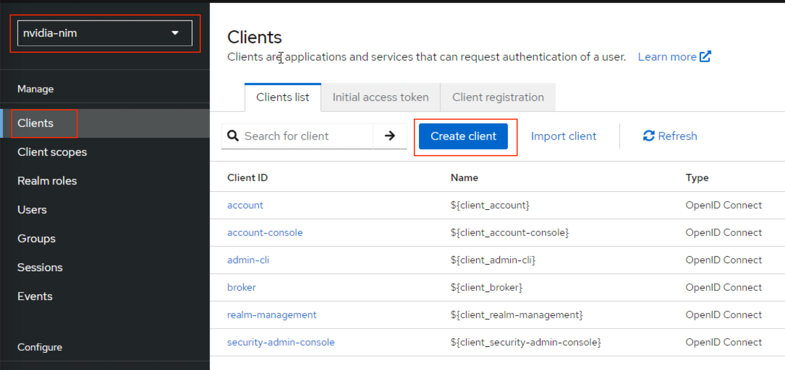
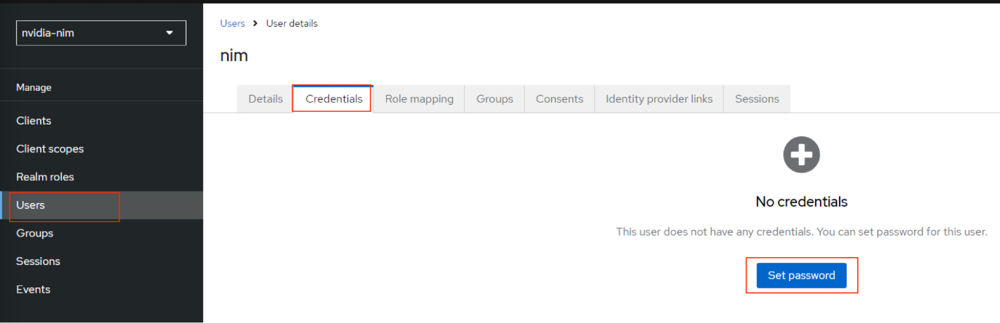
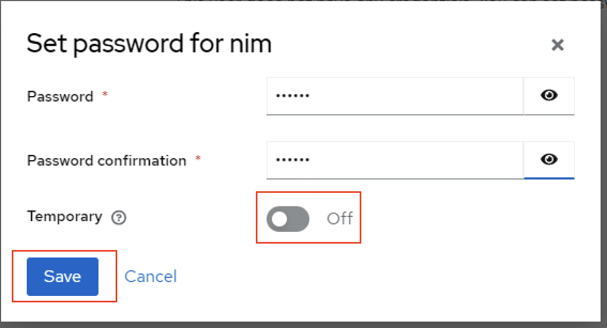
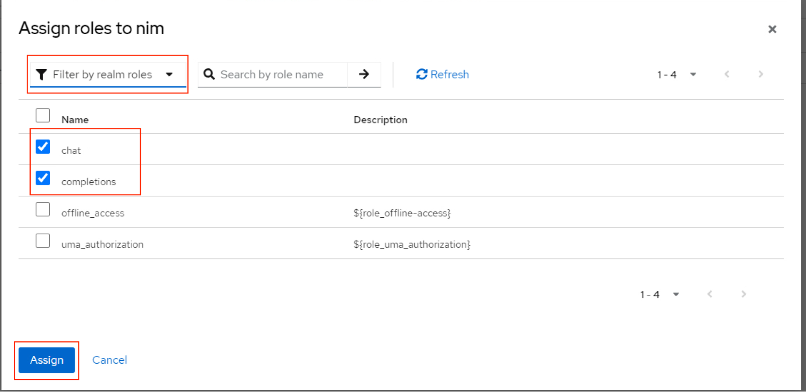

<!--
  SPDX-FileCopyrightText: Copyright (c) 2023 NVIDIA CORPORATION & AFFILIATES. All rights reserved.
  SPDX-License-Identifier: Apache-2.0
-->

# Sample Implementation Details

The service mesh uses an Istio-based service mesh for creating a secure, observable, and highly configurable communication layer.
OIDC is provided by tools like Keycloak, DEX, or other commercial solutions as an OIDC provider. NVIDIA developed and tested this document using the following installations methods.

```{contents}
:depth: 2
:backlinks: none
:local: true
```

## Prerequisites

- A Kubernetes cluster and the cluster-admin role.
  Refer to [](platform-support.md) for information about supported operating systems and Kubernetes platforms.

- A Linux VM or WSL on Windows.

## Service Mesh Installation Using Istio

1. Run the following command to download Istio.

   ```console
   curl https://raw.githubusercontent.com/istio/istio/release-1.23/release/downloadIstioCandidate.sh | sh -
   ```

   The download creates a directory with name such as ``istio-1.2x.x``.

2. Change directory into the Istio directory.

   ```console
   cd istio-1.23.2
   ```

3. Add `istioctl` to `PATH`.

   ```console
   export PATH=$PWD/bin:$PATH
   ```

4. Optional: For VMware Tanzu Kubernetes or Red Hat OpenShift, create a namespace and label the namespace to run privileged pods.

   ```console
   kubectl create ns istio-system
   ```

   ```console
   kubectl label --overwrite ns istio-system pod-security.kubernetes.io/warn=privileged  pod-security.kubernetes.io/enforce=privileged
   ```

5. Install Istio with the demonstration profile.

   ```console
   istioctl install --set profile=demo -y
   ```

6. Determine the storage classes on the cluster.
   Grafana Loki uses persistent storage and you must specify a storage class.

   ```console
   kubectl get storageclass
   ```

7. Update the storage class for Loki.

   ```console
   sed -i '/accessModes:/i\        storageClassName: <storage-class-name> ' samples/addons/loki.yaml
   ```

8. Run the below command to install the add-ons like Prometheus, Grafana and Jaeger.

    ```console
    kubectl rollout status deployment/kiali -n istio-system
    ```

   ```console
   kubectl rollout status deployment/kiali -n istio-system
   ```

## Install OIDC Keycloak

1. Label the default namespace to run the privileged pods.

    ```console
    kubectl label --overwrite ns default pod-security.kubernetes.io/warn=privileged  pod-security.kubernetes.io/enforce=privileged
    ```

2. Install KeyCloak.

   ```console
   kubectl create -f https://raw.githubusercontent.com/keycloak/keycloak-quickstarts/latest/kubernetes/keycloak.yaml
   ```

### Configure KeyCloak

1. Determine the node port of the Keycloak service.

   ```console
   kubectl get svc
   ```

   *Example Output*

   ```console
   NAME       TYPE           CLUSTER-IP       EXTERNAL-IP     PORT(S)          AGE
   keycloak   LoadBalancer   10.108.216.157   10.28.234.100   8080:30111/TCP   21h
   ```

2. List the worker IP addresses and then use any one of them with the service node port.

   ```console
   for node in `kubectl get nodes | awk '{print $1}' | grep -v NAME`; do echo $node ' ' | tr -d '\n'; kubectl describe node $node | grep -i 'internalIP:' | awk '{print $2}'; done
   ```

   *Example Output*

   ```console
   test-cluster-03-worker-nbhk9-56b4b888dd-8lpqd  10.120.199.16
   test-cluster-03-worker-nbhk9-56b4b888dd-hnrxr  10.120.199.23
   ```


3. Use any of the worker IP addresses to access the Keycloak administration interface.

   ```console
   10.120.199.15:30111
   ```

4. After you access the application, you can see the page like the following.
   Click on **Administration Console**.

   

5. Enter the default credentials as `admin` and `admin` and then sign in.

   

6. Create a new **Realm**.

   

7. Enter the **Realm Name** as `nvidia-nim` and click **Create**.

   

8. Click **Clients** on the navigation bar and then click **Create client**.

   

9. Provide **Client ID** as `nvidia-nim` and click **Next** with default values for steps 2 and 3.

   

10. Navigate to **Realm roles** on the left side pane and click **Create** to create a role.

    

11. Create role with name `chat` and save.

    

12. Create another role with name `completions` and save.

    

13. Navigate to **Users** on left side pane and click **Add user**.

    

14. Create a user with name `nim` and click **Create**.

    

    Keycloak displays the `nim` User details page.

15. On the `nim` User details page, click **Credentials** and then click **Set password** to create a password.

    

16. Enter the password `nvidia`, set the **Temporary** switch to **Off**, and click **Save**.

    

    

17. Navigate to the **Role Mapping0** tab for `nimuser` and click **Assign Role**.

    

18. Enable **chat** and **completion** roles for `nimuser` and click **Assign**.

    

## Next Steps

- Refer to [](./configure.md) to create and validate ingress resources.
