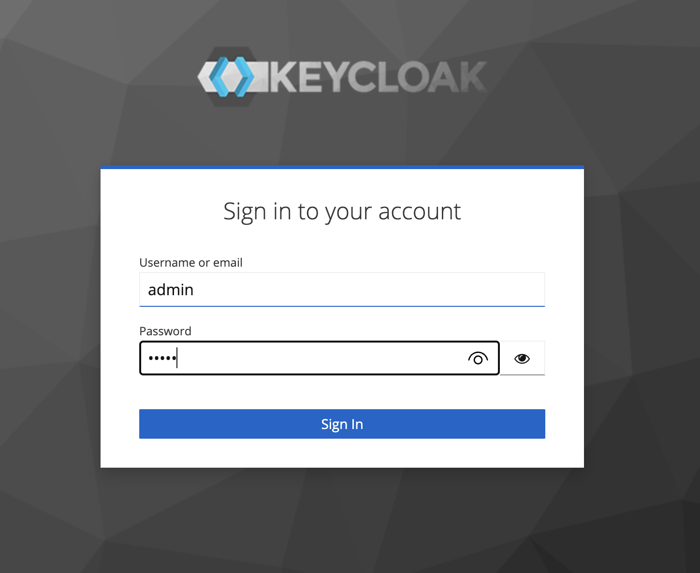
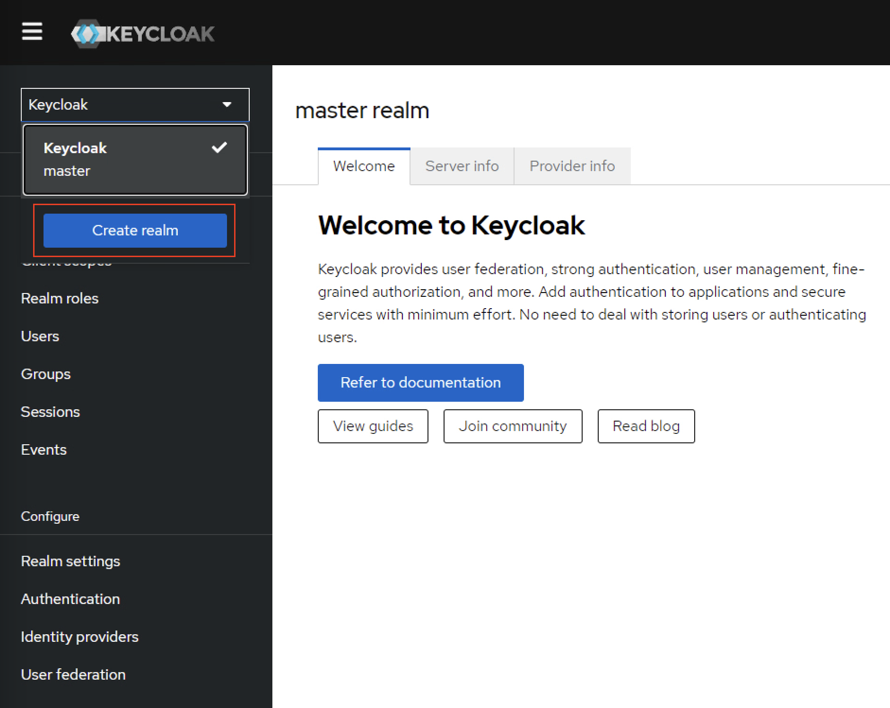
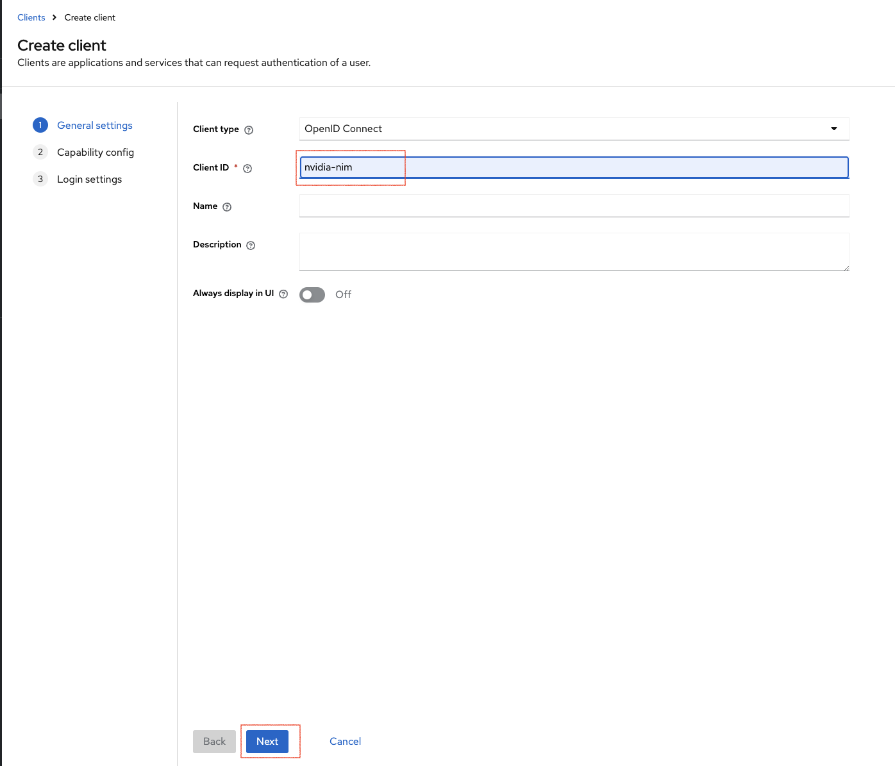
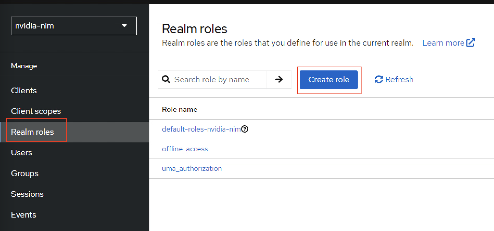
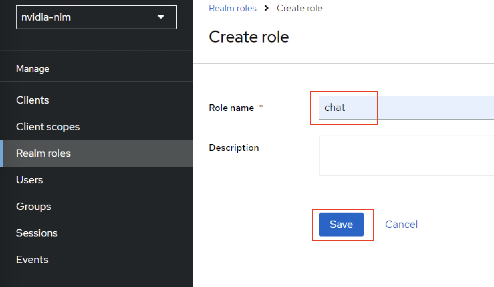
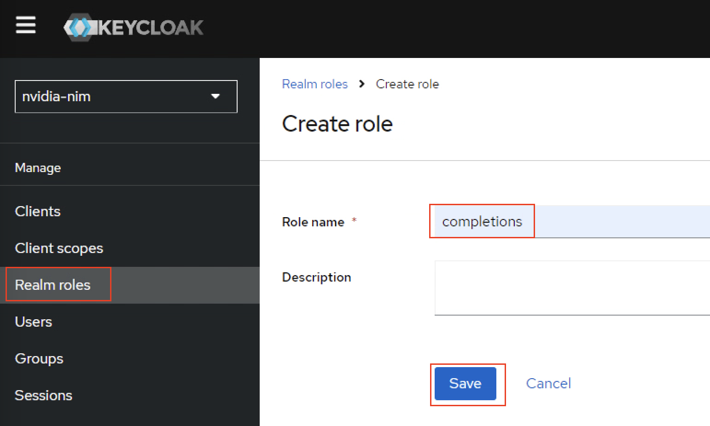
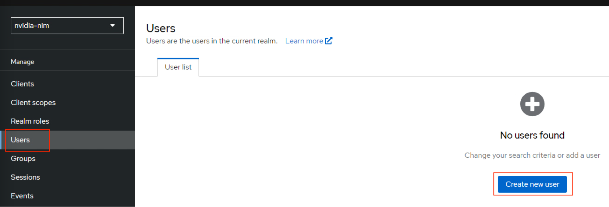
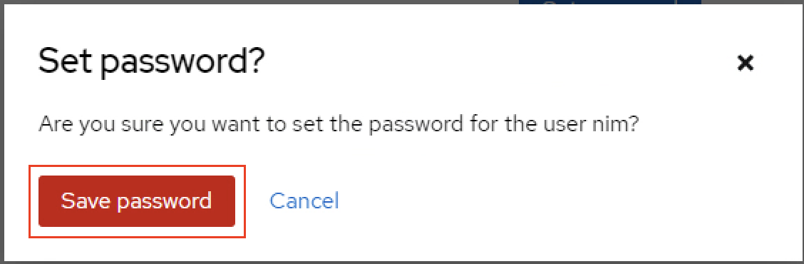

<!--
  SPDX-FileCopyrightText: Copyright (c) 2023 NVIDIA CORPORATION & AFFILIATES. All rights reserved.
  SPDX-License-Identifier: Apache-2.0
-->

# Sample Implementation Details

Service Mesh Tools: Istio-based service mesh for creating a secure, observable, and highly configurable communication layer. OIDC Integration: Using tools like Keycloak, DEX, or other commercial solutions as an OIDC provider.

```{contents}
:depth: 2
:backlinks: none
:local: true
```

## Prerequisites

- A Kubernetes cluster and the cluster-admin role.
  Refer to [](platform-support.md) for information about supported operating systems and Kubernetes platforms.

- A Linux VM/WSL on Windows

## Service Mesh (Istio) Installation

1. Run the below command to download the Istio.

   ```console
   curl https://raw.githubusercontent.com/istio/istio/release-1.23/release/downloadIstioCandidate.sh | sh -
   ```

2. Once you have downloaded, you will see the directory with name as ``istio-1.2x.x``. If the directory name as ``istio-1.23.2`` run the below command enter into Istio directory.

   ```console
   cd istio-1.23.2
   ```

3. Run the below command to add ``istioctl`` to PATH.

   ```console
   export PATH=$PWD/bin:$PATH
   ```

4. Run the below commands for Tanzu Kubernetes Cluster or OpenShift Cluster.
   
   - Create a namespace and apply the label on the Cluster.

      ```console
      kubectl create ns istio-system
      ```

      ```console
      kubectl label --overwrite ns istio-system pod-security.kubernetes.io/warn=privileged  pod-security.kubernetes.io/enforce=privileged
      ```

5. Run the below command to install Istio on your cluster. 

   ```console       
   istioctl install --set profile=demo -y
   ```

6. Run the below command to know the available storage classes on the cluster.

   ```console
   kubectl get storageclass
   ```

7. Once you install Istio, run the below command to update the Storage Class for loki.

    ```console
    sed -i '/accessModes:/i\        storageClassName: <storage-class-name> ' samples/addons/loki.yaml
    ``` 
        
8. Run the below command to install the add-ons like Prometheus, Grafana and Jaeger.

    ```console 
    kubectl rollout status deployment/kiali -n istio-system
    ```

   ```console 
   kubectl rollout status deployment/kiali -n istio-system
   ```

### Inject Istio 

1. Run the below command to enable Istio to namespace, replace the `<namespace>` with your target namespace

   ```console
   kubectl label namespace <namespace> istio-injection=enabled --overwrite
   ```
        

2. Run the below command to delete the existing pods to recreate with Istio sidecar containers, replace the `<namespace>` with your target namespace

   ```console
   kubectl delete pod $(kubectl get pods -n <namespace> | awk '{print $1}') -n rag-sample
   ````
        
## Install OIDC Keycloak

1. Run the below command to update the label to run the privileged pods on default namespace.

    ```console
    kubectl label --overwrite ns default pod-security.kubernetes.io/warn=privileged  pod-security.kubernetes.io/enforce=privileged
    ```

2. Execute the below command to install the KeyCloak on the cluster.

   ```console     
   kubectl create -f https://raw.githubusercontent.com/keycloak/keycloak-quickstarts/latest/kubernetes/keycloak.yaml
   ```

### Configure KeyCloak

1. Run the below command to find the NodePort of keycloak service.

   ```console
   kubectl get svc
   ```       
         
   Example Output:

   ```console
   NAME       TYPE           CLUSTER-IP       EXTERNAL-IP     PORT(S)          AGE
   keycloak   LoadBalancer   10.108.216.157   10.28.234.100   8080:30111/TCP   21h
   ```

2. Run the below command to list the worker IP addresses, use any one of them with above services NodePort.

    ```console
   for node in `kubectl get nodes | awk '{print $1}' | grep -v NAME`; do echo $node ' ' | tr -d '\n'; kubectl describe node $node | grep -i 'internalIP:' | awk '{print $2}'; done 
    ```       

    Example Output:

   ```console
   test-cluster-03-worker-nbhk9-56b4b888dd-8lpqd  10.120.199.16
   test-cluster-03-worker-nbhk9-56b4b888dd-hnrxr  10.120.199.23
   ```


3. Use any of the above worker IP to access the Chat Web Application.

   ```console
   10.120.199.15:30111
   ```

4. Once you have access the application, you can see the page like and click on **Administration Console**.


5. Use the default credentials as admin/admin and sign in. 



6. Once you’ve logged in, create a new **Realm** as shown below.



7. Enter the **Realm Name** as *nvidia-rag-llm* and click on **Create** as shown below.


8. Next you will create Clients, click **Clients** on the Navigation bar and then click on **Create client** as per shown below. 


9. Provide **Client ID** as nvidia-rag-llm and click **Next** with default values for steps 2 and 3.



10. Now navigate to **Realm roles** on the left side pane and click on **Create** role like shown below.



11. Create role with name as chat and save. 	 	



12. Create another role with name as completions and save as shown below.	



13. Navigate to **Users** on left side pane and click on **Add user** as shown below.



14. Create a user with name as *rag* and click on **Create**.


15. Once you have clicked on **Create** you will see multiple tabs for the user and click on **Credentials** and then click on **Set password** to create a *password* for *rag user* as shown below.


16. Enter the password as *nvidia* and turn off the Temporary button as shown below and click on **Save** and confirm and save password. 




17. Now Navigate to **Role Mapping0** tab for *rag user* and click on **Assign Role**.	


18. Enable **chat** and **completion** roles to the *rag user* and click on **Assign** as shown below, 


## Next Steps

- Refer to [Configure RBAC](./configure.md) to create and validate Ingress Objects.
