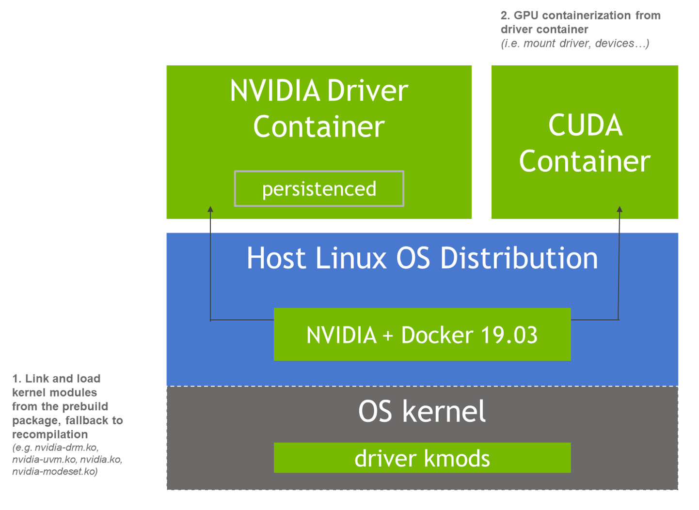
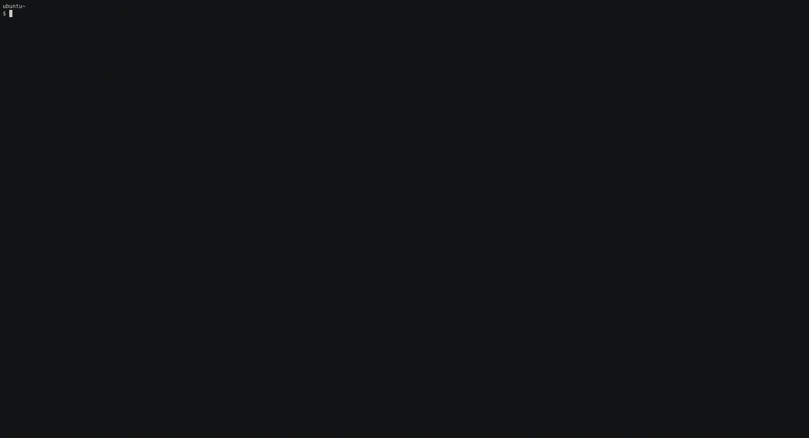

.. Date: Sept 30 2020
.. Author: pramarao

*****************************************
Overview
*****************************************

The NVIDIA GPU driver container allows the provisioning of the `NVIDIA driver <https://www.nvidia.com/Download/index.aspx?lang=en-us>`_ 
through the use of containers. This provides a few benefits over a standard driver installation, for example:

* Ease of deployment
* Fast installation
* Reproducibility

The driver container can be used in standard Linux distributions and container operating system distributions 
such as Red Hat CoreOS, Flatcar Linux or others that have immutable read-only file systems. 

For more details on the internals of the driver container, see this `presentation <https://docs.google.com/presentation/d/1NY4X2K6BMaByfnF9rMEcNq6hS3NtmOKGTfihZ44zfrw/edit?usp=sharing>`_.

----

Pre-requisites
==============

The list of prerequisites for running a driver container is described below:

* Ubuntu 16.04, Ubuntu 18.04 or Centos 7 with the IPMI driver enabled and the Nouveau driver disabled
* NVIDIA GPU with Architecture > Fermi (2.1)
* The `NVIDIA Container Toolkit for Docker <https://docs.nvidia.com/datacenter/cloud-native/container-toolkit/overview.html>`_ configured with the ``root`` option. See below for configuration.
* If you are running Ubuntu 18.04 with an AWS kernel, you also need to enable the ``i2c_core`` kernel module

Configuration
===============

You will need to update the NVIDIA Container Toolkit config file (``/etc/nvidia-container-runtime/config.toml``) so that the ``root`` directive points to the driver container as shown below:

.. code-block:: console

  disable-require = false
  #swarm-resource = "DOCKER_RESOURCE_GPU"

  [nvidia-container-cli]
  root = "/run/nvidia/driver"
  #path = "/usr/bin/nvidia-container-cli"
  environment = []
  #debug = "/var/log/nvidia-container-toolkit.log"
  #ldcache = "/etc/ld.so.cache"
  load-kmods = true
  #no-cgroups = false
  #user = "root:video"
  ldconfig = "@/sbin/ldconfig.real"

  [nvidia-container-runtime]
  #debug = "/var/log/nvidia-container-runtime.log"

Quickstart
===========

Ubuntu 18.04
-------------

Follow the `guide <https://docs.nvidia.com/datacenter/cloud-native/container-toolkit/install-guide.html>`_ to get started with the NVIDIA Container Toolkit for Docker. 

Now modify the configuration to update the ``root`` directive:

.. code-block:: console

  $ sudo sed -i 's/^#root/root/' /etc/nvidia-container-runtime/config.toml

Disable the Nouveau driver modules:

.. code-block:: console

  $ sudo tee /etc/modules-load.d/ipmi.conf <<< "ipmi_msghandler" \
    && sudo tee /etc/modprobe.d/blacklist-nouveau.conf <<< "blacklist nouveau" \
    && sudo tee -a /etc/modprobe.d/blacklist-nouveau.conf <<< "options nouveau modeset=0"

If using an AWS kernel, ensure that the ``i2c_core`` kernel module is enabled:

.. code-block:: console

  $ sudo tee /etc/modules-load.d/ipmi.conf <<< "i2c_core"

Update the ``initramfs``:

.. code-block:: console

  $ sudo update-initramfs -u

Optionally, if the kernel is not up to date

.. code-block:: console
  
  $ sudo apt-get dist-upgrade

Reboot your system (or VM) if required:

.. code-block:: console

  $ sudo reboot

Run the driver container:

.. code-block:: console

  $ sudo docker run --name nvidia-driver -d --privileged --pid=host \ 
    -v /run/nvidia:/run/nvidia:shared \ 
    -v /var/log:/var/log \ 
    --restart=unless-stopped \
    nvidia/driver:450.80.02-ubuntu18.04

Once the driver container is running, try running a GPU container:

.. code-block:: console

  $ sudo docker run --gpus all nvidia/cuda:11.0-base nvidia-smi

Container Images
=================

Driver containers are released for the NVIDIA datacenter driver `releases <https://docs.nvidia.com/datacenter/tesla/index.html>`_.

The following tags are available on both `NVIDIA DockerHub <https://hub.docker.com/r/nvidia/driver/>`_ and `NGC <https://ngc.nvidia.com/containers/nvidia:driver>`_.

Licenses and Contributing
=========================

By downloading and using the driver container, you accept the terms and conditions of these licenses:

* NVIDIA Driver 
  The license for the NVIDIA datacenter drivers is available at this `link <https://www.nvidia.com/content/DriverDownload-March2009/licence.php?lang=us>`_.

Since the underlying images may include components licensed under open-source licenses such as GPL, 
the sources for these components are archived on the CUDA opensource `index <https://developer.download.nvidia.com/compute/cuda/opensource/>`_.

