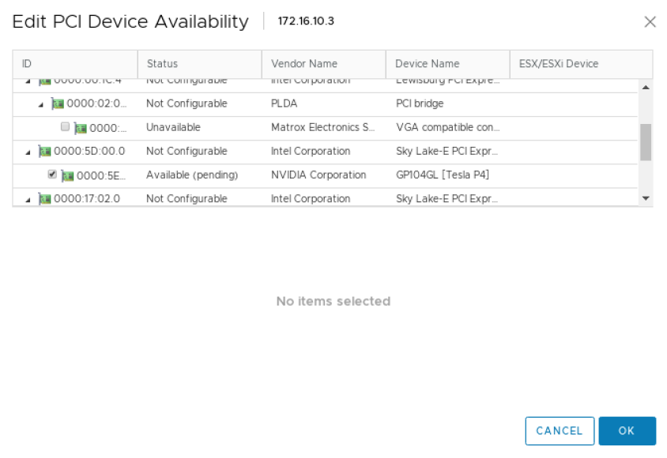
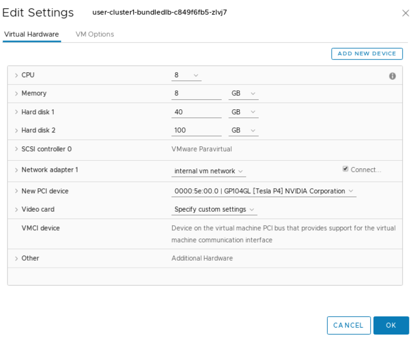
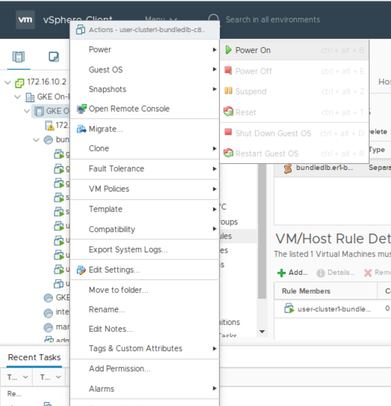

.. Date: November 13 2020
.. Author: pramarao

.. _anthos-guide:

#########################################
NVIDIA GPUs with Google Cloud's Anthos
#########################################

**********
Changelog
**********

* 3/22/2020 (author: PR):
   * Fixed URLs
* 11/30/2020 (author: PR/DF):
   * Added information on Anthos on bare metal
* 11/25/2020 (author: PR): 
   * Migrated docs to new format
* 8/14/2020 (author: PR): 
   * Initial Version

***************
Introduction
***************

Google Cloud's Anthos is a modern application management platform that lets users 
build, deploy, and manage applications anywhere in a secure, consistent manner. 
The platform provides a consistent development and operations experience across 
deployments while reducing operational overhead and improving developer productivity. 
Anthos runs in hybrid and multi-cloud environments that spans `Google Cloud <https://cloud.google.com/kubernetes-engine>`_, 
`on-premise <https://cloud.google.com/anthos/docs/setup/on-premises>`_, and is generally 
available on `Amazon Web Services (AWS) <https://cloud.google.com/anthos/docs/setup/public-cloud>`_. 
Support for Anthos on Microsoft Azure is in preview. For more information on Anthos, 
see the `product overview <https://cloud.google.com/anthos>`_.

Systems with NVIDIA GPUs can be deployed in various configurations for use with Google Cloud's Anthos. 
The purpose of this document is to provide users with steps on getting started with using 
NVIDIA GPUs with Anthos in these various configurations. 

***************************
Deployment Configurations
***************************

Anthos can be deployed in different configurations. Depending on your deployment, choose one of the sections below 
to get started with NVIDIA GPUs in Google Cloud's Anthos:

#. :ref:`Anthos Clusters on Bare Metal with NVIDIA DGX Systems and GPU-Accelerated Servers<anthos-dgx-bm>`
#. :ref:`Anthos Clusters with VMware and NVIDIA GPU-Accelerated Servers<anthos-virt>`

*********************
Supported Platforms
*********************

GPUs
=====

The following GPUs are supported:

* NVIDIA A100, T4 and V100

DGX Systems
============

The following NVIDIA DGX systems are supported:

* NVIDIA DGX A100
* NVIDIA DGX-2 and DGX-1 (Volta)

Linux Distributions
=====================

The following Linux distributions are supported:

* Ubuntu 18.04.z, 20.04.z LTS

For more information on the Anthos Ready platforms, visit this `page <https://cloud.google.com/anthos/docs/resources/partner-platforms#nvidia>`_.

*****************
Getting Support
*****************

For support issues related to using GPUs with Anthos, please `open a ticket <https://github.com/NVIDIA/gpu-operator/issues/new>`_ 
on the NVIDIA GPU Operator GitHub project. Your feedback is appreciated. 

DGX customers can visit the `NVIDIA DGX Systems Support Portal <https://www.nvidia.com/en-us/data-center/dgx-systems/support/>`_.

.. _anthos-dgx-bm:

***********************************************************************************
Anthos Clusters on Bare Metal with NVIDIA DGX Systems and GPU-Accelerated Servers
***********************************************************************************

Anthos on bare metal with DGX A100 or NVIDIA GPU-accelerated servers systems enables a consistent development and operational experience across deployments, 
while reducing expensive overhead and improving developer productivity. Refer to the Anthos `documentation <https://cloud.google.com/anthos/gke/docs>`_ for 
more information on Anthos cluster environments.

Installation Flow
===================

The basic steps described in this document follows this workflow:

#. Configure nodes

   * Ensure each node (including the control plane) meets the pre-requisites, including time synchronization, correct versions of Docker and other conditions.

#. Configure networking (Optional)

   * Ensure network connectivity between control plane and nodes - ideally the VIPs, control plane and the nodes in the cluster are in the same network subnet.

#. Configure an admin workstation and set up Anthos to create the cluster

   * Set up the cluster using Anthos on bare-metal 

#. Setup NVIDIA software on GPU nodes

   * Set up the NVIDIA software components on the GPU nodes to ensure that your cluster can run CUDA applications.

At the end of the installation flow, you should have a user cluster with GPU-enabled nodes that you can use to deploy applications.

Configure Nodes
================

These steps are required on each node in the cluster (including the control plane). 

Time Synchronization
----------------------

* Ensure ``apparmor`` is stopped:

   .. code-block:: console

      $ apt-get install -y apparmor-utils policycoreutils

   .. code-block:: console

      $ systemctl --now enable apparmor \
         && systemctl stop apparmor

* Synchronize the time on each node:

   * Check the current time
   
      .. code-block:: console

         $ timedatectl

      .. code-block:: console

                        Local time: Fri 2020-11-20 10:38:06 PST
                    Universal time: Fri 2020-11-20 18:38:06 UTC
                          RTC time: Fri 2020-11-20 18:38:08
                         Time zone: US/Pacific (PST, -0800)
         System clock synchronized: no
                       NTP service: active
                   RTC in local TZ: no      

   * Configure the NTP server in ``/etc/systemd/timesyncd.conf``:

      .. code-block:: console

         NTP=time.google.com
   
   * Adjust the system clock:
   
      .. code-block:: console
      
         $ timedatectl set-local-rtc 0 --adjust-system-clock

   * Restart the service

      .. code-block:: console

         $ systemctl restart systemd-timesyncd.service

   * Verify the synchronization with the time server

      .. code-block:: console

         $ timedatectl

      .. code-block:: console

                        Local time: Fri 2020-11-20 11:03:22 PST
                    Universal time: Fri 2020-11-20 19:03:22 UTC
                          RTC time: Fri 2020-11-20 19:03:22
                         Time zone: US/Pacific (PST, -0800)
         System clock synchronized: yes
                       NTP service: active
                   RTC in local TZ: no 

Test Network Connectivity
---------------------------

* Ensure you can ``nslookup`` on *hostname*

   .. code-block:: console

      $ systemctl restart systemd-resolved \
         && ping us.archive.ubuntu.com

   .. code-block:: console
   
      ping: us.archive.ubuntu.com: Temporary failure in name resolution

* Check the nameserver in ``resolve.conf``

   .. code-block:: console

      $ cat <<EOF > /etc/resolv.conf
      nameserver 8.8.8.8
      EOF

* And re-test ``ping``

   .. code-block:: console

      $ ping us.archive.ubuntu.com

      PING us.archive.ubuntu.com (91.189.91.38) 56(84) bytes of data.
      64 bytes from banjo.canonical.com (91.189.91.38): icmp_seq=1 ttl=49 time=73.4 ms
      64 bytes from banjo.canonical.com (91.189.91.38): icmp_seq=2 ttl=49 time=73.3 ms
      64 bytes from banjo.canonical.com (91.189.91.38): icmp_seq=3 ttl=49 time=73.4 ms

Install Docker
----------------

Follow these steps to install Docker. On DGX systems, Docker may already be installed using the ``docker-ce`` package. 
In this case, use ``docker.io`` as the base installation package for Docker to ensure a successful cluster setup with 
Anthos. 

* Stop services using docker:

   .. code-block:: console

      $ systemctl stop kubelet \
         && systemctl stop docker \
         && systemctl stop containerd \
         && systemctl stop containerd.io

* Purge the existing packages of Docker and ``nvidia-docker2`` if any:

   .. code-block:: console

      $ systemctl stop run-docker-netns-default.mount \
         && systemctl stop docker.haproxy

   .. code-block:: console

      $ dpkg -r nv-docker-options \
         && dpkg --purge nv-docker-options \
         && dpkg -r nvidia-docker2 \
         && dpkg --purge nvidia-docker2 \
         && dpkg -r docker-ce \
         && dpkg --purge docker-ce \
         && dpkg -r docker-ce-cli \
         && dpkg -r containerd \
         && dpkg --purge containerd \
         && dpkg -r containerd.io \
         && dpkg --purge

* Re-install Docker

   .. code-block:: console

      $ apt-get update \
         && apt-get install -y apt-transport-https \
            ca-certificates \
            curl \
            software-properties-common \
            inetutils-traceroute \
            conntrack
   
   .. code-block:: console

      $ curl -fsSL https://download.docker.com/linux/ubuntu/gpg | apt-key add -

   .. code-block:: console

      $ add-apt-repository \
         "deb [arch=amd64] https://download.docker.com/linux/ubuntu \
         $(lsb_release -cs) stable"

   .. code-block:: console

      $ apt-get update \
         && apt-get install -y docker.io

   .. code-block:: console

      $ systemctl --now enable docker

Install ``nvidia-docker2`` on GPU Nodes
^^^^^^^^^^^^^^^^^^^^^^^^^^^^^^^^^^^^^^^^^

.. note::

   This step should be performed on the GPU nodes only

For DGX systems, re-install ``nvidia-docker2`` from the DGX repositories: 

.. code-block:: console

   $ apt-get install -y nvidia-docker2

Since Kubernetes does not support the ``--gpus`` option with Docker yet, the ``nvidia`` runtime should 
be setup as the default container runtime for Docker on the GPU node. This can be done by adding the 
``default-runtime`` line into the Docker daemon config file, which is usually located on the system 
at ``/etc/docker/daemon.json``:

.. code-block:: console

   {
      "default-runtime": "nvidia",
      "runtimes": {
           "nvidia": {
               "path": "/usr/bin/nvidia-container-runtime",
               "runtimeArgs": []
         }
      }
   }

Restart the Docker daemon to complete the installation after setting the default runtime:

.. code-block:: console

   $ sudo systemctl restart docker

For non-DGX systems, refer to the NVIDIA Container Toolkit `installation guide <https://docs.nvidia.com/datacenter/cloud-native/container-toolkit/install-guide.html#docker>`_ 
to setup ``nvidia-docker2``.

Configure Networking (Optional)
=================================

.. note::

   The following steps are provided as a reference for configuring the network so that the control plane and the 
   nodes are on the same subnet by using tunnels and DNAT. If the nodes in your cluster are on the same subnet, 
   then you may skip this step. 

   In the example below:

   * The control plane is at ``10.117.29.41``
   * The GPU node or admin workstation is at ``10.110.20.149``
   * The control plane VIP is ``10.0.0.8``

   If the machines are on a different subnet than each other or the control plane VIP then tunnel routes 
   can be used to establish connectivity.

   There are two scenarios to consider:

   #. If the machines are on the same subnet, but the VIP is on a different subnet, then add the correct 
      IP route (using ``ip route add 10.0.0.8 via <contro-plane-ip>`` from the GPU node or admin-workstation
   
   #. If the machines and VIP are on different subnets, then a tunnel is also needed to enable the above 
      route command to succeed where ``<control-plane-ip>`` is the control plane tunnel ``192.168.210.1``.

Control Plane
---------------

Setup tunneling:

.. code-block:: console

   $ ip tunnel add tun0 mode ipip local 10.117.29.41 remote 10.110.20.149

.. code-block:: console

   $ ip addr add 192.168.200.1/24 dev tun0

.. code-block:: console

   $ ip link set tun0 up

Update DNAT to support the control plane VIP over the tunnel:

.. code-block:: console

   $ iptables -t nat -I PREROUTING  -p udp -d 192.168.210.1  --dport 6081 -j DNAT --to-destination 10.117.29.41

.. comment out this part 
.. .. code-block:: console
..
..   $ iptables -t nat -I PREROUTING  -p tcp -d 192.168.210.1  --dport 9990 -j DNAT --to-destination 10.117.29.41
..
.. .. code-block:: console
..
..   $ iptables -t nat -I PREROUTING  -p tcp -d 192.168.210.1  --dport 443 -j DNAT --to-destination 10.0.0.8:6443

GPU Node or Admin Workstation
--------------------------------

Establish connectivity with the control plane:

.. code-block:: console

   $ ip tunnel add tun1 mode ipip local 10.110.20.149  remote 10.117.29.41

.. code-block:: console

   $ ip addr add 192.168.210.2/24 dev tun1

.. code-block:: console

   $ ip link set tun1 up 

.. code-block:: console

   $ ip route add 10.0.0.8/32 via 192.168.210.1

.. comment out this part
.. If you have a firewall that disables outgoing traffic, open traffic for the ports below:
..
.. .. code-block:: console
..
..   $ ip tunnel add tun3 mode ipip local 10.110.20.149  remote 10.117.29.98 
..
.. .. code-block:: console
..
..   $ ip addr add 192.168.220.2/24 dev tun3
..
.. .. code-block:: console
..   
..   $ ip link set tun3 up 

Setup DNAT:

.. code-block:: console

   $ iptables -t nat -I OUTPUT -p udp -d 10.117.29.41  --dport 6081 -j DNAT --to-destination 192.168.210.1 

.. comment out this part
.. .. code-block:: console
..
..   $ iptables -t nat -I OUTPUT -p tcp -d 10.117.29.41  --dport 9990 -j DNAT --to-destination 192.168.210.1 
..
.. .. code-block:: console
..
..   $ iptables -t nat -I OUTPUT -p udp -d 10.117.29.98  --dport 6081 -j DNAT --to-destination 192.168.220.1 
..
.. .. code-block:: console
..
..   $ iptables -t nat -I OUTPUT -p tcp -d 10.96.0.1 -j DNAT --to-destination 192.168.210.1
..
.. .. code-block:: console
..
..   $ iptables -t nat -I POSTROUTING -o tun1 -j MASQUERADE
..
.. .. code-block:: console
..
..   $ iptables -t nat -I POSTROUTING -o tun3 -j MASQUERADE

Configure Admin Workstation
=============================

Configure the admin workstation prior to setting up the cluster. 

Download the Google Cloud SDK:

.. code-block:: console

   $ wget https://dl.google.com/dl/cloudsdk/channels/rapid/downloads/google-cloud-sdk-314.0.0-linux-x86_64.tar.gz \
      && tar -xf google-cloud-sdk-314.0.0-linux-x86_64.tar.gz 

.. code-block:: console

   $ google-cloud-sdk/install.sh

Install the Anthos authentication components:

   $ gcloud components install anthos-auth

See the `Anthos installtion overview <https://cloud.google.com/anthos/gke/docs/on-prem/how-to/install-overview-basic>`_ 
for detailed instructions for installing Anthos in an on-premise environment and setup your cluster. 

Setup NVIDIA Software on GPU Nodes
====================================

Once the Anthos cluster has been set up, you can proceed to deploy the NVIDIA software components on the GPU nodes.

NVIDIA Drivers 
---------------

.. note:: 

   DGX systems include the NVIDIA drivers. This step can be skipped.

For complete instructions on setting up NVIDIA drivers, visit the quickstart 
guide at https://docs.nvidia.com/datacenter/tesla/tesla-installation-notes/index.html.
The guide covers a number of pre-installation requirements and steps on supported Linux 
distributions for a successful install of the driver. 

NVIDIA Device Plugin
----------------------

To use GPUs in Kubernetes, the `NVIDIA Device Plugin <https://github.com/NVIDIA/k8s-device-plugin/>`_ is required. 
The NVIDIA Device Plugin is a daemonset that automatically enumerates the number of GPUs on each node of the cluster 
and allows pods to be run on GPUs.

The preferred method to deploy the device plugin is as a daemonset using ``helm``. 

Add the ``nvidia-device-plugin`` ``helm`` repository:

.. code-block:: console

   $ helm repo add nvdp https://nvidia.github.io/k8s-device-plugin \
      && helm repo update

Deploy the device plugin:

.. code-block:: console

   $ helm install --generate-name nvdp/nvidia-device-plugin

For more user configurable options while deploying the daemonset, refer to the device plugin 
`README <https://github.com/NVIDIA/k8s-device-plugin/#deployment-via-helm>`_ 

Node Feature Discovery
-----------------------

For detecting the hardware configuration and system configuration, we will deploy the `Node Feature Discovery <https://github.com/kubernetes-sigs/node-feature-discovery>`_ 
add-on:

.. code-block:: console

   $ kubectl apply -f https://raw.githubusercontent.com/kubernetes-sigs/node-feature-discovery/v0.6.0/nfd-master.yaml.template

.. code-block:: console

   $ kubectl apply -f https://raw.githubusercontent.com/kubernetes-sigs/node-feature-discovery/v0.6.0/nfd-worker-daemonset.yaml.template

See the `NFD documentation <https://kubernetes-sigs.github.io/node-feature-discovery>`_ for more information on NFD.

.. _anthos-virt: 

****************************************************************
Anthos Clusters with VMware and NVIDIA GPU Accelerated Servers
****************************************************************

Anthos running on-premise has requirements for which vSphere versions are supported along with network and storage requirements. 
Please see the Anthos version compatibility matrix for more information: 
`https://cloud.google.com/anthos/gke/docs/on-prem/versioning-and-upgrades#version_compatibility_matrix <https://cloud.google.com/anthos/gke/docs/on-prem/versioning-and-upgrades#version_compatibility_matrix.>`_.

This guide assumes that the user already has an installed Anthos on-premise cluster in a vSphere environment. Please see 
`https://cloud.google.com/anthos/gke/docs/on-prem/how-to/install-overview-basic <https://cloud.google.com/anthos/gke/docs/on-prem/how-to/install-overview-basic>`_ 
for detailed instructions for installing Anthos in an on-premise environment.

Kubernetes provides access to special hardware resources such as NVIDIA GPUs, NICs, 
Infiniband adapters and other devices through the `device plugin framework <https://kubernetes.io/docs/concepts/extend-kubernetes/compute-storage-net/device-plugins/>`_. 
However, configuring and managing nodes with these hardware resources requires 
configuration of multiple software components such as drivers, container runtimes 
or other libraries which are difficult and prone to errors. The `NVIDIA GPU Operator <https://github.com/NVIDIA/gpu-operator>`_
uses the operator framework within Kubernetes to automate the management of all NVIDIA 
software components needed to provision GPUs.

In the VMware vSphere configuration, Anthos uses the NVIDIA GPU Operator to configure GPU nodes in the Kubernetes cluster 
so that the nodes can be used to schedule CUDA applications. The GPU Operator itself is 
deployed using Helm. The rest of this section provides users with steps on getting 
started.

Configuring PCIe Passthrough
==============================

For the GPU to be accessible to the VM, first you must enable `PCI Passthrough <https://kb.vmware.com/s/article/1010789>`_ 
on the ESXi host. This can be done from the vSphere client. This will require a reboot 
of the ESXi host to complete the process and therefore the host should be put into 
maintenance mode and any VMs running on the ESXi host evacuated to another. 
If you only have a single ESXi host, then the VMs will need to be restarted after the reboot.

From the vSphere client, select an ESXi host from the Inventory of VMware vSphere Client. 
In the Configure tab, click Hardware > PCI Devices. This will show you the 
passthrough-enabled devices (you will most likely find none at this time).

.. image:: graphics/anthos/virt/image01.png
   :width: 800

Click CONFIGURE PASSTHROUGH to launch the Edit PCI Device Availability window. Look for the GPU device and 
select the checkbox next to it (the GPU device will be recognizable as having NVIDIA Corporation in the Vendor Name view). 
Select the GPU devices (you may have more than one) and click OK.

At this point, the GPU(s) will appear as Available (pending). You will need to select Reboot This Host and complete the reboot before proceeding to the next step.

.. image:: graphics/anthos/virt/image03.png
   :width: 800

It is a VMware best practice to reboot an ESXi host only when it is in maintenance mode and after all the VMs have been migrated to other hosts. 
If you have only 1 ESXi host, then you can reboot without migrating the VMs, though shutting them down gracefully first is always a good idea.

.. image:: graphics/anthos/virt/image04.png
   :width: 400

Once the server has rebooted. Make sure to remove maintenance mode (if it was used) or restart the VMs that needed to be stopped (when only a single ESXi host is used).

Adding GPUs to a Node
=======================

Creating a Node Pool for the GPU Node
---------------------------------------

.. note::
   This is an optional step.

Node Pools are a good way to specify pools of Kubernetes worker nodes which may have different or unique attributes. In this case, we have the opportunity to 
create a node pool which contains workers that manually have a GPU assigned to it. See `here <https://cloud.google.com/anthos/gke/docs/on-prem/how-to/managing-node-pools?hl=en>`_ 
for more information regarding node pools with Anthos on-premise.

First, edit your user cluster config.yaml file on the admin workstation and add an additional node pool:

.. code-block:: console

   - name: user-cluster1-gpu
     cpus: 4
     memoryMB: 8192
     replicas: 1
     labels:
       hardware: gpu

After adding the node pool to your configuration, use the ``gkectl`` update command push the change:

.. code-block:: console

   $ gkectl update cluster --kubeconfig [ADMIN_CLUSTER_KUBECONFIG] \
      --config [USER_CLUSTER_KUBECONFIG]

.. code-block:: console

   Reading config with version "v1"
   Update summary for cluster user-cluster1-bundledlb:
      Node pool(s) to be created: [user-cluster1-gpu]
   Do you want to continue? [Y/n]: Y
   Updating cluster "user-cluster1-bundledlb"...
   Creating node MachineDeployment(s) in user cluster...  DONE
   Done updating the user cluster

Add GPUs to Nodes in vSphere
-------------------------------

Select an existing user-cluster node to add a GPU to (if you created a node pool 
with the previous step then you would choose a node from that pool). Make sure that 
this VM is on the host with the GPU (if you have vMotion enabled this could be as 
simple as right clicking on the VM and selecting **Migrate**).

To configure a PCI device on a virtual machine, from the Inventory in vSphere Client, 
right-click the virtual machine and select **Power->Power Off**.

.. image:: graphics/anthos/virt/image05.png
   :width: 800

After the VM is powered off, right-click the virtual machine and click **Edit Settings**.

.. image:: graphics/anthos/virt/image06.png
   :width: 400

Within the Edit Settings window, click **ADD NEW DEVICE**.

.. image:: graphics/anthos/virt/image07.png
   :width: 800

Choose PCI Device from the dropdown.

.. image:: graphics/anthos/virt/image08.png
   :width: 400

You may need to select the GPU or if it’s the only device available it may be automatically 
selected for you. If you don’t see the GPU, it’s possible your VM is not currently on the 
ESXi host with the passthrough device configured.

Expand the **Memory** section and make sure to select the option for Reserve all **Guest Memory (All locked)**.

.. image:: graphics/anthos/virt/image10.png
   :width: 800

Click **OK**.

Before the VM can be started, the VM/Host Rule for VM anti-affinity must be deleted. 
(Note that this step may not be necessary if your cluster’s ``config.yaml`` contains ``antiAffinityGroups.enabled: False``). 
From the vSphere Inventory list, click on the cluster then the **Configure** tab and then 
under **Configuration** select **VM/Host Rules**. Select the rule containing your node and delete it.

.. image:: graphics/anthos/virt/image11.png
   :width: 800

Now you can power on the VM, right click on the VM and select **Power>Power On**.

If vSphere presents you with **Power On Recommendations** then select **OK**.

.. image:: graphics/anthos/virt/image13.png
   :width: 800

The following steps should be performed from your Admin Workstation or other Linux system which has the ability to use ``kubectl`` to work with the cluster.

.. Shared content for setting up the Operator

.. include:: ../gpu-operator/install-gpu-operator.rst

Running GPU Applications
==========================

Jupyter Notebooks
-------------------

This section of the guide walks through how to run a sample Jupyter notebook on the Kubernetes cluster.

#. Create a yaml file for the pod and service for the notebook:

   .. code-block:: console

      $ LOADBALANCERIP=<ip address to be used to expose the service>

   .. code-block:: console

      $ cat << EOF | kubectl create -f -
      apiVersion: v1
      kind: Service
      metadata:
        name: tf-notebook
        labels:
          app: tf-notebook
      spec:
        type: LoadBalancer
        loadBalancerIP: $LOADBALANCERIP
        ports:
        - port: 80
          name: http
          targetPort: 8888
          nodePort: 30001
        selector:
          app: tf-notebook
      ---
      apiVersion: v1
      kind: Pod
      metadata:
        name: tf-notebook
        labels:
          app: tf-notebook
      spec:
        securityContext:
          fsGroup: 0
        containers:
        - name: tf-notebook
          image: tensorflow/tensorflow:latest-gpu-jupyter
          resources:
            limits:
              nvidia.com/gpu: 1
          ports:
          - containerPort: 8888
            name: notebook
      EOF

#. View the logs of the tf-notebook pod to obtain the token:

   .. code-block:: console

      $ kubectl logs tf-notebook

   .. code-block:: console

      [I 19:07:43.061 NotebookApp] Writing notebook server cookie secret to /root/.local/share/jupyter/runtime/notebook_cookie_secret
      [I 19:07:43.423 NotebookApp] Serving notebooks from local directory: /tf
      [I 19:07:43.423 NotebookApp] The Jupyter Notebook is running at:
      [I 19:07:43.423 NotebookApp] http://tf-notebook:8888/?token=fc5d8b9d6f29d5ddad62e8c731f83fc8e90a2d817588d772
      [I 19:07:43.423 NotebookApp]  or http://127.0.0.1:8888/?token=fc5d8b9d6f29d5ddad62e8c731f83fc8e90a2d817588d772
      [I 19:07:43.423 NotebookApp] Use Control-C to stop this server and shut down all kernels (twice to skip confirmation).
      [C 19:07:43.429 NotebookApp] 
         
         To access the notebook, open this file in a browser:
            file:///root/.local/share/jupyter/runtime/nbserver-1-open.html
         Or copy and paste one of these URLs:
            http://tf-notebook:8888/?token=fc5d8b9d6f29d5ddad62e8c731f83fc8e90a2d817588d772
         or http://127.0.0.1:8888/?token=fc5d8b9d6f29d5ddad62e8c731f83fc8e90a2d817588d772
      [I 19:08:24.180 NotebookApp] 302 GET / (172.16.20.30) 0.61ms
      [I 19:08:24.182 NotebookApp] 302 GET /tree? (172.16.20.30) 0.57ms

#. From a web browser, navigate to ``http://<LOADBALANCERIP>`` and enter the token where prompted to login: 
   Depending on your environment you may not have web browser access to the exposed service. You may be able to use 
   `SSH Port Forwarding/Tunneling <https://www.ssh.com/ssh/tunneling/example>`_ to achieve this.

   .. image:: graphics/anthos/virt/image14.png
      :width: 800

#. Once logged in, navigate click on the tenserflow-tutorials folder and then on the first file, **classification.ipynb**:

   .. image:: graphics/anthos/virt/image15.png
      :width: 800

#. This will launch a new tab with the Notebook loaded. You can now run through the Notebook by clicking on the **Run** 
   button. The notebook will step through each section and execute the code as you go. Continue pressing **Run** until you 
   reach the end of the notebook and observe the execution of the classification program.

   .. image:: graphics/anthos/virt/image16.png
      :width: 800

#. Once the notebook is complete you can check the logs of the ``tf-notebook`` pod to confirm it was using the GPU:

   .. code-block:: console

      =========snip===============
      [I 19:17:58.116 NotebookApp] Saving file at /tensorflow-tutorials/classification.ipynb
      2020-05-21 19:21:01.422482: I tensorflow/stream_executor/platform/default/dso_loader.cc:44] Successfully opened dynamic library libcuda.so.1
      2020-05-21 19:21:01.436767: I tensorflow/stream_executor/cuda/cuda_gpu_executor.cc:981] successful NUMA node read from SysFS had negative value (-1), but there must be at least one NUMA node, so returning NUMA node zero
      2020-05-21 19:21:01.437469: I tensorflow/core/common_runtime/gpu/gpu_device.cc:1561] Found device 0 with properties: 
      pciBusID: 0000:13:00.0 name: Tesla P4 computeCapability: 6.1
      coreClock: 1.1135GHz coreCount: 20 deviceMemorySize: 7.43GiB deviceMemoryBandwidth: 178.99GiB/s
      2020-05-21 19:21:01.438477: I tensorflow/stream_executor/platform/default/dso_loader.cc:44] Successfully opened dynamic library libcudart.so.10.1
      2020-05-21 19:21:01.462370: I tensorflow/stream_executor/platform/default/dso_loader.cc:44] Successfully opened dynamic library libcublas.so.10
      2020-05-21 19:21:01.475269: I tensorflow/stream_executor/platform/default/dso_loader.cc:44] Successfully opened dynamic library libcufft.so.10
      2020-05-21 19:21:01.478104: I tensorflow/stream_executor/platform/default/dso_loader.cc:44] Successfully opened dynamic library libcurand.so.10
      2020-05-21 19:21:01.501057: I tensorflow/stream_executor/platform/default/dso_loader.cc:44] Successfully opened dynamic library libcusolver.so.10
      2020-05-21 19:21:01.503901: I tensorflow/stream_executor/platform/default/dso_loader.cc:44] Successfully opened dynamic library libcusparse.so.10
      2020-05-21 19:21:01.544763: I tensorflow/stream_executor/platform/default/dso_loader.cc:44] Successfully opened dynamic library libcudnn.so.7
      2020-05-21 19:21:01.545022: I tensorflow/stream_executor/cuda/cuda_gpu_executor.cc:981] successful NUMA node read from SysFS had negative value (-1), but there must be at least one NUMA node, so returning NUMA node zero
      2020-05-21 19:21:01.545746: I tensorflow/stream_executor/cuda/cuda_gpu_executor.cc:981] successful NUMA node read from SysFS had negative value (-1), but there must be at least one NUMA node, so returning NUMA node zero
      2020-05-21 19:21:01.546356: I tensorflow/core/common_runtime/gpu/gpu_device.cc:1703] Adding visible gpu devices: 0
      2020-05-21 19:21:01.546705: I tensorflow/core/platform/cpu_feature_guard.cc:143] Your CPU supports instructions that this TensorFlow binary was not compiled to use: AVX2 AVX512F FMA
      2020-05-21 19:21:01.558283: I tensorflow/core/platform/profile_utils/cpu_utils.cc:102] CPU Frequency: 2194840000 Hz
      2020-05-21 19:21:01.558919: I tensorflow/compiler/xla/service/service.cc:168] XLA service 0x7f6f2c000b20 initialized for platform Host (this does not guarantee that XLA will be used). Devices:
      2020-05-21 19:21:01.558982: I tensorflow/compiler/xla/service/service.cc:176]   StreamExecutor device (0): Host, Default Version
      2020-05-21 19:21:01.645786: I tensorflow/stream_executor/cuda/cuda_gpu_executor.cc:981] successful NUMA node read from SysFS had negative value (-1), but there must be at least one NUMA node, so returning NUMA node zero
      2020-05-21 19:21:01.646387: I tensorflow/compiler/xla/service/service.cc:168] XLA service 0x53ab350 initialized for platform CUDA (this does not guarantee that XLA will be used). Devices:
      2020-05-21 19:21:01.646430: I tensorflow/compiler/xla/service/service.cc:176]   StreamExecutor device (0): Tesla P4, Compute Capability 6.1
      2020-05-21 19:21:01.647005: I tensorflow/stream_executor/cuda/cuda_gpu_executor.cc:981] successful NUMA node read from SysFS had negative value (-1), but there must be at least one NUMA node, so returning NUMA node zero
      2020-05-21 19:21:01.647444: I tensorflow/core/common_runtime/gpu/gpu_device.cc:1561] Found device 0 with properties: 
      pciBusID: 0000:13:00.0 name: Tesla P4 computeCapability: 6.1
      coreClock: 1.1135GHz coreCount: 20 deviceMemorySize: 7.43GiB deviceMemoryBandwidth: 178.99GiB/s
      2020-05-21 19:21:01.647523: I tensorflow/stream_executor/platform/default/dso_loader.cc:44] Successfully opened dynamic library libcudart.so.10.1
      2020-05-21 19:21:01.647570: I tensorflow/stream_executor/platform/default/dso_loader.cc:44] Successfully opened dynamic library libcublas.so.10
      2020-05-21 19:21:01.647611: I tensorflow/stream_executor/platform/default/dso_loader.cc:44] Successfully opened dynamic library libcufft.so.10
      2020-05-21 19:21:01.647647: I tensorflow/stream_executor/platform/default/dso_loader.cc:44] Successfully opened dynamic library libcurand.so.10
      2020-05-21 19:21:01.647683: I tensorflow/stream_executor/platform/default/dso_loader.cc:44] Successfully opened dynamic library libcusolver.so.10
      2020-05-21 19:21:01.647722: I tensorflow/stream_executor/platform/default/dso_loader.cc:44] Successfully opened dynamic library libcusparse.so.10
      2020-05-21 19:21:01.647758: I tensorflow/stream_executor/platform/default/dso_loader.cc:44] Successfully opened dynamic library libcudnn.so.7
      2020-05-21 19:21:01.647847: I tensorflow/stream_executor/cuda/cuda_gpu_executor.cc:981] successful NUMA node read from SysFS had negative value (-1), but there must be at least one NUMA node, so returning NUMA node zero
      2020-05-21 19:21:01.648311: I tensorflow/stream_executor/cuda/cuda_gpu_executor.cc:981] successful NUMA node read from SysFS had negative value (-1), but there must be at least one NUMA node, so returning NUMA node zero
      2020-05-21 19:21:01.648720: I tensorflow/core/common_runtime/gpu/gpu_device.cc:1703] Adding visible gpu devices: 0
      2020-05-21 19:21:01.649158: I tensorflow/stream_executor/platform/default/dso_loader.cc:44] Successfully opened dynamic library libcudart.so.10.1
      2020-05-21 19:21:01.650302: I tensorflow/core/common_runtime/gpu/gpu_device.cc:1102] Device interconnect StreamExecutor with strength 1 edge matrix:
      2020-05-21 19:21:01.650362: I tensorflow/core/common_runtime/gpu/gpu_device.cc:1108]      0 
      2020-05-21 19:21:01.650392: I tensorflow/core/common_runtime/gpu/gpu_device.cc:1121] 0:   N 
      2020-05-21 19:21:01.650860: I tensorflow/stream_executor/cuda/cuda_gpu_executor.cc:981] successful NUMA node read from SysFS had negative value (-1), but there must be at least one NUMA node, so returning NUMA node zero
      2020-05-21 19:21:01.651341: I tensorflow/stream_executor/cuda/cuda_gpu_executor.cc:981] successful NUMA node read from SysFS had negative value (-1), but there must be at least one NUMA node, so returning NUMA node zero
      2020-05-21 19:21:01.651773: I tensorflow/core/common_runtime/gpu/gpu_device.cc:1247] Created TensorFlow device (/job:localhost/replica:0/task:0/device:GPU:0 with 7048 MB memory) -> physical GPU (device: 0, name: Tesla P4, pci bus id: 0000:13:00.0, compute capability: 6.1)
      2020-05-21 19:21:03.601093: I tensorflow/stream_executor/platform/default/dso_loader.cc:44] Successfully opened dynamic library libcublas.so.10
      [I 19:21:58.132 NotebookApp] Saving file at /tensorflow-tutorials/classification.ipynb
 
Uninstall and Cleanup
=======================

You can remove the ``tf-notebook`` and service with the following commands:

.. code-block:: console

   $ kubectl delete pod tf-notebook

.. code-block:: console

   $ kubectl delete svc tf-notebook

You can remove the GPU operator with the command:

.. code-block:: console

   $ helm uninstall $(helm list | grep gpu-operator | awk '{print $1}')

.. code-block:: console

   release "gpu-operator-1590086955" uninstalled

You can now stop the VM, remove the PCI device, remove the memory reservation, and restart the VM.

You do not need to remove the PCI passthrough device from the host.

Known Issues
==============

This section outlines some known issues with using Google Cloud's Anthos with NVIDIA GPUs.

#. Attaching a GPU to a Anthos on-prem worker node requires manually editing the VM from vSphere. 
   These changes will not survive an Anthos on-prem upgrade process. When the node with the GPU is 
   deleted as part of the update process, the new VM replacing it will not have the GPU added. 
   The GPU must be added back to a new VM manually again. While the NVIDIA GPU seems to be able to 
   handle that event gracefully, the workload backed by the GPU may need to be initiated again manually.

#. Attaching a VM to the GPU means that the VM can no longer be migrated to another ESXi host. The VM 
   will essentially be pinned to the ESXi host which hosts the GPU. vMotion and VMware HA features cannot be used.

#. VMs that use a PCI Passthrough device require that their full memory allocation be locked. This will cause a 
   **Virtual machine memory usage** alarm on the VM which can safely be ignored.

   .. image:: graphics/anthos/virt/image17.png
      :width: 800
