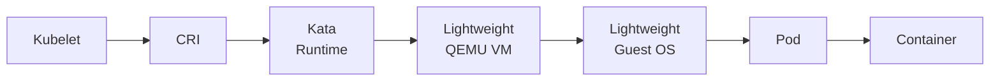

<!-- SPDX-FileCopyrightText: Copyright (c) 2026 NVIDIA CORPORATION & AFFILIATES. All rights reserved. -->
<!-- SPDX-License-Identifier: Apache-2.0 -->

# Deploy with Kata Containers

## About the Operator with Kata Containers

[Kata Containers](https://katacontainers.io/) is an open source project that creates lightweight Virtual Machines (VMs) that feel and perform like traditional containers such as a Docker container.
A traditional container packages software for user-space isolation from the host,
but the container runs on the host and shares the operating system kernel with the host.
Sharing the operating system kernel is a potential vulnerability.

A Kata container runs in a virtual machine on the host.
The virtual machine has a separate operating system and operating system kernel.
Hardware virtualization and a separate kernel provide improved workload isolation
in comparison with traditional containers.

The NVIDIA GPU Operator works with the Kata container runtime.
Kata uses a hypervisor, such as QEMU, to provide a lightweight virtual machine with a single purpose: to run a Kubernetes pod.

The following diagram shows the software components that Kubernetes uses to run a Kata container.



**Tip:**

This page describes deploying with Kata containers only.
Refer to the Confidential Containers documentation if you are interested in deploying Confidential Containers with Kata Containers and the GPU Operator.

## Step 1: Benefits of Using Kata Containers

The primary benefits of Kata Containers are as follows:

* Running untrusted workloads in a container.
  The virtual machine provides a layer of defense against the untrusted code.

* Limiting access to hardware devices such as NVIDIA GPUs.
  The virtual machine is provided access to specific devices.
  This approach ensures that the workload cannot access additional devices.

* Transparent deployment of unmodified containers.

## Step 2: Limitations and Restrictions

* For GPU passthrough workloads, all GPUs must be assigned to one Kata Container virtual machine.
  Configuring only some GPUs on a node for Kata Containers is not supported.
  vGPU is not supported.

* Support for Kata Containers is limited to the implementation described on this page.
  The Operator offers Technology Preview support for Red Hat OpenShift Sandboxed Containers v1.12.

* NVIDIA supports the Operator and Kata Containers with the containerd runtime only.

## Step 3: Cluster Topology Considerations

You can configure all the worker nodes in your cluster for Kata Containers or you can configure some nodes for Kata Containers and others for traditional containers.
Consider the following example where node A is configured to run traditional containers and node B is configured to run Kata Containers.

| Node A - Traditional Container nodes receive the following software components | Node B - Kata Container nodes receive the following software components |
| --- | --- |
| * `NVIDIA Driver Manager for Kubernetes` -- to install the data-center driver. * `NVIDIA Container Toolkit` -- to ensure that containers can access GPUs. * `NVIDIA Device Plugin for Kubernetes` -- to discover and advertise GPU resources to kubelet. * `NVIDIA DCGM and DCGM Exporter` -- to monitor GPUs. * `NVIDIA MIG Manager for Kubernetes` -- to manage MIG-capable GPUs. * `Node Feature Discovery` -- to detect CPU, kernel, and host features and label worker nodes. * `NVIDIA GPU Feature Discovery` -- to detect NVIDIA GPUs and label worker nodes. | * `NVIDIA Confidential Computing Manager for Kubernetes` -- to set the confidential computing (CC) mode on the NVIDIA GPUs. This component is deployed to all nodes configured for Kata Containers, even if you are not planning to run Confidential Containers. Refer to the Confidential Containers documentation for more details. * `NVIDIA Sandbox Device Plugin` -- to discover and advertise the passthrough GPUs to kubelet. * `NVIDIA VFIO Manager` -- to bind NVIDIA GPUs and NVIDIA NVSwitches to the vfio-pci driver for VFIO passthrough. * `Node Feature Discovery` -- to detect CPU security features, NVIDIA GPUs, and label worker nodes. |
This configuration can be controlled through node labelling, as described in the Label Nodes section.
You can also set `sandboxWorkloads.defaultWorkload=vm-passthrough` when you install the GPU Operator to configure all nodes to run Kata Containers by default.

## Step 4: Configure the GPU Operator for Kata Containers

To enable Kata Containers for GPUs on your cluster, you do the following:

1. Make sure your cluster meets the prerequisites.
1. Label the nodes you want to use for Kata Containers.
1. Install the upstream `kata-deploy` Helm chart, which deploys all Kata runtime classes, including NVIDIA-specific runtime classes.
   The `kata-qemu-nvidia-gpu` runtime class is used with Kata Containers.
1. Install the NVIDIA GPU Operator with Kata sandbox mode enabled.

After installation, you can run a sample workload that uses the Kata runtime class.

### Prerequisites

#### Hardware and BIOS

* Ensure hosts are configured to enable hardware virtualization and Access Control Services (ACS).
  With some AMD CPUs and BIOSes, ACS might be grouped under Advanced Error Reporting (AER).
  Enabling these features is typically performed by configuring the host BIOS.

* Configure hosts to support IOMMU.
  You can check if your host is configured for IOMMU by running the following command:

  ```console
  $ ls /sys/kernel/iommu_groups
  ```

  If the output of this command includes 0, 1, and so on, then your host is configured for IOMMU.

  If the host is not configured or if you are unsure, add the `intel_iommu=on` (or `amd_iommu=on` for AMD CPUs) Linux kernel command-line argument.
  For most Linux distributions, add the argument to the `/etc/default/grub` file:

  ```text
  ...
  GRUB_CMDLINE_LINUX_DEFAULT="quiet intel_iommu=on modprobe.blacklist=nouveau"
  ...
  ```

  On Ubuntu systems, run `sudo update-grub` after making the change to configure the bootloader.
  On other systems, you might need to run `sudo dracut` after making the change.
  Refer to the documentation for your operating system.
  Reboot the host after configuring the bootloader.

  **Note:**

  After configuring IOMMU, you might see QEMU warnings about PCI P2P DMA when running GPU workloads.
  These are expected and can be safely ignored.
* Ensure that no NVIDIA GPU drivers are installed on the host.
  Kata Containers uses VFIO to pass GPUs directly to the VM, and host-level GPU drivers interfere with VFIO device binding.

  To check if NVIDIA GPU drivers are installed, run the following command:

  ```console
  $ lsmod | grep nvidia
  ```

  If the output is empty, no NVIDIA GPU drivers are loaded.
  If modules such as `nvidia`, `nvidia_uvm`, or `nvidia_modeset` are listed, NVIDIA GPU drivers are present and must be removed before proceeding.
  Refer to [Removing the Driver](https://docs.nvidia.com/datacenter/tesla/driver-installation-guide/removing-the-driver.html) in the NVIDIA Driver Installation Guide.

#### Kubernetes Cluster

* A Kubernetes cluster with cluster administrator privileges.

* Helm installed on your cluster.
  Use the command below to install Helm or refer to the [Helm documentation](https://helm.sh/docs/intro/install/) for installation instructions.

  ```console
  $ curl -fsSL -o get_helm.sh https://raw.githubusercontent.com/helm/helm/master/scripts/get-helm-3 \
        && chmod 700 get_helm.sh \
        && ./get_helm.sh
  ```

* Enable the `KubeletPodResourcesGet` Kubelet feature gate on your cluster.
  The Kata runtime uses this feature gate to query the Kubelet Pod Resources API and discover allocated GPU devices during sandbox creation.

  * For Kubernetes v1.34 and later, the `KubeletPodResourcesGet` feature gate is enabled by default.

  * For Kubernetes versions older than v1.34, you must explicitly enable the `KubeletPodResourcesGet` feature gate.
    Add the feature gate to your Kubelet configuration (typically `/var/lib/kubelet/config.yaml`):

    ```yaml
    apiVersion: kubelet.config.k8s.io/v1beta1
    kind: KubeletConfiguration
    featureGates:
      KubeletPodResourcesGet: true
    ```

    If your `config.yaml` already has a `featureGates` section, add the gate to the existing section rather than creating a duplicate.

    Restart the Kubelet service to apply the changes:

    ```console
    $ sudo systemctl restart kubelet
    ```

  Refer to the [Kata Containers documentation](https://github.com/kata-containers/kata-containers/blob/main/docs/use-cases/NVIDIA-GPU-passthrough-and-Kata-QEMU.md#kata-runtime) for more details on the Kata runtime and VFIO cold-plug.

### Label Nodes to use Kata Containers

1. Get a list of the nodes in your cluster:

   ```console
   $ kubectl get nodes
   ```

   *Example Output:*

   ```output
   NAME          STATUS   ROLES           AGE   VERSION
   node-01       Ready    <none>          10d   v1.34.0
   node-02       Ready    <none>          10d   v1.34.0
   ```

1. Label the nodes you want to use for Kata Containers:

   ```console
   $ kubectl label node <node-name> nvidia.com/gpu.workload.config=vm-passthrough
   ```

   The GPU Operator uses this label to determine what software components to deploy to a node.
   The `nvidia.com/gpu.workload.config=vm-passthrough` label specifies that the node should receive the software components to run Kata Containers.
   A node can only run one container runtime at a time, so a labeled node runs only Kata container workloads and cannot run traditional GPU container workloads.
   The labeling approach is useful if you want to run Kata container workloads on some nodes and traditional GPU container workloads on other nodes in your cluster.
   Refer to the GPU Operator Cluster Topology Considerations section for more details on what gets deployed to a Kata Container node.

   **Tip:**

   Skip this section if you plan to set `sandboxWorkloads.defaultWorkload=vm-passthrough` when you install the GPU Operator.
1. Verify the node label was added:

   ```console
   $ kubectl describe node <node-name> | grep nvidia.com/gpu.workload.config
   ```

   *Example Output:*

   ```output
   nvidia.com/gpu.workload.config: vm-passthrough
   ```

After labeling the nodes, you can continue to the next steps to install Kata Containers and the NVIDIA GPU Operator.

### Install the Kata Containers Helm Chart

Install Kata Containers using the `kata-deploy` Helm chart.
The `kata-deploy` chart installs all required components from the Kata Containers project including the Kata Containers runtime binary, runtime configuration, UVM kernel, and images that NVIDIA uses for Kata Containers.

The minimum required version is 3.29.0.

1. Set the chart version and registry path:

   ```console
   $ export VERSION="3.29.0"
   $ export CHART="oci://ghcr.io/kata-containers/kata-deploy-charts/kata-deploy"
   ```

1. Install the kata-deploy Helm chart:

   ```console
   $ helm install kata-deploy "${CHART}" \
      --namespace kata-system --create-namespace \
      --set nfd.enabled=false \
      --wait --timeout 10m \
      --version "${VERSION}"
   ```

   *Example Output:*

   ```output
   LAST DEPLOYED: Wed Apr  1 17:03:00 2026
   NAMESPACE: kata-system
   STATUS: deployed
   REVISION: 1
   DESCRIPTION: Install complete
   TEST SUITE: None
   ```

   **Note:**

   The `--wait` flag in the install command instructs Helm to wait until the release is deployed before returning.
   It can take a few minutes to return output.

   There is a [known Helm issue](https://github.com/helm/helm/issues/8660) on single node clusters, that may result in the Helm command finishing before all deployed pods are finished initializing.
   If you are deploying to a single node cluster, you may need to wait for an additional few minutes after the Helm command completes for the `kata-deploy` pod to be in the Running state.
   **Note:**

   Both `kata-deploy` and the GPU Operator deploy Node Feature Discovery (NFD) by default.
   The install command includes `--set nfd.enabled=false` to prevent `kata-deploy` from deploying NFD.
   The GPU Operator will deploy and manage NFD in the next step.
1. Optional: Verify that the `kata-deploy` pod is running:

   ```console
   $ kubectl get pods -n kata-system | grep kata-deploy
   ```

   *Example Output:*

   ```output
   NAME                    READY   STATUS    RESTARTS      AGE
   kata-deploy-b2lzs       1/1     Running   0             6m37s
   ```

1. Optional: Verify that the `kata-qemu-nvidia-gpu` runtime class is available:

   ```console
   $ kubectl get runtimeclass | grep kata-qemu-nvidia-gpu
   ```

   *Example Output:*

   ```output
   NAME                       HANDLER                    AGE
   kata-qemu-nvidia-gpu       kata-qemu-nvidia-gpu       40s
   kata-qemu-nvidia-gpu-snp   kata-qemu-nvidia-gpu-snp   40s
   kata-qemu-nvidia-gpu-tdx   kata-qemu-nvidia-gpu-tdx   40s
   ```

   Several runtime classes are installed by the `kata-deploy` chart.
   The `kata-qemu-nvidia-gpu` runtime class is used with Kata Containers.
   The `kata-qemu-nvidia-gpu-snp` and `kata-qemu-nvidia-gpu-tdx` runtime classes are used to deploy Confidential Containers.

   **Note:**

   To manage the lifecycle of Kata Containers, including upgrades and day-two operations,
   install the [Kata Lifecycle Manager](https://github.com/kata-containers/lifecycle-manager).
   This Argo Workflows-based tool is the recommended way to manage Kata Containers deployments.
1. Optional: If you have an issue deploying the `kata-deploy` pod or are not seeing the expected runtime classes, get the pod name and view the logs:

   ```console
   $ kubectl get pods -n kata-system | grep kata-deploy
   $ kubectl logs -n kata-system <pod-name>
   ```

   Replace `<pod-name>` with the name of the `kata-deploy` pod from the first command's output.

### Install the NVIDIA GPU Operator

Install the NVIDIA GPU Operator and configure it to deploy Kata Container components.

1. Add and update the NVIDIA Helm repository:

   ```console
   $ helm repo add nvidia https://helm.ngc.nvidia.com/nvidia \
      && helm repo update
   ```

   *Example Output:*

   ```output
   "nvidia" has been added to your repositories
   Hang tight while we grab the latest from your chart repositories...
   ...Successfully got an update from the "nvidia" chart repository
   Update Complete. ⎈Happy Helming!⎈
   ```

1. Install the GPU Operator.
   The following configures the GPU Operator to deploy the operands that are required for Kata Containers.
   Refer to Common Chart Customization Options for more details on the additional configuration options you can specify when installing the GPU Operator.

   ```console
   $ helm install --generate-name \
      -n gpu-operator --create-namespace \
      nvidia/gpu-operator \
      --version=${version} \
      --set sandboxWorkloads.enabled=true \
      --set sandboxWorkloads.mode=kata \
      --set nfd.enabled=true \
      --set nfd.nodefeaturerules=true
   ```

   *Example Output:*

   ```output
   NAME: gpu-operator
   LAST DEPLOYED: Wed Mar 25 17:21:34 2026
   NAMESPACE: gpu-operator
   STATUS: deployed
   REVISION: 1
   DESCRIPTION: Install complete
   TEST SUITE: None
   ```

   **Tip:**

   Add `--set sandboxWorkloads.defaultWorkload=vm-passthrough` if every worker node should use Kata by default.
1. Optional: Verify that all GPU Operator pods, especially the Sandbox Device Plugin and VFIO Manager operands, are running:

   ```console
   $ kubectl get pods -n gpu-operator
   ```

   *Example Output:*

   ```output
   NAME                                                              READY   STATUS    RESTARTS   AGE
   gpu-operator-1766001809-node-feature-discovery-gc-75776475sxzkp   1/1     Running   0          86s
   gpu-operator-1766001809-node-feature-discovery-master-6869lxq2g   1/1     Running   0          86s
   gpu-operator-1766001809-node-feature-discovery-worker-mh4cv       1/1     Running   0          86s
   gpu-operator-f48fd66b-vtfrl                                       1/1     Running   0          86s
   nvidia-cc-manager-7z74t                                           1/1     Running   0          61s
   nvidia-kata-sandbox-device-plugin-daemonset-d5rvg                 1/1     Running   0          30s
   nvidia-sandbox-validator-6xnzc                                    1/1     Running   0          30s
   nvidia-vfio-manager-h229x                                         1/1     Running   0          62s
   ```

   **Note:**

   It can take several minutes for all GPU Operator pods to be in the Running state.
   If you are not seeing the expected output, you can view the logs for the GPU Operator pods:

   ```console
   $ kubectl logs -n gpu-operator <pod-name>
   ```

   Replace `<pod-name>` with the name of the GPU Operator pod from `kubectl get pods -n gpu-operator`.
   **Note:**

   The NVIDIA Confidential Computing (CC) Manager for Kubernetes (`nvidia-cc-manager`) is deployed to all nodes configured to run Kata containers, even if you are not planning to run Confidential Containers.
   This manager sets the confidential computing mode on the NVIDIA GPUs, if your GPU is capable of Confidential Computing, but will not be used if you are deploying in Kata Containers only.
   Refer to Confidential Containers for more details.
1. Optional: If you have host access to the worker node, you can perform the following validation step:

   a. Confirm that the host uses the `vfio-pci` device driver for GPUs:

      ```console
      $ lspci -nnk -d 10de:
      ```

      *Example Output:*

      ```output
      65:00.0 3D controller [0302]: NVIDIA Corporation xxxxxxx [xxx] [10de:xxxx] (rev xx)
              Subsystem: NVIDIA Corporation xxxxxxx [xxx] [10de:xxxx]
              Kernel driver in use: vfio-pci
              Kernel modules: nvidiafb, nouveau
      ```

### Optional: Configuring GPU or NVSwitch Resource Types Name

By default, the NVIDIA GPU Operator creates a resource type for GPUs and NVSwitches, `nvidia.com/pgpu` and `nvidia.com/nvswitch`.
You can reference these names in your manifests to request GPU or NVSwitch resources for your workload.
If you want to use a different name, you can set the `P_GPU_ALIAS` or `NVSWITCH_ALIAS` environment variables in the Kata device plugin to your preferred name.
In clusters where all GPUs are the same model, a single resource type is typically sufficient.

In heterogeneous clusters, where you have different GPU types on your nodes, you might want to use specific GPU types for your workload.
To do this, specify an empty `P_GPU_ALIAS` environment variable in the Kata device plugin by adding the following to your GPU Operator installation:
`--set kataSandboxDevicePlugin.env[0].name=P_GPU_ALIAS` and
`--set kataSandboxDevicePlugin.env[0].value=""`.

When this variable is set to `""`, the Kata device plugin creates GPU model-specific resource types, for example `nvidia.com/GH100_H100L_94GB`, instead of the default `nvidia.com/pgpu` type.
Use the exposed device resource types in pod specs by specifying respective resource limits.

Similarly, you can set `NVSWITCH_ALIAS` to `""` to advertise model-specific NVSwitch resource types.

The following example installs the GPU Operator with both `P_GPU_ALIAS` and `NVSWITCH_ALIAS` configured:

```console
$ helm install --generate-name \
   -n gpu-operator --create-namespace \
   nvidia/gpu-operator \
   --version=${version} \
   --set sandboxWorkloads.enabled=true \
   --set sandboxWorkloads.mode=kata \
   --set nfd.enabled=true \
   --set nfd.nodefeaturerules=true \
   --set kataSandboxDevicePlugin.env[0].name=P_GPU_ALIAS \
   --set kataSandboxDevicePlugin.env[0].value="" \
   --set kataSandboxDevicePlugin.env[1].name=NVSWITCH_ALIAS \
   --set kataSandboxDevicePlugin.env[1].value=""
```

After installing the GPU Operator, you can view the GPU or NVSwitch resource types available on a node by running the following command:

```console
$ kubectl get node <node-name> -o json | grep nvidia.com
```

*Example Output:*

```output
"nvidia.com/GH100_H100L_94GB": "1"
```

## Step 5: Run a Sample Workload

A pod specification for a Kata container requires the following:

* Specify a Kata runtime class.

* Specify a passthrough GPU resource.

1. Create a file, such as `cuda-vectoradd-kata.yaml`, with the following content:

   ```yaml
   apiVersion: v1
   kind: Pod
   metadata:
     name: cuda-vectoradd-kata
     namespace: default
   spec:
     runtimeClassName: kata-qemu-nvidia-gpu
     restartPolicy: OnFailure
     containers:
       - name: cuda-vectoradd
         image: "nvcr.io/nvidia/k8s/cuda-sample:vectoradd-cuda12.5.0-ubuntu22.04"
         resources:
           limits:
             nvidia.com/pgpu: "1"
             memory: 16Gi
   ```

1. Create the pod:

   ```console
   $ kubectl apply -f cuda-vectoradd-kata.yaml
   ```

   *Example Output:*

   ```output
   pod/cuda-vectoradd-kata created
   ```

1. Optional: Verify the pod is running:

   ```console
   $ kubectl get pod cuda-vectoradd-kata
   ```

   *Example Output:*

   ```output
   NAME                  READY   STATUS    RESTARTS   AGE
   cuda-vectoradd-kata   1/1     Running   0          10s
   ```

1. View the pod logs:

   ```console
   $ kubectl logs -n default cuda-vectoradd-kata
   ```

   *Example Output:*

   ```output
   [Vector addition of 50000 elements]
   Copy input data from the host memory to the CUDA device
   CUDA kernel launch with 196 blocks of 256 threads
   Copy output data from the CUDA device to the host memory
   Test PASSED
   Done
   ```

1. Delete the pod:

   ```console
   $ kubectl delete -f cuda-vectoradd-kata.yaml
   ```

### Troubleshooting Workloads

If the sample workload does not run, confirm that you labeled nodes to run virtual machines in containers:

```console
$ kubectl get nodes -l nvidia.com/gpu.workload.config=vm-passthrough
```

*Example Output:*

```output
NAME               STATUS   ROLES    AGE   VERSION
kata-worker-1      Ready    <none>   10d   v1.35.3
kata-worker-2      Ready    <none>   10d   v1.35.3
kata-worker-3      Ready    <none>   10d   v1.35.3
```

You might have configured `vm-passthrough` as the default sandbox workload in the ClusterPolicy resource.
That setting applies the default sandbox workload cluster-wide, including for Kata when `mode` is `kata`.
Also confirm in the ClusterPolicy that `sandboxWorkloads` is configured for Kata as shown in the following example.

```console
$ kubectl describe clusterpolicy | grep sandboxWorkloads
```

*Example Output:*

```output
sandboxWorkloads:
  enabled: true
  defaultWorkload: vm-passthrough
  mode: kata
```
