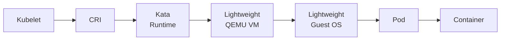

<!-- SPDX-FileCopyrightText: Copyright (c) 2026 NVIDIA CORPORATION & AFFILIATES. All rights reserved. -->
<!-- SPDX-License-Identifier: Apache-2.0 -->

# Kata Containers with the GPU Operator: Concepts

## About the Operator with Kata Containers

[Kata Containers](https://katacontainers.io/) is an open source project that creates lightweight Virtual Machines (VMs) that feel and perform like traditional containers such as a Docker container.
A traditional container packages software for user-space isolation from the host,
but the container runs on the host and shares the operating system kernel with the host.
Sharing the operating system kernel is a potential vulnerability.

A Kata container runs in a virtual machine on the host.
The virtual machine has a separate operating system and operating system kernel.
Hardware virtualization and a separate kernel provide improved workload isolation
in comparison with traditional containers.

The NVIDIA GPU Operator works with the Kata container runtime.
Kata uses a hypervisor, such as QEMU, to provide a lightweight virtual machine with a single purpose: to run a Kubernetes pod.

The following diagram shows the software components that Kubernetes uses to run a Kata container.

> [!TIP]
> This page describes deploying with Kata containers only.
> Refer to the Confidential Containers documentation if you are interested in deploying Confidential Containers with Kata Containers and the GPU Operator.

## Benefits of Using Kata Containers

The primary benefits of Kata Containers are as follows:

* Running untrusted workloads in a container.
  The virtual machine provides a layer of defense against the untrusted code.

* Limiting access to hardware devices such as NVIDIA GPUs.
  The virtual machine is provided access to specific devices.
  This approach ensures that the workload cannot access additional devices.

* Transparent deployment of unmodified containers.

## Limitations and Restrictions

* For GPU passthrough workloads, all GPUs must be assigned to one Kata Container virtual machine.
  Configuring only some GPUs on a node for Kata Containers is not supported.
  vGPU is not supported.

* Support for Kata Containers is limited to the implementation described on this page.
  The Operator offers Technology Preview support for Red Hat OpenShift Sandboxed Containers v1.12.

* NVIDIA supports the Operator and Kata Containers with the containerd runtime only.

## Cluster Topology Considerations

You can configure all the worker nodes in your cluster for Kata Containers or you can configure some nodes for Kata Containers and others for traditional containers.
Consider the following example where node A is configured to run traditional containers and node B is configured to run Kata Containers.

| Node A - Traditional Container nodes receive the following software components | Node B - Kata Container nodes receive the following software components |
| --- | --- |
| * `NVIDIA Driver Manager for Kubernetes` -- to install the data-center driver. * `NVIDIA Container Toolkit` -- to ensure that containers can access GPUs. * `NVIDIA Device Plugin for Kubernetes` -- to discover and advertise GPU resources to kubelet. * `NVIDIA DCGM and DCGM Exporter` -- to monitor GPUs. * `NVIDIA MIG Manager for Kubernetes` -- to manage MIG-capable GPUs. * `Node Feature Discovery` -- to detect CPU, kernel, and host features and label worker nodes. * `NVIDIA GPU Feature Discovery` -- to detect NVIDIA GPUs and label worker nodes. | * `NVIDIA Confidential Computing Manager for Kubernetes` -- to set the confidential computing (CC) mode on the NVIDIA GPUs. This component is deployed to all nodes configured for Kata Containers, even if you are not planning to run Confidential Containers. Refer to the Confidential Containers documentation for more details. * `NVIDIA Sandbox Device Plugin` -- to discover and advertise the passthrough GPUs to kubelet. * `NVIDIA VFIO Manager` -- to bind NVIDIA GPUs and NVIDIA NVSwitches to the vfio-pci driver for VFIO passthrough. * `Node Feature Discovery` -- to detect CPU security features, NVIDIA GPUs, and label worker nodes. |

This configuration can be controlled through node labelling, as described in the Label Nodes section.
You can also set `sandboxWorkloads.defaultWorkload=vm-passthrough` when you install the GPU Operator to configure all nodes to run Kata Containers by default.

## Overview of the configuration flow

To enable Kata Containers for GPUs on your cluster, you do the following:

1. Make sure your cluster meets the prerequisites (see [references/prerequisites.md](prerequisites.md)).
1. Label the nodes you want to use for Kata Containers (see [references/install.md](install.md)).
1. Install the upstream `kata-deploy` Helm chart, which deploys all Kata runtime classes, including NVIDIA-specific runtime classes.
   The `kata-qemu-nvidia-gpu` runtime class is used with Kata Containers.
1. Install the NVIDIA GPU Operator with Kata sandbox mode enabled.

After installation, you can run a sample workload that uses the Kata runtime class (see [references/workload.md](workload.md)).
