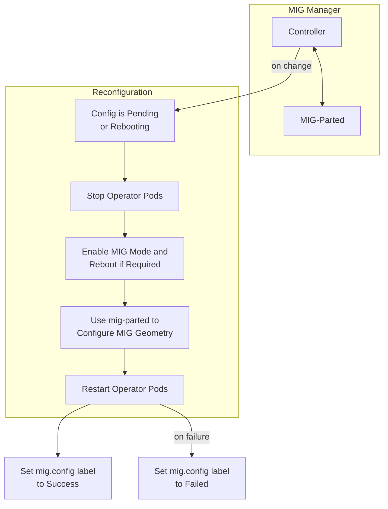

<!-- SPDX-FileCopyrightText: Copyright (c) 2026 NVIDIA CORPORATION & AFFILIATES. All rights reserved. -->
<!-- SPDX-License-Identifier: Apache-2.0 -->

# GPU Operator with MIG

## About Multi-Instance GPU

Multi-Instance GPU (MIG) enables GPUs based on the NVIDIA Ampere and later architectures, such as NVIDIA A100, to be partitioned into separate and secure GPU instances for CUDA applications.
Refer to the [MIG User Guide](https://docs.nvidia.com/datacenter/tesla/mig-user-guide/index.html) for more information about MIG.

GPU Operator deploys MIG Manager to manage MIG configuration on nodes in your Kubernetes cluster.
You must enable MIG during installation by choosing a MIG strategy before you can configure MIG.

Refer to the [Multi-Instance GPU architecture](https://docs.nvidia.com/datacenter/cloud-native/gpu-operator/latest/gpu-operator-mig.html) for more information about how MIG is implemented in the GPU Operator.

## Enabling MIG During Installation

Use the following steps to enable MIG and deploy MIG Manager.

1. Install the Operator:

   ```console
   $ helm install --wait --generate-name \
       -n gpu-operator --create-namespace \
       nvidia/gpu-operator \
       --version=v26.3.1 \
       --set mig.strategy=single
   ```

   This example sets `single`  as the MIG strategy.
   Available MIG strategy options:

   * `single`: MIG mode is enabled on all GPUs on a node.
   * `mixed`: MIG mode is not enabled on all GPUs on a node.

   In a cloud service provider (CSP) environment such as Google Cloud, also specify
   `--set migManager.env[0].name=WITH_REBOOT --set-string migManager.env[0].value=true`
   to ensure that the node reboots and can apply the MIG configuration.

   MIG Manager supports preinstalled drivers, meaning drivers that are not managed by the GPU Operator and you installed directly on the host.
   If drivers are preinstalled, also specify `--set driver.enabled=false`.
   Refer to [MIG with pre-installed drivers](https://docs.nvidia.com/datacenter/cloud-native/gpu-operator/latest/gpu-operator-mig.html) for more details.

   After several minutes, all GPU Operator pods, including the `nvidia-mig-manager` are deployed on nodes that have MIG capable GPUs.

   > [!NOTE]
   > MIG Manager requires that no user workloads are running on the GPUs being configured.
   > In some cases, the node might need to be rebooted, such as a CSP, so the node might need to be cordoned
   > before changing the MIG mode or the MIG geometry on the GPUs.

   1. Optional: Display the pods in the Operator namespace:

   ```console
   $ kubectl get pods -n gpu-operator
   ```

   *Example Output*

1. Optional: Display the labels applied to the node:

   ```console
   $ kubectl get node -o json | jq '.items[].metadata.labels'
   ```

   *Partial Output*

## Configuring MIG Profiles

When MIG is enabled, nodes are labeled with `nvidia.com/mig.config: all-disabled` by default.
To use a profile on a node, update the label value with the desired profile, for example, `nvidia.com/mig.config=all-1g.10gb`.

Introduced in GPU Operator v26.3.0, MIG Manager generates the MIG configuration for a node at runtime from the available hardware.
The configuration is generated on startup, discovering MIG profiles for each MIG-capable GPU on a node using [NVIDIA Management Library (NVML)](https://developer.nvidia.com/management-library-nvml), then writing it to a ConfigMap for each MIG-capable node in your cluster.
The ConfigMap is named `<node-name>-mig-config`, where `<node-name>` is the name of each MIG-capable node.
Each ConfigMap contains a complete mig-parted config, including `all-disabled`, `all-enabled`, per-profile configs such as `all-1g.10gb`, and `all-balanced` with device-filter support for mixed GPU types.
When a new MIG-capable GPU is added to a node, the new GPU is automatically added to the ConfigMap.

If you need custom profiles, you can use a custom MIG configuration instead of the generated one.
You can use the Helm chart to create a ConfigMap from values at install time, or create and reference your own ConfigMap.
For an example, refer to dynamically-creating-the-mig-configuration-configmap.

> [!NOTE]
> Generated MIG configuration might not be available on older drivers, such as 535 branch GPU drivers, as they do not support querying MIG profiles when MIG mode is disabled. In those cases, the GPU Operator will use a  [static Configmap](https://github.com/NVIDIA/gpu-operator/blob/main/assets/state-mig-manager/0400_configmap.yaml), `default-mig-parted-config`, for MIG profiles.
### Example: Single MIG Strategy

The following steps show how to use the single MIG strategy and configure the `1g.10gb` profile on one node.

1. Configure the MIG strategy to `single` if you are unsure of the current strategy:

   ```console
   $ kubectl patch clusterpolicies.nvidia.com/cluster-policy \
       --type='json' \
       -p='[{"op":"replace", "path":"/spec/mig/strategy", "value":"single"}]'
   ```

1. Label the nodes with the profile to configure:

   ```console
   $ kubectl label nodes <node-name> nvidia.com/mig.config=all-1g.10gb --overwrite
   ```

   MIG Manager proceeds to apply a `mig.config.state` label to the node and terminates all
   the GPU pods in preparation to enable MIG mode and configure the GPU into the desired MIG geometry.

1. Optional: Display the node labels:

   ```console
   $ kubectl get node <node-name> -o=jsonpath='{.metadata.labels}' | jq .
   ```

   *Partial Output*

   ```json
     "nvidia.com/gpu.product": "NVIDIA-H100-80GB-HBM3",
     "nvidia.com/gpu.replicas": "1",
     "nvidia.com/gpu.sharing-strategy": "none",
     "nvidia.com/mig.capable": "true",
     "nvidia.com/mig.config": "all-1g.10gb",
     "nvidia.com/mig.config.state": "pending",
     "nvidia.com/mig.strategy": "single"
   }
   ```

   When the `WITH_REBOOT` option is set, MIG Manager sets the label to `nvidia.com/mig.config.state: rebooting`.

1. Confirm that MIG Manager completed the configuration by checking the node labels:

   ```console
   $ kubectl get node <node-name> -o=jsonpath='{.metadata.labels}' | jq .
   ```

   Check for the following labels:

   * `nvidia.com/gpu.count: 7` (the value differs according to the GPU model)
   * `nvidia.com/gpu.slices.ci: 1`
   * `nvidia.com/gpu.slices.gi: 1`
   * `nvidia.com/mig.config.state: success`

   *Partial Output*

   ```json
   "nvidia.com/gpu.count": "7",
   "nvidia.com/gpu.present": "true",
   "nvidia.com/gpu.product": "NVIDIA-H100-80GB-HBM3-MIG-1g.10gb",
   "nvidia.com/gpu.slices.ci": "1",
   "nvidia.com/gpu.slices.gi": "1",
   "nvidia.com/mig.capable": "true",
   "nvidia.com/mig.config": "all-1g.10gb",
   "nvidia.com/mig.config.state": "success",
   "nvidia.com/mig.strategy": "single"
   ```

1. Optional: Run the `nvidia-smi` command in the driver container to verify that the MIG configuration has been applied.

   ```console
   $ kubectl exec -it -n gpu-operator ds/nvidia-driver-daemonset -- nvidia-smi -L
   ```

   *Example Output*

### Example: Mixed MIG Strategy

The following steps show how to use the `mixed` MIG strategy and configure the `all-balanced` profile on one node.

1. Configure the MIG strategy to `mixed` if you are unsure of the current strategy:

   ```console
   $ kubectl patch clusterpolicies.nvidia.com/cluster-policy \
       --type='json' \
       -p='[{"op":"replace", "path":"/spec/mig/strategy", "value":"mixed"}]'
   ```

1. Label the nodes with the profile to configure:

   ```console
   $ kubectl label nodes <node-name> nvidia.com/mig.config=all-balanced --overwrite
   ```

   MIG Manager proceeds to apply a `mig.config.state` label to the node and terminates all
   the GPU pods in preparation to enable MIG mode and configure the GPU into the desired MIG geometry.

1. Confirm that MIG Manager completed the configuration by checking the node labels:

   ```console
   $ kubectl get node <node-name> -o=jsonpath='{.metadata.labels}' | jq .
   ```

   Check for labels like the following.
   The profiles and GPU counts differ according to the GPU model.

   * `nvidia.com/mig-1g.10gb.count: 2`
   * `nvidia.com/mig-2g.20gb.count: 1`
   * `nvidia.com/mig-3g.40gb.count: 1`
   * `nvidia.com/mig.config.state: success`

   *Partial Output*

1. Optional: Run the `nvidia-smi` command in the driver container to verify that the GPU has been configured.

   ```console
   $ kubectl exec -it -n gpu-operator ds/nvidia-driver-daemonset -- nvidia-smi -L
   ```

   *Example Output*

### Example: Reconfiguring MIG Profiles

MIG Manager supports dynamic reconfiguration of the MIG geometry.
The following steps show how to update a GPU on a node to the `3g.40gb` profile with the single MIG strategy.

1. Label the node with the profile:

   ```console
   $ kubectl label nodes <node-name> nvidia.com/mig.config=all-3g.40gb --overwrite
   ```

1. Optional: Monitor the MIG Manager logs to confirm the new MIG geometry is applied:

   ```console
   $ kubectl logs -n gpu-operator -l app=nvidia-mig-manager -c nvidia-mig-manager
   ```

   *Example Output*

   ```console
   Applying the selected MIG config to the node
   time="2024-05-14T18:31:26Z" level=debug msg="Parsing config file..."
   time="2024-05-14T18:31:26Z" level=debug msg="Selecting specific MIG config..."
   time="2024-05-14T18:31:26Z" level=debug msg="Running apply-start hook"
   time="2024-05-14T18:31:26Z" level=debug msg="Checking current MIG mode..."
   time="2024-05-14T18:31:26Z" level=debug msg="Walking MigConfig for (devices=all)"
   time="2024-05-14T18:31:26Z" level=debug msg="  GPU 0: 0x233010DE"
   time="2024-05-14T18:31:26Z" level=debug msg="    Asserting MIG mode: Enabled"
   time="2024-05-14T18:31:26Z" level=debug msg="    MIG capable: true\n"
   time="2024-05-14T18:31:26Z" level=debug msg="    Current MIG mode: Enabled"
   time="2024-05-14T18:31:26Z" level=debug msg="Checking current MIG device configuration..."
   time="2024-05-14T18:31:26Z" level=debug msg="Walking MigConfig for (devices=all)"
   time="2024-05-14T18:31:26Z" level=debug msg="  GPU 0: 0x233010DE"
   time="2024-05-14T18:31:26Z" level=debug msg="    Asserting MIG config: map[3g.40gb:2]"
   time="2024-05-14T18:31:26Z" level=debug msg="Running pre-apply-config hook"
   time="2024-05-14T18:31:26Z" level=debug msg="Applying MIG device configuration..."
   time="2024-05-14T18:31:26Z" level=debug msg="Walking MigConfig for (devices=all)"
   time="2024-05-14T18:31:26Z" level=debug msg="  GPU 0: 0x233010DE"
   time="2024-05-14T18:31:26Z" level=debug msg="    MIG capable: true\n"
   time="2024-05-14T18:31:26Z" level=debug msg="    Updating MIG config: map[3g.40gb:2]"
   MIG configuration applied successfully
   time="2024-05-14T18:31:27Z" level=debug msg="Running apply-exit hook"
   Restarting validator pod to re-run all validations
   pod "nvidia-operator-validator-kmncw" deleted
   Restarting all GPU clients previously shutdown in Kubernetes by reenabling their component-specific nodeSelector labels
   node/node-name labeled
   Changing the 'nvidia.com/mig.config.state' node label to 'success'
   ```

1. Optional: Display the node labels to confirm the GPU count (`2`), slices (`3`), and profile are set:

   ```console
   $ kubectl get node <node-name> -o=jsonpath='{.metadata.labels}' | jq .
   ```

   *Partial Output*

   ```json
     "nvidia.com/gpu.count": "2",
     "nvidia.com/gpu.present": "true",
     "nvidia.com/gpu.product": "NVIDIA-H100-80GB-HBM3-MIG-3g.40gb",
     "nvidia.com/gpu.replicas": "1",
     "nvidia.com/gpu.sharing-strategy": "none",
     "nvidia.com/gpu.slices.ci": "3",
     "nvidia.com/gpu.slices.gi": "3",
     "nvidia.com/mig.capable": "true",
     "nvidia.com/mig.config": "all-3g.40gb",
     "nvidia.com/mig.config.state": "success",
     "nvidia.com/mig.strategy": "single",
     "nvidia.com/mps.capable": "false"
   }
   ```

### Example: Custom MIG Configuration During Installation

If you need to use custom profiles, you can create a custom ConfigMap during installation by passing in a name and data for the ConfigMap with the Helm command.

The MIG Manager daemonset is configured to use this ConfigMap instead of the auto-generated one.

In your values.yaml file, set `migManager.config.create` to `true`, set `migManager.config.name`, and add the ConfigMap data under `migManager.config.data`, for example:

1. In your `values.yaml` file, add the data for the ConfigMap, like the following example:

> [!NOTE]
> Custom ConfigMaps must contain a key named "config.yaml"

1. Install or upgrade the GPU Operator with this values file so the chart creates the ConfigMap:

   ```console
   $ helm upgrade --install gpu-operator -n gpu-operator --create-namespace \
       nvidia/gpu-operator --version=v26.3.1 \
       -f values.yaml
   ```

1. If the custom configuration specifies more than one instance profile, set the strategy to `mixed`:

   ```console
   $ kubectl patch clusterpolicies.nvidia.com/cluster-policy \
       --type='json' \
       -p='[{"op":"replace", "path":"/spec/mig/strategy", "value":"mixed"}]'
   ```

1. Label the nodes with the profile to configure:

   ```console
   $ kubectl label nodes <node-name> nvidia.com/mig.config=custom-mig --overwrite
   ```

1. Optional: Monitor the MIG Manager logs to confirm the new MIG geometry is applied:

   ```console
   $ kubectl logs -n gpu-operator -l app=nvidia-mig-manager -c nvidia-mig-manager
   ```

   *Example Output*

   ```console
   Applying the selected MIG config to the node
   time="2024-05-15T13:40:08Z" level=debug msg="Parsing config file..."
   time="2024-05-15T13:40:08Z" level=debug msg="Selecting specific MIG config..."
   time="2024-05-15T13:40:08Z" level=debug msg="Running apply-start hook"
   time="2024-05-15T13:40:08Z" level=debug msg="Checking current MIG mode..."
   time="2024-05-15T13:40:08Z" level=debug msg="Walking MigConfig for (devices=all)"
   time="2024-05-15T13:40:08Z" level=debug msg="  GPU 0: 0x233010DE"
   time="2024-05-15T13:40:08Z" level=debug msg="    Asserting MIG mode: Enabled"
   time="2024-05-15T13:40:08Z" level=debug msg="    MIG capable: true\n"
   time="2024-05-15T13:40:08Z" level=debug msg="    Current MIG mode: Enabled"
   time="2024-05-15T13:40:08Z" level=debug msg="Checking current MIG device configuration..."
   time="2024-05-15T13:40:08Z" level=debug msg="Walking MigConfig for (devices=all)"
   time="2024-05-15T13:40:08Z" level=debug msg="  GPU 0: 0x233010DE"
   time="2024-05-15T13:40:08Z" level=debug msg="    Asserting MIG config: map[1g.10gb:5 2g.20gb:1]"
   time="2024-05-15T13:40:08Z" level=debug msg="Running pre-apply-config hook"
   time="2024-05-15T13:40:08Z" level=debug msg="Applying MIG device configuration..."
   time="2024-05-15T13:40:08Z" level=debug msg="Walking MigConfig for (devices=all)"
   time="2024-05-15T13:40:08Z" level=debug msg="  GPU 0: 0x233010DE"
   time="2024-05-15T13:40:08Z" level=debug msg="    MIG capable: true\n"
   time="2024-05-15T13:40:08Z" level=debug msg="    Updating MIG config: map[1g.10gb:5 2g.20gb:1]"
   time="2024-05-15T13:40:09Z" level=debug msg="Running apply-exit hook"
   MIG configuration applied successfully
   ```

### Example: Custom MIG Configuration

You can create and apply a ConfigMap yourself if the default profiles do not meet your needs.

1. Create a file, such as `custom-mig-config.yaml`, with contents like the following example:

   ```yaml
   apiVersion: v1
   kind: ConfigMap
   metadata:
     name: custom-mig-config
   data:
     config.yaml: |
       version: v1
       mig-configs:
         all-disabled:
           - devices: all
             mig-enabled: false

         five-1g-one-2g:
           - devices: all
             mig-enabled: true
             mig-devices:
               "1g.10gb": 5
               "2g.20gb": 1
   ```

> [!NOTE]
> Custom ConfigMaps must contain a key named "config.yaml"

1. Apply the manifest:

   ```console
   $ kubectl apply -n gpu-operator -f custom-mig-config.yaml
   ```

1. If the custom configuration specifies more than one instance profile, set the strategy to `mixed`:

   ```console
   $ kubectl patch clusterpolicies.nvidia.com/cluster-policy \
       --type='json' \
       -p='[{"op":"replace", "path":"/spec/mig/strategy", "value":"mixed"}]'
   ```

1. Patch the cluster policy so MIG Manager uses the custom ConfigMap:

   ```console
   $ kubectl patch clusterpolicies.nvidia.com/cluster-policy \
       --type='json' \
       -p='[{"op":"replace", "path":"/spec/migManager/config/name", "value":"custom-mig-config"}]'
   ```

1. Label the nodes with the profile to configure:

   ```console
   $ kubectl label nodes <node-name> nvidia.com/mig.config=five-1g-one-2g --overwrite
   ```

## Verification: Running Sample CUDA Workloads

## Disabling MIG

You can disable MIG on a node by setting the `nvidia.com/mig.config` label to `all-disabled`:

```console
$ kubectl label nodes <node-name> nvidia.com/mig.config=all-disabled --overwrite
```

## MIG Manager with Preinstalled Drivers

MIG Manager supports preinstalled drivers.
Information in the preceding sections still applies, however there are a few additional details to consider.

### Install

During GPU Operator installation, `driver.enabled=false` must be set. The following options
can be used to install the GPU Operator:

```console
$ helm install gpu-operator \
    -n gpu-operator --create-namespace \
    nvidia/gpu-operator \
    --version=v26.3.1 \
    --set driver.enabled=false
```

### Managing Host GPU Clients

MIG Manager stops all operator-managed pods that have access to GPUs when applying a MIG reconfiguration.
When drivers are preinstalled, there can be GPU clients on the host that also need to be stopped.

When drivers are preinstalled, MIG Manager attempts to stop and restart a list of systemd services on the host across a MIG reconfiguration.
The list of services is specified in the `default-gpu-clients` ConfigMap.

The following sample GPU clients file, `clients.yaml`, is used to create the `default-gpu-clients` ConfigMap:

```yaml
version: v1
systemd-services:
  - nvsm.service
  - nvsm-mqtt.service
  - nvsm-core.service
  - nvsm-api-gateway.service
  - nvsm-notifier.service
  - nv_peer_mem.service
  - nvidia-dcgm.service
  - dcgm.service
  - dcgm-exporter.service
```

You can modify the list by editing the ConfigMap after installation.
Alternatively, you can create a custom ConfigMap for use by MIG Manager by performing the following steps:

1. Create the `gpu-operator` namespace:

   ```console
   $ kubectl create namespace gpu-operator
   ```

1. Create a `ConfigMap` containing the custom `clients.yaml` file with a list of GPU clients:

   ```console
   $ kubectl create configmap -n gpu-operator gpu-clients --from-file=clients.yaml
   ```

1. Install the GPU Operator:

   ```console
   $ helm install gpu-operator \
       -n gpu-operator --create-namespace \
       nvidia/gpu-operator \
       --version=v26.3.1 \
       --set migManager.gpuClientsConfig.name=gpu-clients \
       --set driver.enabled=false
   ```

## Architecture

MIG Manager is designed as a controller within Kubernetes. It watches for changes to the
`nvidia.com/mig.config` label on the node and then applies the user-requested MIG configuration.
When the label changes, MIG Manager first stops all GPU pods, including device plugin, GPU feature discovery,
and DCGM exporter.
MIG Manager then stops all host GPU clients listed in the `clients.yaml` ConfigMap if drivers are preinstalled.
Finally, it applies the MIG reconfiguration and restarts the GPU pods and possibly, host GPU clients.
The MIG reconfiguration can also involve rebooting a node if a reboot is required to enable MIG mode.

The default MIG profiles are specified in the `<node-name>-mig-config` ConfigMap.
This ConfigMap is auto-generated by the MIG Manager for each MIG-capable node and contains the standard MIG profiles for the available GPUs on the node.
You can also configure the operator to configure a custom ConfigMap to use instead of the auto-generated one.

You can specify one of these profiles to apply to the `mig.config` label to trigger a reconfiguration of the MIG geometry.

MIG Manager uses the [mig-parted](https://github.com/NVIDIA/mig-parted) tool to apply the configuration
changes to the GPU, including enabling MIG mode, with a node reboot as required by some scenarios.


