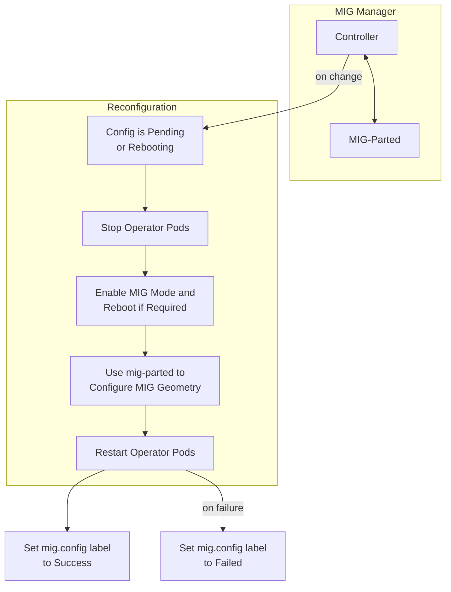

<!-- SPDX-FileCopyrightText: Copyright (c) 2026 NVIDIA CORPORATION & AFFILIATES. All rights reserved. -->
<!-- SPDX-License-Identifier: Apache-2.0 -->

# Multi-Instance GPU: Concepts, Enabling MIG, and Configuring Profiles

## About Multi-Instance GPU

Multi-Instance GPU (MIG) enables GPUs based on the NVIDIA Ampere and later architectures, such as NVIDIA A100, to be partitioned into separate and secure GPU instances for CUDA applications.
Refer to the [MIG User Guide](https://docs.nvidia.com/datacenter/tesla/mig-user-guide/index.html) for more information about MIG.

GPU Operator deploys MIG Manager to manage MIG configuration on nodes in your Kubernetes cluster.
You must enable MIG during installation by choosing a MIG strategy before you can configure MIG.

Refer to the [Multi-Instance GPU architecture](https://docs.nvidia.com/datacenter/cloud-native/gpu-operator/latest/gpu-operator-mig.html) for more information about how MIG is implemented in the GPU Operator.

## Enabling MIG During Installation

Use the following steps to enable MIG and deploy MIG Manager.

> [!NOTE]
> Replace `<gpu-operator-version>` with your target GPU Operator release; see the [releases page](https://github.com/NVIDIA/gpu-operator/releases).

1. Install the Operator:

   ```console
   $ helm install --wait --generate-name \
       -n gpu-operator --create-namespace \
       nvidia/gpu-operator \
       --version=<gpu-operator-version> \
       --set mig.strategy=single
   ```

   This example sets `single`  as the MIG strategy.
   Available MIG strategy options:

   * `single`: MIG mode is enabled on all GPUs on a node.
   * `mixed`: MIG mode is not enabled on all GPUs on a node.

   In a cloud service provider (CSP) environment such as Google Cloud, also specify
   `--set migManager.env[0].name=WITH_REBOOT --set-string migManager.env[0].value=true`
   to ensure that the node reboots and can apply the MIG configuration.

   MIG Manager supports preinstalled drivers, meaning drivers that are not managed by the GPU Operator and you installed directly on the host.
   If drivers are preinstalled, also specify `--set driver.enabled=false`.
   Refer to [MIG with pre-installed drivers](https://docs.nvidia.com/datacenter/cloud-native/gpu-operator/latest/gpu-operator-mig.html) for more details.

   After several minutes, all GPU Operator pods, including the `nvidia-mig-manager` are deployed on nodes that have MIG capable GPUs.

   > [!NOTE]
   > MIG Manager requires that no user workloads are running on the GPUs being configured.
   > In some cases, the node might need to be rebooted, such as a CSP, so the node might need to be cordoned
   > before changing the MIG mode or the MIG geometry on the GPUs.

   1. Optional: Display the pods in the Operator namespace:

   ```console
   $ kubectl get pods -n gpu-operator
   ```

   *Example Output*

1. Optional: Display the labels applied to the node:

   ```console
   $ kubectl get node -o json | jq '.items[].metadata.labels'
   ```

   *Partial Output*

## Configuring MIG Profiles

When MIG is enabled, nodes are labeled with `nvidia.com/mig.config: all-disabled` by default.
To use a profile on a node, update the label value with the desired profile, for example, `nvidia.com/mig.config=all-1g.10gb`.

Introduced in GPU Operator v26.3.0, MIG Manager generates the MIG configuration for a node at runtime from the available hardware.
The configuration is generated on startup, discovering MIG profiles for each MIG-capable GPU on a node using [NVIDIA Management Library (NVML)](https://developer.nvidia.com/management-library-nvml), then writing it to a ConfigMap for each MIG-capable node in your cluster.
The ConfigMap is named `<node-name>-mig-config`, where `<node-name>` is the name of each MIG-capable node.
Each ConfigMap contains a complete mig-parted config, including `all-disabled`, `all-enabled`, per-profile configs such as `all-1g.10gb`, and `all-balanced` with device-filter support for mixed GPU types.
When a new MIG-capable GPU is added to a node, the new GPU is automatically added to the ConfigMap.

If you need custom profiles, you can use a custom MIG configuration instead of the generated one.
You can use the Helm chart to create a ConfigMap from values at install time, or create and reference your own ConfigMap.
For an example, refer to dynamically-creating-the-mig-configuration-configmap.

> [!NOTE]
> Generated MIG configuration might not be available on older drivers, such as 535 branch GPU drivers, as they do not support querying MIG profiles when MIG mode is disabled. In those cases, the GPU Operator will use a  [static Configmap](https://github.com/NVIDIA/gpu-operator/blob/main/assets/state-mig-manager/0400_configmap.yaml), `default-mig-parted-config`, for MIG profiles.

## Architecture

MIG Manager is designed as a controller within Kubernetes. It watches for changes to the
`nvidia.com/mig.config` label on the node and then applies the user-requested MIG configuration.
When the label changes, MIG Manager first stops all GPU pods, including device plugin, GPU feature discovery,
and DCGM exporter.
MIG Manager then stops all host GPU clients listed in the `clients.yaml` ConfigMap if drivers are preinstalled.
Finally, it applies the MIG reconfiguration and restarts the GPU pods and possibly, host GPU clients.
The MIG reconfiguration can also involve rebooting a node if a reboot is required to enable MIG mode.

The default MIG profiles are specified in the `<node-name>-mig-config` ConfigMap.
This ConfigMap is auto-generated by the MIG Manager for each MIG-capable node and contains the standard MIG profiles for the available GPUs on the node.
You can also configure the operator to configure a custom ConfigMap to use instead of the auto-generated one.

You can specify one of these profiles to apply to the `mig.config` label to trigger a reconfiguration of the MIG geometry.

MIG Manager uses the [mig-parted](https://github.com/NVIDIA/mig-parted) tool to apply the configuration
changes to the GPU, including enabling MIG mode, with a node reboot as required by some scenarios.


