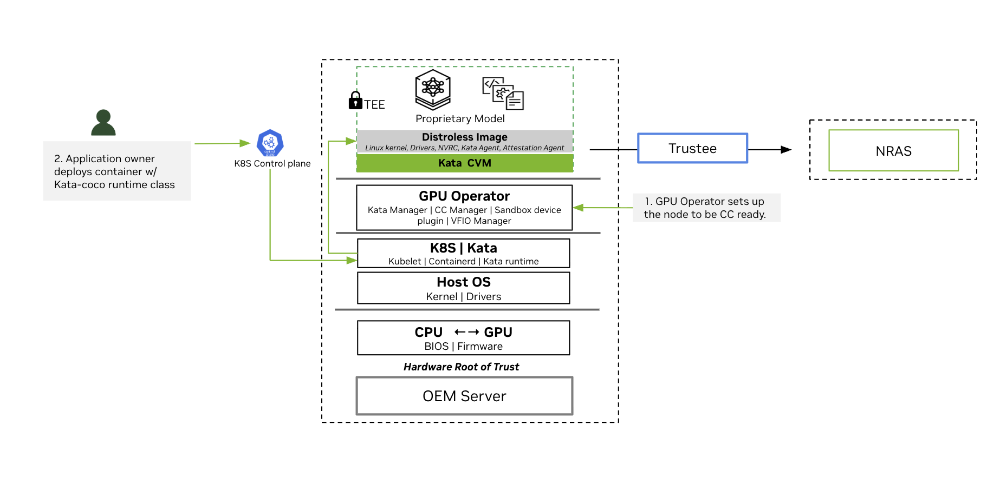

.. _early-access-gpu-operator-confidential-containers-kata:

****************************************************************************
Early Access: NVIDIA GPU Operator with Confidential Containers based on Kata
****************************************************************************

.. note::

   Early Access features are not supported in production environments and are not functionally complete. Early Access features provide a preview of upcoming product features, enabling customers to test functionality and provide feedback during the development process. These releases may not have complete documentation, and testing is limited. Additionally, API and architectural designs are not final and may change in the future.

.. _confidential-containers-nvidia-gpu-early-access:

Overview
========

NVIDIA GPUs power the training and deployment of Frontier Models—world-class Large Language Models (LLMs) that define the state of the art in AI reasoning and capability. As organizations adopt these models in regulated industries such as financial services, healthcare, and the public sector, protecting model intellectual property and sensitive user data becomes essential. 

While securing data at rest and in transit is industry standard, protecting data in use remains a critical gap. Confidential Computing (CC) addresses this gap by providing isolation, encryption, and integrity verification of proprietary application code and sensitive data during processing. CC uses hardware-based Trusted Execution Environments (TEEs)—such as AMD SEV—to create protected enclaves in both CPU and GPU.

The TEE provides embedded encryption keys and an attestation mechanism through cryptographic verification to ensure that keys are only accessible by authorized application code.

`Confidential Containers <https://github.com/confidential-containers>`_ (CoCo) is the cloud-native approach of CC in Kubernetes. `Kata Containers <https://katacontainers.io/>`_ is an open source project that provides lightweight utility Virtual Machines (UVMs) that feel and perform like containers but provide strong workload isolation. Along with the CoCo project, Kata enables the orchestration of secure, GPU-accelerated workloads in Kubernetes.

This page describes NVIDIA's Early Access implementation for orchestrating CoCo with Kata using the NVIDIA GPU Operator.

Architecture Overview
---------------------

The following high-level flow and diagram show some fundamental concepts for CoCo. The NVIDIA GPU operator is a central component to enable this workflow. In the following section, we describe the most important components and the deployment scenario.

*High-Level Logical Diagram of Software Components and Communication Paths*

1. The GPU Operator sets up the nodes to be Confidential Computing ready.

   * During installation, the GPU Operator deploys the components needed to run Confidential Containers to nodes that meet Confidential Container requirements.

2. Application Owner deploys container with Kata-Confidential Containers runtime class.

   * The user deploys a confidential container GPU workload, which is placed onto a specific node by the Kubernetes control plane. On this node, the local Kubelet instructs its container runtime to create this pod.
   * Containerd is configured to run a Kata runtime to start the Kata CVM.  
   * The Kata runtime starts the Kata CVM using the upstream Kata Containers kernel and NVIDIA initial RAM disk containing the VM's root filesystem.
   * In the Kata CVM's early boot phase, the `NVRC <https://github.com/NVIDIA/nvrc/tree/main>`_ prepares the passthrough GPU for container access.
   * Kata agent starts containers in the Kata CVM.  
   * The confidential containers attestation agent exercises remote attestation based on the Remote ATtestation ProcedureS (RATS) model in concert with the Confidential Containers' Trustee solution. As part of this, the attestation agent transitions the GPU into the Ready state. Refer to the attestation section for more details.

.. _key-software-components-gpu-operator:

Key Software Components of the NVIDIA GPU Operator
===================================================

NVIDIA GPU Operator brings together the following software components to simplify managing the software required for confidential computing and deploying confidential container workloads:

**NVIDIA Kata Manager for Kubernetes**

GPU Operator deploys the NVIDIA Kata Manager for Kubernetes, k8s-kata-manager. The manager is responsible for creating host-side CDI specifications for GPU passthrough.

**NVIDIA Confidential Computing Manager for Kubernetes**

GPU Operator deploys the manager, k8s-cc-manager, to set the confidential computing (CC) mode on the NVIDIA GPUs.

**NVIDIA Sandbox Device Plugin**

GPU Operator deploys the sandbox device plugin, nvidia-sandbox-device-plugin-daemonset, to discover NVIDIA GPUs along with their capabilities, to advertise these to Kubernetes, and to allocate GPUs during pod deployment.

**NVIDIA VFIO Manager**

GPU Operator deploys the VFIO manager, nvidia-vfio-manager, to bind discovered NVIDIA GPUs to the vfio-pci driver for VFIO passthrough.

**Node Feature Discovery (NFD)**

When you install NVIDIA GPU Operator for confidential computing, you must specify the ``nfd.nodefeaturerules=true`` option. This option directs the Operator to install node feature rules that detect CPU security features and the NVIDIA GPU hardware. You can confirm the rules are installed by running ``kubectl get nodefeaturerules nvidia-nfd-nodefeaturerules``.

On nodes that have NVIDIA Hopper family GPU and AMD SEV-SNP, NFD adds labels to the node such as ``"feature.node.kubernetes.io/cpu-security.sev.snp.enabled": "true"`` and ``"nvidia.com/cc.capable": "true"``. NVIDIA GPU Operator only deploys the operands for confidential containers on nodes that have the ``"nvidia.com/cc.capable": "true"`` label.

Cluster Topology Considerations
---------------------------------

You can configure all the worker nodes in your cluster for running GPU workloads with confidential containers or you configure some nodes for confidential containers and the others for traditional containers. Consider the following example where node A is configured to run traditional containers and node B is configured to run confidential containers.

.. list-table::
   :widths: 50 50
   :header-rows: 1

   * - Node A - Traditional Containers receives the following software components
     - Node B - Kata CoCo receives the following software components
   * - * NVIDIA Driver Manager for Kubernetes
       * NVIDIA Container Toolkit
       * NVIDIA Device Plugin for Kubernetes
       * NVIDIA DCGM and DCGM Exporter
       * NVIDIA MIG Manager for Kubernetes
       * Node Feature Discovery
       * NVIDIA GPU Feature Discovery
     - * NVIDIA Kata Manager for Kubernetes
       * NVIDIA Confidential Computing Manager for Kubernetes
       * NVIDIA Sandbox Device Plugin
       * NVIDIA VFIO Manager
       * Node Feature Discovery

This configuration can be controlled through node labelling as described in :ref:`confidential-containers-deploy`.

.. _supported-platforms:

Supported Platforms
===================

Refer to the *Confidential Computing Deployment Guide* at the https://docs.nvidia.com/confidential-computing website for information about supported NVIDIA GPUs, such as the NVIDIA Hopper H100, and specifically to https://docs.nvidia.com/cc-deployment-guide-snp.pdf for setup specific to AMD SEV-SNP machines.

The following topics in the deployment guide apply to a cloud-native environment:

* Hardware selection and initial hardware configuration, such as BIOS settings.  
* Host operating system selection, initial configuration, and validation. 

When following the cloud-native sections in above linked deployment guide, use Ubuntu 25.10 as host OS with its default kernel version and configuration.

The remaining configuration topics in the deployment guide do not apply to a cloud-native environment. NVIDIA GPU Operator performs the actions that are described in these topics.

For scope of this EA, the following is the validated support matrix. Any other combination has not been evaluated:

.. list-table::
   :widths: 50 50
   :header-rows: 1

   * - Component
     - Release
   * - GPU Platform
     - Hopper 100/200
   * - GPU Driver
     - R580 TRD 3
   * - kata-containers/kata-containers
     - 3.24.0
   * - NVIDIA/gpu-operator
     - v25.10.0 and higher

.. _limitations-and-restrictions:

Limitations and Restrictions
=============================

* GPUs are available to containers as a single GPU in passthrough mode only. Multi-GPU passthrough and vGPU are not supported.  
* Support is limited to initial installation and configuration only. Upgrade and configuration of existing clusters to configure confidential computing is not supported.  
* Support for confidential computing environments is limited to the implementation described on this page.  
* NVIDIA supports the GPU Operator and confidential computing with the containerd runtime only.  
* Only the AMD platform using SEV-SNP is supported for Confidential Containers Early Access.  
* OpenShift is not supported in the Early Access release.
* NFD doesn't label all Confidential Container capable nodes as such automatically. In some cases, users must manually label nodes to deploy the NVIDIA Confidential Computing Manager for Kubernetes operand onto these nodes as described below.

Deployment and Configuration
=============================

For detailed instructions on deploying and configuring confidential containers with the NVIDIA GPU Operator, refer to the following guide:

.. toctree::
   :maxdepth: 2

   confidential-containers-deploy
