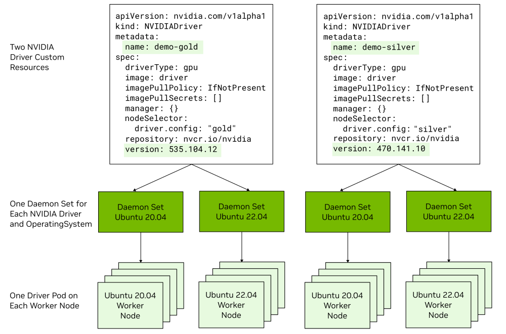

.. license-header
  SPDX-FileCopyrightText: Copyright (c) 2023 NVIDIA CORPORATION & AFFILIATES. All rights reserved.
  SPDX-License-Identifier: Apache-2.0

  Licensed under the Apache License, Version 2.0 (the "License");
  you may not use this file except in compliance with the License.
  You may obtain a copy of the License at

  http://www.apache.org/licenses/LICENSE-2.0

  Unless required by applicable law or agreed to in writing, software
  distributed under the License is distributed on an "AS IS" BASIS,
  WITHOUT WARRANTIES OR CONDITIONS OF ANY KIND, either express or implied.
  See the License for the specific language governing permissions and
  limitations under the License.

.. headings (h1/h2/h3/h4/h5) are # * = -

############################################
NVIDIA GPU Driver Custom Resource Definition
############################################

*****************************************************
Overview of the GPU Driver Custom Resource Definition
*****************************************************

You can create one or more instances of an NVIDIA driver (``NVIDIADriver``) custom resource
to specify the NVIDIA GPU driver type and driver version to configure on specific nodes.
You can specify labels in the node selector field to control which NVIDIA driver configuration is applied to specific nodes.

Driver Management Modes
=======================

To use NVIDIA driver custom resources with a cluster policy custom resource, set
``spec.driver.useNvidiaDriverCRD`` to ``true``.
The cluster policy controller continues to manage the other GPU Operator operands, but delegates
driver management to the NVIDIA driver custom resource controller.
If ``spec.driver.useNvidiaDriverCRD`` is ``false``, the Operator does not reconcile
NVIDIA driver custom resources.

You can migrate a Helm installation from managing the driver with the cluster policy custom resource
to managing it with NVIDIA driver custom resources.
For the supported procedure, refer to `Migrating from Cluster Policy Driver Management`_.

Comparison: Managing the Driver with CRD versus the Cluster Policy
==================================================================

Before the introduction of the NVIDIA GPU Driver custom resource definition, you managed the driver by modifying
the driver field and subfields of the cluster policy custom resource definition.

The key differences between the two approaches are summarized in the following table.

.. list-table::
   :header-rows: 1
   :widths: 50 50

   * - Cluster Policy CRD
     - NVIDIA Driver CRD

   * -
       - Supports a single driver type and version on all nodes.
       - Does not support multiple operating system versions.
         This limitation complicates performing an operating system upgrade on your nodes.

     -
       - Supports multiple driver types and versions on different nodes.
       - Supports multiple operating system versions on nodes.

Driver Daemon Sets
==================

The NVIDIA GPU Operator starts a driver daemon set for each NVIDIA driver custom resource and each operating system version.

For example, if your cluster has one NVIDIA driver custom resource that specifies a 580 branch GPU driver and some
worker nodes run Ubuntu 22.04 and other worker nodes run Ubuntu 24.04, the Operator starts two driver daemon sets.
One daemon set configures the GPU driver on the Ubuntu 22.04 nodes and the other configures the driver on the Ubuntu 24.04 nodes.
All the nodes run the same 580 branch GPU driver.

If you choose to use precompiled driver containers, the Operator starts a driver daemon set for each Linux kernel version.

For example, if some nodes run Ubuntu 22.04 and the 5.15.0-84-generic kernel, and other nodes run the 5.15.0-78-generic kernel,
then the Operator starts two daemon sets.

About the Default NVIDIA Driver Custom Resource
===============================================

By default, the Helm chart configures a default NVIDIA driver custom resource during installation.
The resource has ``spec.default: true`` and does not include a node selector.
It acts as a fallback and applies to every GPU node that does not match the node selector of another
NVIDIA driver custom resource.
The Operator starts a driver daemon set and pods for each operating system version in your cluster.

You can use the default resource and additional user-defined resources at the same time.
A user-defined resource takes precedence on nodes that match its node selector, and the default resource
continues to manage the remaining GPU nodes.
User-defined resources must not select the same node.
If they do, the affected resources report ``notReady`` with a ``ConflictingNodeSelector`` condition,
and the Operator retains the existing driver ownership labels until you resolve the conflict.

Only one NVIDIA driver custom resource can have ``spec.default: true``.
A default resource cannot specify ``spec.nodeSelector`` because it would not be able to act as a fallback.
If more than one default resource exists, the Operator marks the affected resources ``notReady`` with a
``ReconcileFailed`` condition and does not change the existing driver ownership labels on nodes.
Delete or update the extra default resource to resume reconciliation.

To prevent the Helm chart from creating the default resource, specify the
``--set driver.nvidiaDriverCRD.deployDefaultCR=false`` argument when you install or upgrade the Operator.
Use this setting only if your user-defined resources select every GPU node that the Operator should manage,
or if leaving some GPU nodes without an Operator-managed driver is intentional.

.. note::

   A user-defined resource without a node selector matches all GPU nodes.
   The resource takes precedence over the default resource and conflicts with any other resource
   that selects one of the same nodes.

Feature Compatibility
=====================

Driver type
  Each NVIDIA driver custom resource specifies the driver type and is one of ``gpu``, ``vgpu``, or ``vgpu-host-manager``.
  You can run the data-center driver (``gpu``) on some nodes and the vGPU driver on other nodes.

GPUDirect RDMA and GPUDirect Storage
  Each NVIDIA driver custom resource can specify how to configure GPUDirect RDMA and GPUDirect Storage (GDS).
  Refer to :ref:`GPUDirect RDMA and GPUDirect Storage` for the platform support and prerequisites.

GDRCopy
  Each NVIDIA driver custom resource can enable the GDRCopy sidecar container in the driver pod.

Precompiled and signed drivers
  You can run the default driver type that is compiled when the driver pod starts on some nodes
  and precompiled driver containers on other nodes.
  The :ref:`precomp-limitations-restrictions` for precompiled driver containers apply.

Preinstalled drivers on nodes
  If a node has an NVIDIA GPU driver installed in the operating system, then no driver container runs on the node.

Support for X86_64 and ARM64
  Each daemon set can run pods and driver containers for the X86_64 and ARM64 architectures.
  Refer to the `NVIDIA GPU Driver tags <https://catalog.ngc.nvidia.com/orgs/nvidia/containers/driver/tags>`__
  web page to determine which driver version and operating system combinations support both architectures.

Custom Driver Parameters
  Each NVIDIA driver custom resource can specify custom kernel module parameters by using a ConfigMap.
  For more information, refer to :doc:`Customizing NVIDIA GPU Driver Parameters during Installation <custom-driver-params>`.

.. _migrate-clusterpolicy-to-nvidiadriver:

***********************************************
Migrating from Cluster Policy Driver Management
***********************************************

You can migrate an existing Helm installation to NVIDIA driver custom resource management through
the controlled driver upgrade flow.
During the migration, the Operator assigns each GPU node to an NVIDIA driver custom resource and uses the
driver upgrade controller to replace the previous cluster policy managed driver pod on each node.

When you migrate from a GPU Operator release earlier than v26.7.0, perform two Helm upgrades.
First, upgrade to v26.7.0 while retaining cluster policy driver management.
Then, upgrade the same release again to enable NVIDIA driver custom resource management.
This sequence starts the controller that supports controlled migration before changing driver ownership.
Do not upgrade from an earlier release and enable NVIDIA driver custom resource management in the same
Helm operation because the old controller can remove the existing driver pods before the new controller
can take ownership.

Before you begin, verify the following requirements:

* The Helm values under ``driver`` represent the driver configuration that you want the chart-created
  default NVIDIA driver custom resource to use.
  The Operator does not copy changes made directly to the ``spec.driver`` field of the cluster policy
  custom resource into the new resource.
* Any existing non-default NVIDIA driver custom resources have non-overlapping node selectors.
  These resources become active when you enable NVIDIA driver custom resource management.
* ``driver.upgradePolicy.autoUpgrade`` is ``true`` so that the upgrade controller can perform the
  controlled replacement of the previous driver pods.
  Nodes with the ``nvidia.com/gpu-driver-upgrade.skip=true`` label are not migrated until you remove
  the label.
* Your workloads can tolerate the disruption configured by the driver upgrade policy.
  For more information, refer to :ref:`gpu-driver-upgrades`.

#. Identify the Helm release name:

   .. code-block:: console

      $ helm list -n gpu-operator

#. If your current GPU Operator release is earlier than v26.7.0, upgrade to the target release while
   retaining cluster policy driver management:

   .. code-block:: console

      $ helm upgrade <release-name> nvidia/gpu-operator \
          -n gpu-operator \
          --version=${version} \
          --reuse-values \
          --disable-openapi-validation \
          --set operator.upgradeCRD=true \
          --set driver.nvidiaDriverCRD.enabled=false \
          --set driver.nvidiaDriverCRD.deployDefaultCR=false \
          --wait

   This operation updates the custom resource definitions, starts the controller that supports
   controlled migration, and leaves the existing cluster policy managed driver pods in place.
   For more information about manually updating the custom resource definitions instead of using
   the Helm hook, refer to :doc:`Upgrading the GPU Operator <upgrade>`.

   Wait for the cluster policy custom resource to return to the ``ready`` state.

#. Upgrade the Helm release and enable NVIDIA driver custom resource management:

   .. code-block:: console

      $ helm upgrade <release-name> nvidia/gpu-operator \
          -n gpu-operator \
          --version=${version} \
          --reuse-values \
          --set driver.nvidiaDriverCRD.enabled=true \
          --set driver.nvidiaDriverCRD.deployDefaultCR=true \
          --set driver.upgradePolicy.autoUpgrade=true \
          --wait

   The chart sets ``spec.driver.useNvidiaDriverCRD`` to ``true`` in the cluster policy custom resource
   and creates a default NVIDIA driver custom resource from the Helm driver values.
   The cluster policy custom resource continues to manage the other GPU Operator operands.
   If the controlled rollout can exceed the default Helm timeout, specify an appropriate duration
   with the ``--timeout`` option.

#. Confirm that exactly one default resource exists:

   .. code-block:: console

      $ kubectl get nvidiadrivers

   The output includes ``true`` in the ``DEFAULT`` column for the chart-created resource.
   The resource can report ``notReady`` while the migration is in progress.

#. Monitor node ownership and the controlled upgrade:

   .. code-block:: console

      $ kubectl get nodes -l nvidia.com/gpu.present=true \
          -L nvidia.com/gpu-operator.driver.owner \
          -L nvidia.com/gpu-driver-upgrade-state

   The migration is complete when each managed node has an NVIDIA driver owner and reports
   ``upgrade-done``, and the NVIDIA driver and cluster policy custom resources report ``ready``.

After the migration, you can create additional NVIDIA driver custom resources with node selectors.
Those resources take ownership of their matching nodes, while the default resource remains the
fallback for the other GPU nodes.
If you do not want the upgrade controller to manage later driver updates automatically, set
``driver.upgradePolicy.autoUpgrade`` to ``false`` in the Helm values for the chart-created default
resource after the migration completes.
For a user-created resource, set ``spec.upgradePolicy.autoUpgrade`` to ``false``.

***************************************
About the NVIDIA Driver Custom Resource
***************************************

An instance of the NVIDIA driver custom resource represents a specific NVIDIA GPU driver type and driver version to install and manage
on nodes.

.. literalinclude:: ./manifests/input/nvd-demo-gold.yaml
   :language: yaml
   :caption: Sample NVIDIA Driver Manifest

The following table describes some of the fields in the custom resource.

.. list-table::
   :header-rows: 1
   :widths: 20 60 20

   * - Field
     - Description
     - Default Value

   * - ``metadata.name``
     - Specifies the name of the NVIDIA driver custom resource.
     - None

   * - ``annotations``
     - Specifies a map of key and value pairs to add as custom annotations to the driver pod.
     - None

   * - ``default``
     - Specifies whether the resource is the fallback driver configuration for GPU nodes that do not
       match a non-default resource.
       Only one resource can be the default, and a default resource cannot specify ``nodeSelector``.
     - ``false``

   * - ``driverType``
     - Specifies one of the following:

       - ``gpu`` to use the NVIDIA data-center GPU driver.
       - ``vgpu`` to use the NVIDIA vGPU guest driver.
       - ``vgpu-host-manager`` to use the NVIDIA vGPU Manager.
     - ``gpu``

   * - ``env``
     - Specifies environment variables to pass to the driver container.
     - None

   * - ``gdrcopy.enabled``
     - Specifies whether to deploy the GDRCopy Driver.
       When set to ``true`` the GDRCopy Driver image runs as a sidecar container.
     - ``false``

   * - ``gds.enabled``
     - Specifies whether to enable GPUDirect Storage.
     - ``false``

   * - ``image``
     - Specifies the driver container image name.
     - ``driver``

   * - ``imagePullPolicy``
     - Specifies the policy for kubelet to download the container image.
       Refer to the Kubernetes documentation for
       `image pull policy <https://kubernetes.io/docs/concepts/containers/images/#image-pull-policy>`__.
     - Refer to the Kubernetes documentation.

   * - ``imagePullSecrets``
     - Specifies the credentials to provide to the registry if the registry is secured.
     - None

   * - ``kernelModuleType``
     - Specifies the type of the NVIDIA GPU Kernel modules to use.
       Valid values are ``auto`` (default), ``proprietary``, and ``open``. 
       
       ``Auto`` means that the recommended kernel module type is chosen based on the GPU devices on the host and the driver branch used.
     - ``auto``

   * - ``labels``
     - Specifies a map of key and value pairs to add as custom labels to the driver pod.
     - None

   * - ``nodeSelector``
     - Specifies one or more node labels to match.
       The driver container is scheduled to nodes that match all the labels.
       Do not specify the Operator-managed ``nvidia.com/gpu-operator.driver.owner`` label.
     - None.
       When you do not specify this field on a non-default resource, the resource selects all GPU nodes.

   * - ``upgradePolicy``
     - Specifies how the upgrade controller upgrades the nodes managed by this resource.
       Each NVIDIA driver custom resource can have a different policy.
       Refer to :ref:`gpu-driver-upgrades`.
     - Automatic upgrades are enabled, with one node upgraded at a time and a maximum of 25 percent
       of the managed nodes unavailable.

   * - ``priorityClassName``
     - Specifies the priority class for the driver pod.
     - ``system-node-critical``

   * - ``rdma.enabled``
     - Specifies whether to enable GPUDirect RDMA.
     - ``false``

   * - ``repository``
     - Specifies the container registry that contains the driver container.
     - ``nvcr.io/nvidia``

   * - ``useOpenKernelModules`` Deprecated.
     - This field is deprecated as of v25.3.0 and will be ignored. Use ``kernelModuleType`` instead. 
       Specifies to use the NVIDIA Open GPU Kernel modules.
     - ``false``

   * - ``tolerations``
     - Specifies a set of tolerations to apply to the driver pod.
     - None

   * - ``usePrecompiled``
     - When set to ``true``, the Operator deploys a driver container image
       with a precompiled driver.
     - ``false``

   * - ``version``
     - Specifies the GPU driver version to install.
       For a data-center driver, specify a value like ``580.126.20``.
       If you set ``usePrecompiled`` to ``true``, specify the driver branch, such as ``580``.
     - Refer to the :ref:`operator-component-matrix`.

**********************************
Installing the NVIDIA GPU Operator
**********************************

Perform the following steps to install the GPU Operator and use the NVIDIA driver custom resources.

#. Optional: If you want to run more than one driver type or version in the cluster,
   label the worker nodes to identify the driver type and version to install on each node:

   *Example*

   .. code-block:: console

      $ kubectl label node <node-name> --overwrite driver.version=580.126.20

   - To use a mix of driver types, such as vGPU, label nodes for the driver type.
   - To use a mix of driver versions, label the nodes for the different versions.
   - To use a mix of conventional drivers and precompiled driver containers, label the nodes for the different types.

#. Install the Operator.

   - Add the NVIDIA Helm repository:

     .. code-block:: console

        $ helm repo add nvidia https://helm.ngc.nvidia.com/nvidia \
            && helm repo update

   - Install the Operator and specify at least the ``--set driver.nvidiaDriverCRD.enabled=true`` argument:

     .. code-block:: console

        $ helm install --wait --generate-name \
            -n gpu-operator --create-namespace \
            nvidia/gpu-operator \
            --version=${version} \
            --set driver.nvidiaDriverCRD.enabled=true

     By default, Helm configures a ``default`` NVIDIA driver custom resource during installation.
     To prevent configuring the default custom resource, also specify ``--set driver.nvidiaDriverCRD.deployDefaultCR=false``.
     You do not need to disable or delete the default resource before you add non-default resources
     with node selectors.

#. Apply NVIDIA driver custom resources manifests to install the NVIDIA GPU driver version, type, and so on for your nodes.
   Refer to the sample manifests.

******************************
Sample NVIDIA Driver Manifests
******************************

One Driver Type and Version on All Nodes
========================================

#. Optional: Remove previously applied node labels.

#. Create a file, such as ``nvd-all.yaml``, with contents like the following:

   .. literalinclude:: ./manifests/input/nvd-all.yaml
      :language: yaml

#. Apply the manifest:

   .. code-block:: console

      $ kubectl apply -n gpu-operator -f nvd-all.yaml

#. Optional: Monitor the progress:

   .. code-block:: console

      $ kubectl get events -n gpu-operator --sort-by='.lastTimestamp'

Multiple Driver Versions
========================

#. Label the nodes.

   - On some nodes, apply a label like the following:

     .. code-block:: console

        $ kubectl label node <node-name> --overwrite driver.config="gold"

   - On other nodes, apply a label like the following:

     .. code-block:: console

        $ kubectl label node <node-name> --overwrite driver.config="silver"

#. Create a file, such as ``nvd-driver-multiple.yaml``, with contents like the following:

   .. literalinclude:: ./manifests/input/nvd-driver-multiple.yaml
      :language: yaml

#. Apply the manifest:

   .. code-block:: console

      $ kubectl apply -n gpu-operator -f nvd-driver-multiple.yaml

#. Optional: Monitor the progress:

   .. code-block:: console

      $ kubectl get events -n gpu-operator --sort-by='.lastTimestamp'

One Precompiled Driver Container on All Nodes
=============================================

#. Optional: Remove previously applied node labels.

#. Create a file, such as ``nvd-precompiled-all.yaml``, with contents like the following:

   .. literalinclude:: ./manifests/input/nvd-precompiled-all.yaml
      :language: yaml

   .. tip::

      Because the manifest does not include a ``nodeSelector`` field, the driver custom
      resource selects all nodes in the cluster that have an NVIDIA GPU.

#. Apply the manifest:

   .. code-block:: console

      $ kubectl apply -n gpu-operator -f nvd-precompiled-all.yaml

#. Optional: Monitor the progress:

   .. code-block:: console

      $ kubectl get events -n gpu-operator --sort-by='.lastTimestamp'

Precompiled Driver Container on Some Nodes
==========================================

#. Label the nodes like the following sample:

   .. code-block:: console

      $ kubectl label node <node-name> --overwrite driver.precompiled="true"
      $ kubectl label node <node-name> --overwrite driver.version="580"

#. Create a file, such as ``nvd-precomiled-some.yaml``, with contents like the following:

   .. literalinclude:: ./manifests/input/nvd-precompiled-some.yaml
      :language: yaml

#. Apply the manifest:

   .. code-block:: console

      $ kubectl apply -n gpu-operator -f nvd-precompiled-some.yaml

#. Optional: Monitor the progress:

   .. code-block:: console

      $ kubectl get events -n gpu-operator --sort-by='.lastTimestamp'

.. _nvd-upgrade:

*******************************
Upgrading the NVIDIA GPU Driver
*******************************

To upgrade a driver managed by an NVIDIA driver custom resource, update the ``spec.version`` field.
The upgrade controller applies the resource's ``spec.upgradePolicy`` to the nodes that it manages.
For the upgrade procedure, configuration options, and monitoring guidance, refer to
:ref:`gpu-driver-upgrades`.

.. _nvd-troubleshooting:

***************
Troubleshooting
***************

If the driver daemon sets and pods are not running as you expect, perform the following steps.

#. Display the NVIDIA driver custom resources:

   .. code-block:: console

      $ kubectl get nvidiadrivers

   *Example Output*

   .. code-block:: output

      NAME           STATUS     DEFAULT   AGE
      default        ready      true      20m
      demo-precomp   notReady   false     2m

   It is normal for the status to report not ready shortly after modifying the resource.
   If more than one row reports ``true`` in the ``DEFAULT`` column, update or delete the extra
   default resource.
   Duplicate default resources report ``notReady`` with a ``ReconcileFailed`` condition, and the
   Operator retains the existing node ownership until the conflict is resolved.

#. If the status is not ready, describe the resource:

   .. code-block:: console

      $ kubectl describe nvidiadriver demo-precomp

   *Example Output*

   .. code-block:: output

      Name:         demo-precomp
      ...
        Version:          580.126.20
      Status:
        Conditions:
          Last Transition Time:  2023-10-13T14:33:30Z
          Message:
          Reason:                Error
          Status:                False
          Type:                  Ready
          Last Transition Time:  2023-10-13T14:33:30Z
          Message:               Waiting for driver pod to be ready
          Reason:                DriverNotReady
          Status:                True
          Type:                  Error
        State:                   notReady

#. Display the node selectors for the driver daemon sets.
   The selectors are set from the NVIDIA driver custom resources:

   .. code-block:: console

      $ kubectl get -n gpu-operator ds -l app.kubernetes.io/component=nvidia-driver

   *Example Output*

   .. code-block:: output

      NAME                                       DESIRED   CURRENT   READY   UP-TO-DATE   AVAILABLE   NODE SELECTOR                                                                                                                                                                                             AGE
      nvidia-gpu-driver-ubuntu24.04-788484b9bb   1         1         1       1            1           driver.config=silver,feature.node.kubernetes.io/system-os_release.ID=ubuntu,feature.node.kubernetes.io/system-os_release.VERSION_ID=24.04,nvidia.com/gpu.deploy.driver=true,nvidia.com/gpu.present=true   10m
      nvidia-gpu-driver-ubuntu22.04-8896c4bf7    2         2         2       2            2           driver.config=gold,feature.node.kubernetes.io/system-os_release.ID=ubuntu,feature.node.kubernetes.io/system-os_release.VERSION_ID=22.04,nvidia.com/gpu.deploy.driver=true,nvidia.com/gpu.present=true     10m

#. View the logs from the GPU Operator pod:

   .. code-block:: console

      $ kubectl logs -n gpu-operator deployment/gpu-operator

   *Example Output*

   .. code-block:: json

      {"level":"info","ts":1697223780.333307,"logger":"controllers.Upgrade","msg":"Node hosting a driver pod","node":"worker-2","state":"upgrade-done"}
      {"level":"info","ts":1697223780.3376482,"logger":"controllers.Upgrade","msg":"Node hosting a driver pod","node":"worker-1","state":"upgrade-done"}
      {"level":"info","ts":1697223780.345211,"logger":"controllers.Upgrade","msg":"Node hosting a driver pod","node":"worker-0","state":"upgrade-done"}
      {"level":"error","ts":1697223780.3452845,"logger":"controllers.Upgrade","msg":"Failed to build node upgrade state for pod","pod":{"namespace":"gpu-operator","name":"nvidia-gpu-driver-ubuntu22.04-6d4df6b96f-c6hfd"},"error":"unable to get node : resource name may not be empty"}
