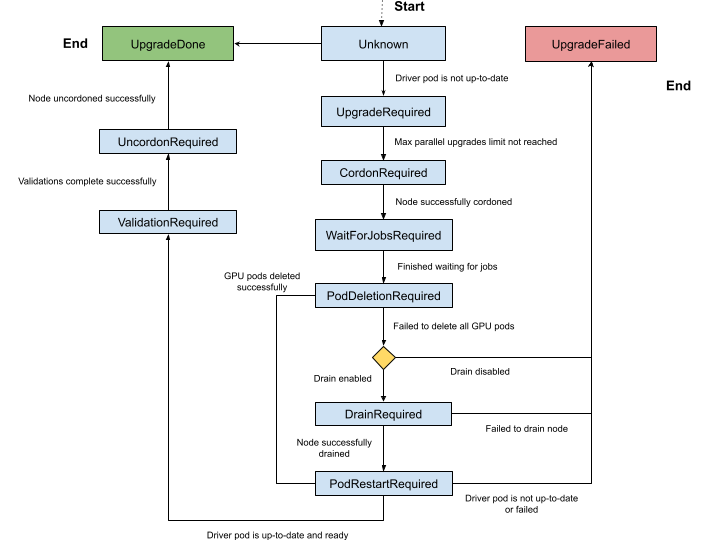

.. license-header
  SPDX-FileCopyrightText: Copyright (c) 2023 NVIDIA CORPORATION & AFFILIATES. All rights reserved.
  SPDX-License-Identifier: Apache-2.0

  Licensed under the Apache License, Version 2.0 (the "License");
  you may not use this file except in compliance with the License.
  You may obtain a copy of the License at

  http://www.apache.org/licenses/LICENSE-2.0

  Unless required by applicable law or agreed to in writing, software
  distributed under the License is distributed on an "AS IS" BASIS,
  WITHOUT WARRANTIES OR CONDITIONS OF ANY KIND, either express or implied.
  See the License for the specific language governing permissions and
  limitations under the License.

.. Date: Jan 30 2023
.. Author: cdesiniotis

.. headings # #, * *, =, -, ^, "

.. _gpu-driver-upgrades:

###################
GPU Driver Upgrades
###################

******************************
About Upgrading the GPU Driver
******************************

The NVIDIA driver daemon set requires special consideration for upgrades because the driver kernel modules must be unloaded and loaded again on each driver container restart.
Consequently, the following steps must occur across a driver upgrade:

#. Disable all clients to the GPU driver.
#. Unload the current GPU driver kernel modules.
#. Start the updated GPU driver pod.
#. Install the updated GPU driver and load the updated kernel modules.
#. Enable the clients of the GPU driver.

The GPU Operator supports several methods for managing and automating this driver upgrade process.

.. note::

   The GPU Operator only manages the lifecycle of containerized drivers.
   Drivers which are pre-installed on the host are not managed by the GPU Operator.

For the ``GPUCluster`` DRA stack, the Operator treats pods with an allocated
``gpu.nvidia.com`` ResourceClaim as GPU workloads during a driver upgrade.
The configured pod deletion policy applies to these workloads before the driver is reloaded.
The DRA kubelet plugin remains available while terminating pods unprepare their claims.

************************************
Upgrades with the Upgrade Controller
************************************

NVIDIA recommends upgrading by using the upgrade controller and the controller is enabled by default in the GPU Operator.
The controller automates the upgrade process and generates metrics and events so that you can monitor the upgrade process.
It supports both cluster policy driver management and NVIDIA driver custom resource management.
The upgrade controller does not require a cluster policy custom resource when NVIDIA driver custom
resources manage the driver.

Quick Reference
===============

.. list-table::
   :header-rows: 1

   * - Driver management method
     - Resource to update
     - Driver version field
     - Upgrade policy field
   * - NVIDIA driver custom resource
     - ``NVIDIADriver/<name>``
     - ``spec.version``
     - ``spec.upgradePolicy``
   * - Cluster policy custom resource
     - ``ClusterPolicy/cluster-policy``
     - ``spec.driver.version``
     - ``spec.driver.upgradePolicy``

Procedure
=========

Select the driver management method that you use.

.. tab-set::
   :sync-group: driver-management-mode

   .. tab-item:: NVIDIA Driver Custom Resource
      :sync: nvidia-driver-cr

      #. Upgrade the driver by changing ``spec.version`` in the NVIDIA driver custom resource that
         manages the target nodes:

         .. code-block:: console

            $ kubectl patch nvidiadrivers.nvidia.com/<resource-name> \
                --type='json' \
                -p='[{"op": "replace", "path": "/spec/version", "value":"580.95.05"}]'

      #. Optional: For each node, monitor the upgrade status:

         .. code-block:: console

            $ kubectl get node -l nvidia.com/gpu.present \
               -ojsonpath='{range .items[*]}{.metadata.name}{"\t"}{.metadata.labels.nvidia\.com/gpu-driver-upgrade-state}{"\n"}{end}'

         *Example Output*

         .. code-block:: output

            k8s-node-1 upgrade-required
            k8s-node-2 upgrade-required
            k8s-node-3 upgrade-required

         You can periodically poll the upgrade status by running the preceding command.
         The GPU driver upgrade is complete when the output shows ``upgrade-done``:

         .. code-block:: output

            k8s-node-1 upgrade-done
            k8s-node-2 upgrade-done
            k8s-node-3 upgrade-done

   .. tab-item:: Cluster Policy Custom Resource
      :sync: cluster-policy

      #. Upgrade the driver by changing ``spec.driver.version`` in the cluster policy custom resource:

         .. code-block:: console

            $ kubectl patch clusterpolicies.nvidia.com/cluster-policy \
                --type='json' \
                -p='[{"op": "replace", "path": "/spec/driver/version", "value":"580.95.05"}]'

         If you are using OpenShift, you must update the ``spec.driver.version``,
         ``spec.driver.repository``, and ``spec.driver.image`` values:

         .. code-block:: console

            $ kubectl patch clusterpolicies.nvidia.com/cluster-policy \
                --type='json' \
                -p='[{"op": "replace", "path": "/spec/driver/version", "value":"580.95.05"},{"op": "replace", "path": "/spec/driver/repository", "value":"nvcr.io/nvidia"},{"op": "replace", "path": "/spec/driver/image", "value":"driver"}]'

      #. Optional: For each node, monitor the upgrade status:

         .. code-block:: console

            $ kubectl get node -l nvidia.com/gpu.present \
               -ojsonpath='{range .items[*]}{.metadata.name}{"\t"}{.metadata.labels.nvidia\.com/gpu-driver-upgrade-state}{"\n"}{end}'

         *Example Output*

         .. code-block:: output

            k8s-node-1 upgrade-required
            k8s-node-2 upgrade-required
            k8s-node-3 upgrade-required

         You can periodically poll the upgrade status by running the preceding command.
         The GPU driver upgrade is complete when the output shows ``upgrade-done``:

         .. code-block:: output

            k8s-node-1 upgrade-done
            k8s-node-2 upgrade-done
            k8s-node-3 upgrade-done

Configuration Options
=====================

.. tab-set::
   :sync-group: driver-management-mode

   .. tab-item:: NVIDIA Driver Custom Resource
      :sync: nvidia-driver-cr

      Configure ``spec.upgradePolicy`` on each NVIDIA driver custom resource.
      The policy applies only to nodes owned by that resource, so different node pools can use
      different parallelism, availability, workload eviction, and drain settings:

      .. code-block:: yaml

         apiVersion: nvidia.com/v1alpha1
         kind: NVIDIADriver
         metadata:
           name: example
         spec:
           version: 580.95.05
           nodeSelector:
             driver.config: example
           upgradePolicy:
             autoUpgrade: true
             maxParallelUpgrades: 1
             maxUnavailable: 25%
             waitForCompletion:
               timeoutSeconds: 0
               podSelector: ""
             podDeletion:
               force: false
               timeoutSeconds: 300
               deleteEmptyDir: false
             drain:
               enable: false
               force: false
               podSelector: ""
               timeoutSeconds: 300
               deleteEmptyDir: false

      If ``spec.upgradePolicy`` is omitted, the Operator enables automatic upgrades with
      ``maxParallelUpgrades: 1``, ``maxUnavailable: 25%``, and the defaults shown in the preceding
      example.
      The ``maxParallelUpgrades`` and ``maxUnavailable`` limits are evaluated separately for the
      nodes owned by each resource.

   .. tab-item:: Cluster Policy Custom Resource
      :sync: cluster-policy

      Configure ``spec.driver.upgradePolicy`` in the cluster policy custom resource.
      One policy applies to all driver nodes:

      .. code-block:: yaml

         spec:
           driver:
             upgradePolicy:
               autoUpgrade: true
               maxParallelUpgrades: 1
               maxUnavailable: 25%
               waitForCompletion:
                 timeoutSeconds: 0
                 podSelector: ""
               gpuPodDeletion:
                 force: false
                 timeoutSeconds: 300
                 deleteEmptyDir: false
               drain:
                 enable: false
                 force: false
                 podSelector: ""
                 timeoutSeconds: 300
                 deleteEmptyDir: false

The policy fields have the following effects:

``autoUpgrade``
  Enables or disables the upgrade controller for the applicable nodes.
  When set to ``false``, the other policy fields are ignored.
``maxParallelUpgrades``
  Sets the number of nodes that can be upgraded in parallel.
  A value of ``0`` means that there is no limit.
``maxUnavailable``
  Sets the maximum number or percentage of applicable nodes that can be unavailable during an upgrade.
``waitForCompletion``
  Selects pods or jobs that must finish before the driver is upgraded on a node and sets how long to wait.
  A ``timeoutSeconds`` value of ``0`` waits indefinitely.
``gpuPodDeletion`` or ``podDeletion``
  Controls eviction of pods that have allocated GPUs.
  ``gpuPodDeletion`` is the field name in the cluster policy and ``podDeletion`` is the field name
  in an NVIDIA driver custom resource.
``drain``
  Configures node drain as a fallback when GPU pod deletion cannot remove the GPU workloads.
  By default, drain is disabled.

.. warning::

   ``spec.driver.upgradePolicy.drain.enable`` in the cluster policy applies to all nodes managed by
   that driver configuration.
   ``spec.upgradePolicy.drain.enable`` in an NVIDIA driver custom resource applies to the nodes owned
   by that resource.
   When set to ``true``, the upgrade controller can drain each applicable node before upgrading the driver on that node.
   Draining a node evicts all pods from that node, including workloads unrelated to the GPU driver.
   This is a disruptive operation that interrupts running GPU and non-GPU workloads on every node the policy processes.

   Enable ``drain`` only when ``gpuPodDeletion`` in the cluster policy, or ``podDeletion`` in an
   NVIDIA driver custom resource, is insufficient to remove all GPU-using pods on its own.
   Adjust the pod deletion settings first and use ``drain`` only if those settings do not work.
   If you must enable ``drain``, use ``podSelector`` to limit which pods are evicted.

If you specify a value for ``maxUnavailable`` and also specify ``maxParallelUpgrades``,
the ``maxUnavailable`` value applies an additional constraint on the value of
``maxParallelUpgrades`` to ensure that the number of parallel upgrades does not
cause more than the intended number of nodes to become unavailable during the upgrade.
For example, if you specify ``maxUnavailable=100%`` and ``maxParallelUpgrades=1``,
one node is upgraded at a time.

The ``maxUnavailable`` value also applies to currently unavailable nodes in the applicable node set.
If the number of cordoned nodes already meets the ``maxUnavailable`` value,
then the upgrade does not progress.

Upgrade State Machine
=====================

The upgrade controller manages driver upgrades through a well-defined state machine.
The node label, ``nvidia.com/gpu-driver-upgrade-state``, indicates the state a node is currently in.
The set of possible states are:

* Unknown (empty): The upgrade controller is disabled or the node has not been processed yet.
* ``upgrade-required``: NVIDIA driver pod is not up-to-date and requires an upgrade. No actions are performed at this stage.
* ``cordon-required``: Node will be marked Unschedulable in preparation for the driver upgrade.
* ``wait-for-jobs-required``: Node will wait on the completion of a group of pods/jobs before proceeding.
* ``pod-deletion-required``: Pods allocated with GPUs are deleted from the node. If pod deletion fails, the node state is set to ``drain-required``
  if drain is enabled in the applicable upgrade policy.
* ``drain-required``: Node is drained using ``kubectl drain``, which evicts all pods on the
  node.
  This state is only reached if pod deletion fails to remove all
  GPU-using pods and ``drain.enable`` is set to ``true`` in the applicable upgrade policy.
  This state is skipped if all GPU pods are successfully deleted from the node.
* ``pod-restart-required``: The NVIDIA driver pod running on the node will be restarted and upgraded to the new version.
* ``validation-required``: Validation of the new driver deployed on the node is required before proceeding. The GPU Operator
  performs validations in the pod named ``operator-validator``.
* ``uncordon-required``: Node will be marked Schedulable to complete the upgrade process.
* ``upgrade-done``: NVIDIA driver pod is up-to-date and running on the node.
* ``upgrade-failed``: A failure occurred during the driver upgrade.

The complete state machine is depicted in the diagram below.

Pausing Driver Upgrades
=======================

With cluster policy driver management, set ``spec.driver.upgradePolicy.autoUpgrade`` to ``false``
to pause automatic upgrades for all driver nodes.
With NVIDIA driver custom resource management, set ``spec.upgradePolicy.autoUpgrade`` to ``false``
on a resource to pause automatic upgrades only for the nodes that it owns.
The Operator removes the upgrade-state labels from those nodes.
Set the field to ``true`` to re-enable automatic upgrades.

Skipping Driver Upgrades
========================

To skip driver upgrades on a certain node, label the node with ``nvidia.com/gpu-driver-upgrade.skip=true``.

Metrics and Events
==================

The GPU Operator generates the following metrics during the upgrade process which can be scraped by Prometheus.
When NVIDIA driver custom resources manage the driver, the node upgrade metrics are aggregated across
all resources, and ``gpu_operator_auto_upgrade_enabled`` is ``1`` when at least one resource enables
automatic upgrades.

* ``gpu_operator_auto_upgrade_enabled``: 1 if driver auto upgrade is enabled; 0 if not.
* ``gpu_operator_nodes_upgrades_in_progress``: Total number of nodes in which a driver pod is being upgraded on.
* ``gpu_operator_nodes_upgrades_done``: Total number of nodes in which a driver pod has been successfully upgraded.
* ``gpu_operator_nodes_upgrades_failed``: Total number of nodes in which a driver pod upgrade has failed.
* ``gpu_operator_nodes_upgrades_available``: Total number of nodes in which a driver pod upgrade can start on.
* ``gpu_operator_nodes_upgrades_pending``: Total number of nodes in which driver pod upgrades are pending.

The GPU Operator generates events during the upgrade process.
The most common events are for state transitions or failures at a particular state.
Below are an example set of events generated for the upgrade of one node.

.. code-block:: console

   $ kubectl get events -n default --sort-by='.lastTimestamp' | grep GPUDriverUpgrade

*Example Output*

.. code-block:: output

   10m         Normal   GPUDriverUpgrade     node/localhost.localdomain   Successfully updated node state label to [upgrade-required]
   10m         Normal   GPUDriverUpgrade     node/localhost.localdomain   Successfully updated node state label to [cordon-required]
   10m         Normal   GPUDriverUpgrade     node/localhost.localdomain   Successfully updated node state label to [wait-for-jobs-required]
   10m         Normal   GPUDriverUpgrade     node/localhost.localdomain   Successfully updated node state label to [pod-deletion-required]
   10m         Normal   GPUDriverUpgrade     node/localhost.localdomain   Successfully updated node state label to [pod-restart-required]
   7m          Normal   GPUDriverUpgrade     node/localhost.localdomain   Successfully updated node state label to [validation-required]
   6m          Normal   GPUDriverUpgrade     node/localhost.localdomain   Successfully updated node state label to [uncordon-required]
   6m          Normal   GPUDriverUpgrade     node/localhost.localdomain   Successfully updated node state label to [upgrade-done]

Troubleshooting
===============

If the upgrade fails for a particular node, the node is labelled with the ``upgrade-failed`` state.

#. View the upgrade state labels:

   .. code-block:: console

      $ kubectl get node -l nvidia.com/gpu.present \
          -ojsonpath='{range .items[*]}{.metadata.name}{"\t"}{.metadata.labels.nvidia\.com/gpu-driver-upgrade-state}{"\n"}{end}'

   *Example Output*

   .. code-block:: output
      :emphasize-lines: 3

      k8s-node-1 upgrade-done
      k8s-node-2 upgrade-done
      k8s-node-3 upgrade-failed

#. Check the events to determine the stage that the upgrade failed:

   .. code:: console

      $ kubectl get events -n default --sort-by='.lastTimestamp' | grep GPUDriverUpgrade

#. (Optional) Check the logs from the upgrade controller in the gpu-operator container:

   .. code:: console

      $ kubectl logs -n gpu-operator gpu-operator-xxxxx | grep controllers.Upgrade

#. After resolving the upgrade failures for a particular node, you can restart the upgrade process on the node by placing it in the ``upgrade-required`` state:

   .. code:: console

      $ kubectl label node <node-name>  nvidia.com/gpu-driver-upgrade-state=upgrade-required --overwrite

***************************************
Upgrades without the Upgrade Controller
***************************************

If the upgrade controller is disabled or not supported for your GPU Operator version, a component called ``k8s-driver-manager`` is responsible
for executing the driver upgrade process.
The ``k8s-driver-manager`` is an `initContainer` within the driver Daemonset, which ensures all existing GPU driver clients are disabled before
unloading the current driver modules and continuing with the new driver installation.
This method still automates the core driver upgrade process, but lacks the observability that the upgrade controller provides as well as additional
controls such as pausing/skipping upgrades.
In addition, no new features will be added to the ``k8s-driver-manager`` moving forward in favor of the upgrade controller.

Procedure
=========

.. tab-set::
   :sync-group: driver-management-mode

   .. tab-item:: NVIDIA Driver Custom Resource
      :sync: nvidia-driver-cr

      #. Upgrade the driver by changing ``spec.version`` in the NVIDIA driver custom resource that
         manages the target nodes:

         .. code-block:: console

            $ kubectl patch nvidiadrivers.nvidia.com/<resource-name> \
                --type='json' \
                -p='[{"op": "replace", "path": "/spec/version", "value":"580.95.05"}]'

      #. Optional: Monitor the upgrade by watching the deployment of the new driver pods on GPU
         worker nodes:

         .. code-block:: console

            $ kubectl get pods -n gpu-operator \
                -l app.kubernetes.io/component=nvidia-driver -w

   .. tab-item:: Cluster Policy Custom Resource
      :sync: cluster-policy

      #. Upgrade the driver by changing the driver version, repository, and image in the cluster
         policy custom resource:

         .. code-block:: console

            $ kubectl patch clusterpolicies.nvidia.com/cluster-policy \
                --type='json' \
                -p='[{"op": "replace", "path": "/spec/driver/version", "value":"580.95.05"},{"op": "replace", "path": "/spec/driver/repository", "value":"nvcr.io/nvidia"},{"op": "replace", "path": "/spec/driver/image", "value":"driver"}]'

      #. Optional: Monitor the upgrade by watching the deployment of the new driver pods on GPU
         worker nodes:

         .. code-block:: console

            $ kubectl get pods -n gpu-operator -lapp=nvidia-driver-daemonset -w

Configuration Options
=====================

The following configuration options are available for ``k8s-driver-manager``. The options allow users to control the
GPU pod eviction and node drain behavior.

.. tab-set::
   :sync-group: driver-management-mode

   .. tab-item:: NVIDIA Driver Custom Resource
      :sync: nvidia-driver-cr

      Configure the options under ``spec.manager.env`` in each NVIDIA driver custom resource:

      .. code-block:: yaml

         apiVersion: nvidia.com/v1alpha1
         kind: NVIDIADriver
         metadata:
           name: example
         spec:
           manager:
             env:
             - name: ENABLE_GPU_POD_EVICTION
               value: "true"
             - name: ENABLE_AUTO_DRAIN
               value: "true"
             - name: DRAIN_USE_FORCE
               value: "false"
             - name: DRAIN_POD_SELECTOR_LABEL
               value: ""
             - name: DRAIN_TIMEOUT_SECONDS
               value: "0s"
             - name: DRAIN_DELETE_EMPTYDIR_DATA
               value: "false"

   .. tab-item:: Cluster Policy Custom Resource
      :sync: cluster-policy

      Configure the options under ``spec.driver.manager.env`` in the cluster policy custom resource:

      .. code-block:: yaml

         spec:
           driver:
             manager:
               env:
               - name: ENABLE_GPU_POD_EVICTION
                 value: "true"
               - name: ENABLE_AUTO_DRAIN
                 value: "true"
               - name: DRAIN_USE_FORCE
                 value: "false"
               - name: DRAIN_POD_SELECTOR_LABEL
                 value: ""
               - name: DRAIN_TIMEOUT_SECONDS
                 value: "0s"
               - name: DRAIN_DELETE_EMPTYDIR_DATA
                 value: "false"

* The ``ENABLE_GPU_POD_EVICTION`` environment variable enables ``k8s-driver-manager`` to attempt evicting only GPU pods from the node before attempting a node drain. Only if this fails and
  ``ENABLE_AUTO_DRAIN`` is enabled will the node ever be drained.
* The ``DRAIN_USE_FORCE`` environment variable must be enabled to evict GPU pods that are not managed by any of the replication controllers such as deployment, daemon set, stateful set, and replica set.
* The ``DRAIN_DELETE_EMPTYDIR_DATA`` environment variable must be enabled to delete GPU pods that use the ``emptyDir`` type volume.

.. note::

   Since GPU pods get evicted whenever the NVIDIA Driver daemon set specification is updated, it might not always be desirable to allow this to happen automatically.
   To prevent this ``daemonsets.updateStrategy`` parameter in the ``ClusterPolicy`` can be set to `OnDelete <https://kubernetes.io/docs/tasks/manage-daemon/update-daemon-set/#daemonset-update-strategy>`_ .
   With ``OnDelete`` update strategy, a new driver pod with the updated spec will only get deployed on a node once the old driver pod is manually deleted.
   Thus, admins can control when to rollout spec updates to driver pods on any given node.
   For more information on DaemonSet update strategies, refer to the `Kubernetes documentation <https://kubernetes.io/docs/tasks/manage-daemon/update-daemon-set/#daemonset-update-strategy>`_.
