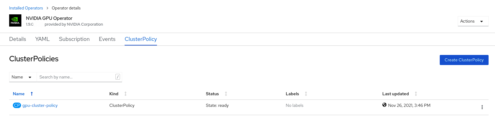

.. Date: March 21 2022
.. Author: stephenjamessmith

.. _nvaie-ocp:

###################################
NVIDIA AI Enterprise with OpenShift
###################################

NVIDIA AI Enterprise is an end-to-end, cloud-native suite of AI and data analytics software, optimized, certified, and supported by NVIDIA with NVIDIA-Certified Systems. Additional information can be found at the `NVIDIA AI Enterprise web page <https://www.nvidia.com/en-us/data-center/products/ai-enterprise-suite/#benefits>`_.

The following methods of installation are supported:

* OpenShift Container Platform on bare metal or VMware vSphere with GPU Passthrough
* OpenShift Container Platform on VMware vSphere with NVIDIA vGPU

******************************************************************************
OpenShift Container Platform bare metal or VMware vSphere with GPU Passthrough
******************************************************************************

For OpenShift Container Platform bare metal or VMware vSphere with GPU Passthrough you do not need to make changes to the `ClusterPolicy`. Follow the guidance in :ref:`install-nvidiagpu` to install the NVIDIA GPU Operator.

.. note::
   The option exists to use the vGPU driver with bare metal and VMware vSphere VMs with GPU Passthrough. In this case, follow the guidance in the section “OpenShift Container Platform on VMware vSphere with NVIDIA vGPU”.

****************************************************************
OpenShift Container Platform on VMware vSphere with NVIDIA vGPUs
****************************************************************

Overview
========

This section provides insights into deploying NVIDIA AI Enterprise for VMware vSphere with RedHat OpenShift Container Platform.

The steps involved are:

-  Step 1: Install Node Feature Discovery (NFD) Operator

-  Step 2: Install NVIDIA GPU Operator

-  Step 3: Create the NGC secret

-  Step 4: Create the ConfigMap

-  Step 5: Create the Cluster Policy

Introduction
============

When NVIDIA AI Enterprise is running on VMware vSphere based virtualized infrastructure, a key component is NVIDIA virtual GPU. The NVIDIA AI Enterprise Host Software vSphere Installation Bundle (VIB) is installed on the VMware ESXi host server and it is responsible for communicating with the NVIDIA vGPU guest driver which is
installed on the guest VM. Guest VMs use the NVIDIA vGPUs in the same manner as a physical GPU that has been passed through by the hypervisor. In the VM itself, vGPU drivers are installed which support the different license levels that are available.

.. note:: Installing the NVIDIA vGPU Host Driver VIB on the ESXi host is out of the scope of this document. See the **NVIDIA AI Enterprise Deployment Guide** for detailed instructions.

Red Hat OpenShift on VMware vSphere
=====================================

Follow the steps outlined in the `Installing vSphere section <https://docs.openshift.com/container-platform/latest/installing/installing_vsphere/preparing-to-install-on-vsphere.html>`_ of the RedHat OpenShift documentation installing OpenShift on vSphere.

   .. note::
      When using virtualized GPUs you must change the boot method of each VM that is deployed as a worker and the VM template to be EFI.
      This requires powering down running worker VMs. The template must be converted to a VM, then change the boot method to EFI, then convert back
      to a template.

      Secure boot also needs to be disabled as shown:

        .. image:: graphics/vmx_secure_boot.png

      When using the `UPI install method <https://docs.openshift.com/container-platform/latest/installing/installing_vsphere/installing-vsphere.html#installation-vsphere-machines_installing-vsphere>`_, after **Step 8** of the “Installing RHCOS and starting the OpenShift
      Container Platform bootstrap process” change the boot method to EFI before **continuing to Step 9**.

      When using the IPI method, each VM’s boot method can be changed to EFI after VM deployment.

      In addition to the EFI boot setting, ensure that the VM has the following configuration parameters set:

      **VM Settings** > **VM options** > **Advanced** > **Configuration Parameters** > **Edit Configuration**

      ``pciPassthru.use64bitMMIO TRUE``

      ``pciPassthru.64bitMMIOSizeGB 512``

         .. image:: graphics/pci_passthrough.png

      To support GPUDirect RDMA ensure that the VM has the following configuration parameters set:

      **VM Settings** > **VM options** > **Advanced** > **Configuration Parameters** > **Edit Configuration**

      ``pciPassthru.allowP2P = true``

      ``pciPassthru.RelaxACSforP2P = true``

It is also recommended that you reference `Running Red Hat OpenShift Container Platform on VMware Cloud Foundation <https://core.vmware.com/resource/running-red-hat-openshift-container-platform-vmware-cloud-foundation#executive-summary>`_ documentation for deployment best practices, system configuration, and reference architecture.

Install Node Feature Discovery Operator
===========================================

Follow the guidance in :ref:`install-nfd` to install the Node Feature Discovery Operator.

Install NVIDIA GPU Operator
===============================

Follow the guidance in :ref:`install-nvidiagpu` to install the NVIDIA GPU Operator.

.. note:: Skip the guidance associated with creating the cluster policy instead follow the guidance in the subsequent sections.

Create the NGC secret
=========================

OpenShift has a secret object type which provides a mechanism for holding sensitive information such as passwords and private source repository credentials. Next you will create a secret object for storing our NGC API key (the mechanism used to authenticate your access to the
NGC container registry).

.. note:: Before you begin you will need to generate or use an existing `API key <https://docs.nvidia.com/ngc/ngc-private-registry-user-guide/index.html#generating-api-key>`_.

#. Navigate to **Home** > **Projects** and ensure the ``nvidia-gpu-operator`` is selected.

#. In the OpenShift Container Platform web console, click **Secrets** from the Workloads drop down.

#. Click the **Create** Drop down.

#. Select Image Pull Secret.

   .. image:: graphics/secrets.png

#. Enter the following into each field:

    * **Secret name**: ngc-secret

    * **Authentication type**: Image registry credentials

    * **Registry server address**: nvcr.io/nvaie

    * **Username**: $oauthtoken

    * **Password**: <API-KEY>

    * **Email**: <YOUR-EMAIL>

   .. image:: graphics/secrets_2.png

#. Click **Create**.

   A pull secret is created.

   .. image:: graphics/created_pull-secret.png

Create the ConfigMap for NLS Token
==================================

Prerequisites
-------------

Generate and download a NLS client license token. See Section 4.6 of the `NVIDIA License System User Guide <https://docs.nvidia.com/license-system/latest/pdf/nvidia-license-system-user-guide.pdf>`_ for instructions.

Procedure
---------

#. Navigate to **Home** > **Projects** and ensure the ``nvidia-gpu-operator`` is selected.

#. Select the **Workloads** Drop Down menu.

#. Select **ConfigMaps**.

#. Click **Create ConfigMap**.

   .. image:: graphics/create_config_map1.png

#. Enter the details for your ConfigMap.

   #. The ``name`` must be ``licensing-config``.

   #. Copy and paste the information for your NLS client token into the ``client_configuration_token.tok`` parameter.

#. Click **Create**.

   **Example output**

   .. code-block:: yaml

      kind: ConfigMap
      apiVersion: v1
      metadata:
       name: licensing-config
      data:
       client_configuration_token.tok: >-
        tJ8EKOD5-rN7sSUWyHKsrvVSgfRYucvKo-lg<SNIP>
       gridd.conf: '# empty file'

#. The created ConfigMap should resemble the following:

   .. image:: graphics/create_config_maps2.png

Create the Cluster Policy Instance
==================================

Now create the cluster policy, which is responsible for maintaining policy resources to create pods in a cluster.

#. In the OpenShift Container Platform web console, from the side menu, select **Operators** > **Installed Operators**, and click **NVIDIA GPU Operator**.

#. Select the **ClusterPolicy** tab, then click **Create ClusterPolicy**.

   .. note:: The platform assigns the default name *gpu-cluster-policy*.

#. Expand the drop down for **NVIDIA GPU/vGPU Driver config** and then **licensingConfig.** In the text box labeled **configMapName,** enter the name of the licensing config map that was previously created (for example *licensing-config*). Check the **nlsEnabled** checkbox.
   Refer the screenshots for parameter examples and modify values accordingly.

   .. note:: This was previously created in the previous section "Create the ConfigMap for NLS Token".

   .. image:: graphics/cluster_policy_1.png

   * **configMapName**: licensing-config
   * **nlsEnabled**: Enabled

#. Scroll down to specify repository path under the **NVIDIA GPU/vGPU Driver config** section. See the screenshot below for parameter examples and modify values accordingly.

   .. image:: graphics/createclusterpolicy2.png

   * **enabled**: Enabled
   * **repository**: ``nvcr.io/nvaie``

   #. Expand the rdma menu and check **enabled** if you want to deploy GPUDirect RDMA:

      .. image:: graphics/enable-gpu-direct-rdma.png

#. Scroll down further to image name and specifgy the NVIDIA vGPU driver version under the **NVIDIA GPU/vGPU Driver config** section.

   .. image:: graphics/createclusterpolicy3.png

   * **version**: 525.60.13
   * **image**: vgpu-guest-driver-3-0

      .. note:: The above version and image are examples for NVIDIA AI Enterprise 3.0. Please update the vGPU driver version and image for the appropriate OpenShift Container Platform version.

                * 4.9 is ``nvcr.io/nvaie/vgpu-guest-driver-3-0:525.60.13-rhcos4.9``
                * 4.10 is ``nvcr.io/nvaie/vgpu-guest-driver-3-0:525.60.13-rhcos4.10``
                * 4.11 is ``nvcr.io/nvaie/vgpu-guest-driver-3-0:525.60.13-rhcos4.11``

#. Expand the **Advanced configuration** menu and specify the imagePullSecret.

   .. note:: This was previously created in the section "Create NGC secret".

   .. image:: graphics/cluster_policy_4.png

#. Click **Create**.

The GPU Operator proceeds to install all the required components to set up the NVIDIA GPUs in the OpenShift Container Platform cluster.

.. note:: Wait at least 10-20 minutes before digging deeper into any form of troubleshooting because this may take some time to finish.

The status of the newly deployed ClusterPolicy *gpu-cluster-policy* for the NVIDIA GPU Operator changes to ``State:ready`` when the installation succeeds.

Verify the ClusterPolicy installation from the CLI run:

   .. code-block:: console

      $ oc get nodes -o=custom-columns='Node:metadata.name,GPUs:status.capacity.nvidia\.com/gpu'

This lists each node and the number of GPUs.

   **Example output**

   .. code-block:: console

      $ oc get nodes -o=custom-columns='Node:metadata.name,GPUs:status.capacity.nvidia\.com/gpu'

        Node GPUs

        nvaie-ocp-7rfr8-master-0 <none>

        nvaie-ocp-7rfr8-master-1 <none>

        nvaie-ocp-7rfr8-master-2 <none>

        nvaie-ocp-7rfr8-worker-7x5km 1

        nvaie-ocp-7rfr8-worker-9jgmk <none>

        nvaie-ocp-7rfr8-worker-jntsp 1

        nvaie-ocp-7rfr8-worker-zkggt <none>

Verify the successful installation of the NVIDIA GPU Operator
=============================================================

Perform the following steps to verify the successful installation of the **NVIDIA GPU Operator**.

#. In the OpenShift Container Platform web console, from the side menu, select **Workloads** > **Pods**.

#. Under the **Project** drop down select the **nvidia-gpu-operator** project.

#. Verify the pods are successfully deployed.

#. Alternatively from the command line run the following command:

   .. code-block:: console

      $ oc get pods -n nvidia-gpu-operator

   .. code-block:: console

         NAME                                                                  READY   STATUS      RESTARTS   AGE
         pod/gpu-feature-discovery-hlpgs                                       1/1     Running     0          91m
         pod/gpu-operator-8dc8d6648-jzhnr                                      1/1     Running     0          94m
         pod/nvidia-dcgm-exporter-ds9xd                                        1/1     Running     0          91m
         pod/nvidia-dcgm-k7tz6                                                 1/1     Running     0          91m
         pod/nvidia-device-plugin-daemonset-nqxmc                              1/1     Running     0          91m
         pod/nvidia-driver-daemonset-49.84.202202081504-0-9df9j                2/2     Running     0          91m
         pod/nvidia-node-status-exporter-7bhdk                                 1/1     Running     0          91m
