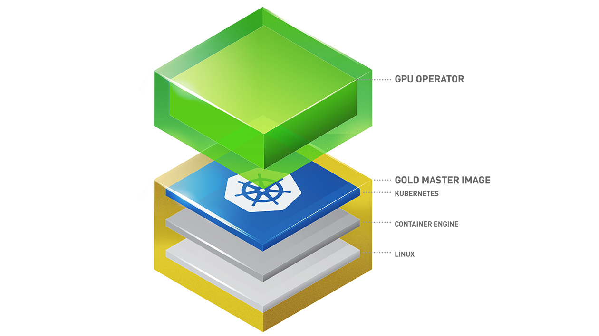

.. license-header
  SPDX-FileCopyrightText: Copyright (c) 2023 NVIDIA CORPORATION & AFFILIATES. All rights reserved.
  SPDX-License-Identifier: Apache-2.0

  Licensed under the Apache License, Version 2.0 (the "License");
  you may not use this file except in compliance with the License.
  You may obtain a copy of the License at

  http://www.apache.org/licenses/LICENSE-2.0

  Unless required by applicable law or agreed to in writing, software
  distributed under the License is distributed on an "AS IS" BASIS,
  WITHOUT WARRANTIES OR CONDITIONS OF ANY KIND, either express or implied.
  See the License for the specific language governing permissions and
  limitations under the License.

.. headings # #, * *, =, -, ^, "

*****************************
About the NVIDIA GPU Operator
*****************************

Kubernetes provides access to special hardware resources such as NVIDIA GPUs, NICs, Infiniband adapters and other devices
through the `device plugin framework <https://kubernetes.io/docs/concepts/extend-kubernetes/compute-storage-net/device-plugins/>`_.
However, configuring and managing nodes with these hardware resources requires
configuration of multiple software components such as drivers, container runtimes or other libraries which are difficult
and prone to errors. The NVIDIA GPU Operator uses the `operator framework <https://coreos.com/blog/introducing-operator-framework>`_
within Kubernetes to automate the management of all NVIDIA software components needed to provision GPU. These components include the NVIDIA drivers (to enable CUDA),
Kubernetes device plugin for GPUs, the `NVIDIA Container Toolkit <https://github.com/NVIDIA/nvidia-container-toolkit>`_,
automatic node labeling using `GFD <https://github.com/NVIDIA/gpu-feature-discovery>`_, `DCGM <https://developer.nvidia.com/dcgm>`_ based monitoring and others.

About This Documentation
========================

Browse through the following documents for getting started, platform support and release notes for the NVIDIA GPU Operator.

.. admonition:: Red Hat OpenShift Container Platform
   :class: tip

   Refer to :external+ocp:doc:`index` for information about installing, managing, and upgrading the Operator on Red Hat OpenShift Container Platform.

Getting Started
---------------

The :ref:`operator-install-guide` guide includes information on installing the GPU Operator in a Kubernetes cluster.

Release Notes
---------------

Refer to :ref:`operator-release-notes` for information about releases.

Platform Support
------------------

The :ref:`operator-platform-support` describes the supported platform configurations.

Licenses and Contributing
=========================

.. _pstai: https://www.nvidia.com/en-us/agreements/enterprise-software/product-specific-terms-for-ai-products/
.. |pstai| replace:: Product-Specific Terms for NVIDIA AI Products

The NVIDIA GPU Operator source code is licensed under `Apache 2.0 <https://www.apache.org/licenses/LICENSE-2.0>`__ and
contributions are accepted with a DCO. Refer to the `contributing <https://github.com/NVIDIA/gpu-operator/blob/master/CONTRIBUTING.md>`_ document for
more information on how to contribute and the release artifacts.

The base images used by the software might include software that is licensed under open-source licenses such as GPL.
The source code for these components is archived on the CUDA opensource `index <https://developer.download.nvidia.com/compute/cuda/opensource/>`_.

The following table identifies the licenses for the Operator and software components.
By installing and using the GPU Operator, you accept the terms and conditions of these licenses.

.. list-table::
   :header-rows: 1
   :widths: 30 10 60

   * - Component
     - Artifact Type
     - Artifact Licenses

   * - NVIDIA GPU Operator
     - Helm Chart
     - `Apache 2.0 <https://www.apache.org/licenses/LICENSE-2.0>`__

   * - NVIDIA GPU Operator
     - Image
     - |pstai|_

   * - NVIDIA GPU Driver
     - Image
     - `License for Customer Use of NVIDIA Software <http://www.nvidia.com/content/DriverDownload-March2009/licence.php?lang=us>`__

       |pstai|_

   * - NVIDIA Container Toolkit
     - Image
     - |pstai|_

   * - NVIDIA Kubernetes Device Plugin
     - Image
     - |pstai|_

   * - NVIDIA MIG Manager for Kubernetes
     - Image
     - |pstai|_

   * - Validator for NVIDIA GPU Operator
     - Image
     - |pstai|_

   * - NVIDIA DCGM
     - Image
     - |pstai|_

   * - NVIDIA DCGM Exporter
     - Image
     - |pstai|_

   * - NVIDIA Driver Manager for Kubernetes
     - Image
     - |pstai|_

   * - NVIDIA KubeVirt GPU Device Plugin
     - Image
     - |pstai|_

   * - NVIDIA vGPU Device Manager
     - Image
     - |pstai|_

   * - NVIDIA GDS Driver
     - Image
     - `License for Customer Use of NVIDIA Software <http://www.nvidia.com/content/DriverDownload-March2009/licence.php?lang=us>`__

       |pstai|_

   * - NVIDIA Confidential Computing
       Manager for Kubernetes
     - Image
     - |pstai|_

   * - NVIDIA GDRCopy Driver
     - Image
     - |pstai|_

Third-Party Notices by GPU Operator Release
-------------------------------------------

The following table maps each GPU Operator patch release to the exact component release and third-party notices.
Unless a row states otherwise, the notices cover the ``amd64`` Ubuntu images.
Notices for other architectures and host operating systems are published with the corresponding image.

.. TODO: Confirm the third-party notices source for the NVIDIA GPU Driver, DCGM, DCGM Exporter,
   and GDS Driver images. The DCGM and GDS teams have not identified per-architecture notices.

.. flat-table::
   :header-rows: 2

   * - :rspan:`1` Component
     - GPU Operator Version

   * - v26.7.0

   * - NVIDIA GPU Operator Helm chart and image
     - | v26.7.0
       | `THIRD_PARTY_NOTICES.md <https://github.com/NVIDIA/gpu-operator/blob/v26.7.0/THIRD_PARTY_NOTICES.md>`__

   * - Validator for NVIDIA GPU Operator
     - | v26.7.0
       | `THIRD_PARTY_NOTICES.md <https://github.com/NVIDIA/gpu-operator/blob/v26.7.0/THIRD_PARTY_NOTICES.md>`__

   * - NVIDIA GPU Driver
     - | 595.91.07
       | The notices are not yet published for this image.

   * - NVIDIA Container Toolkit
     - | v1.20.0
       | `THIRD_PARTY_NOTICES.md <https://github.com/NVIDIA/nvidia-container-toolkit/blob/v1.20.0/THIRD_PARTY_NOTICES.md>`__

   * - NVIDIA Kubernetes Device Plugin
     - | v0.20.0
       | `THIRD_PARTY_NOTICES.md <https://github.com/NVIDIA/k8s-device-plugin/blob/v0.20.0/THIRD_PARTY_NOTICES.md>`__

   * - NVIDIA MIG Manager for Kubernetes
     - | v0.15.0
       | `THIRD_PARTY_NOTICES.md <https://github.com/NVIDIA/mig-parted/blob/v0.15.0/THIRD_PARTY_NOTICES.md>`__

   * - NVIDIA DCGM
     - | 4.6.0-1-ubuntu24.04
       | The notices are not yet published for this image.

   * - NVIDIA DCGM Exporter
     - | 4.6.0-4.8.3-distroless
       | The notices are not yet published for this image.

   * - NVIDIA Driver Manager for Kubernetes
     - | v0.12.0
       | `THIRD_PARTY_NOTICES.md <https://github.com/NVIDIA/k8s-driver-manager/blob/v0.12.0/THIRD_PARTY_NOTICES.md>`__

   * - NVIDIA KubeVirt GPU Device Plugin
     - | v1.6.0
       | `THIRD_PARTY_NOTICES.md <https://github.com/NVIDIA/kubevirt-gpu-device-plugin/blob/v1.6.0/THIRD_PARTY_NOTICES.md>`__

   * - NVIDIA vGPU Device Manager
     - | v0.5.0
       | `THIRD_PARTY_NOTICES.md <https://github.com/NVIDIA/vgpu-device-manager/blob/v0.5.0/THIRD_PARTY_NOTICES.md>`__

   * - NVIDIA GDS Driver
     - | 2.29.4
       | The notices are not yet published for this image.

   * - NVIDIA Confidential Computing
       Manager for Kubernetes
     - | v0.4.3
       | `THIRD_PARTY_NOTICES.md <https://github.com/NVIDIA/k8s-cc-manager/blob/v0.4.3/THIRD_PARTY_NOTICES.md>`__

   * - NVIDIA GDRCopy Driver
     - | v2.6
       | The notices are published with each operating-system-specific image in the `NGC Catalog <https://catalog.ngc.nvidia.com/orgs/nvidia/cloud-native/containers/gdrdrv/->`__.
         Select the image tag that matches your host operating system.
